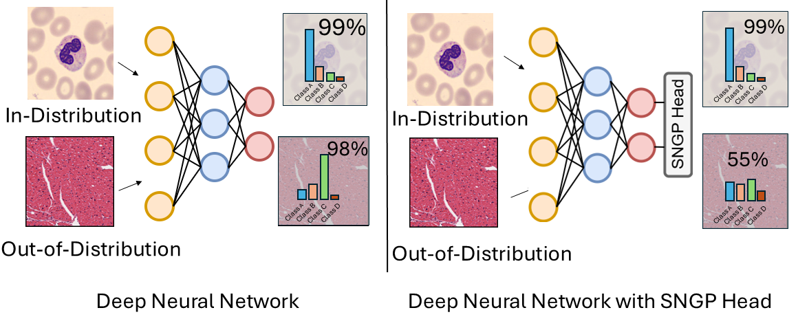

<div align="center">
  <h1>🧬 SNGP Lightning + Hydra Experimentation Framework</h1>
  <p><em>A flexible framework for training and evaluating Spectral-normalized Neural Gaussian Processes on medical imaging datasets</em></p>
  
  [](https://python.org)
  [](https://lightning.ai)
  [](https://hydra.cc)
  [](https://wandb.ai)
</div>

---

## Notes

test: used for getting csv on test set which is used for submitting to kaggle

predict: used for testing on validation set and getting confusion matrix
after training confusion matrix on train and val set will from last checkpoint will be logged to wandb

## 📋 Table of Contents
- [Overview](#-overview)
- [Quick Start](#-quick-start)
- [Project Structure](#-project-structure)
- [Training](#️-training)
- [Evaluation](#-evaluation)
- [Configuration](#️-configuration)
- [Datasets](#-datasets)
- [Experiment Tracking](#-experiment-tracking)

---

## 🎯 Overview

<div align="center">
  
</div>

<!-- This repository provides a comprehensive experimentation framework for **Spectral-normalized Neural Gaussian Processes (SNGP)** models using PyTorch Lightning and Hydra. The framework enables:

- 🔬 **Modular experimentation** with easy configuration management
- 📊 **Automatic experiment tracking** via Weights & Biases
- 🔄 **Reproducible research** with locked dependencies
- 🏥 **Medical imaging focus** with multiple histopathology datasets
- 🎯 **Out-of-distribution detection** for uncertainty quantification

### Key Features
- **SNGP vs Baseline comparisons** on medical imaging datasets
- **Uncertainty quantification** for reliable predictions
- **Multi-dataset evaluation** including OOD detection
- **Flexible configuration** via Hydra
- **Reproducible environments** with uv package manager

--- -->

## 🚀 Quick Start

### Prerequisites
- Python 3.8+
- CUDA-compatible GPU (recommended)

### 1. Clone & Setup Environment

```bash
# Clone the repository
git clone <repository-url>
cd sngp_core

# Install uv package manager
curl -Ls https://astral.sh/uv/install.sh | sh

# Install dependencies (exact versions from lock file)
uv sync
```

### 2. Configure Environment Variables

Create a `.env` file in the project root:

```bash
cp .env.example .env
# Edit .env with your credentials
```

Required variables:
```bash
WANDB_API_KEY=your_wandb_api_key_here
HF_TOKEN=your_huggingface_token_here
```

### 3. Run Your Experiment

```bash
# Train baseline model on Acevedo dataset
uv run src/train.py experiment=baseline_acevedo

#or customize training 
uv run src/train.py \
  model=sngp_classifier \
  data=image_classifier \
  trainer.max_epochs=50 \
  model.optimizer.lr=1e-4 \
  callbacks=default \
  logger=wandb
```

### 4. Model Evaluation

Evaluate trained models using checkpoints from W&B artifacts or local training logs.

#### Option 1: Using Bash Scripts (Recommended)
```bash
# Use pre-configured evaluation scripts
bash scripts/eval/acevedo_baseline.sh
# Check the script files for specific configurations and checkpoint paths
```

#### Option 2: Manual Configuration
```bash
uv run src/eval.py \
    logger=wandb \
    ckpt_path="<your-checkpoint-path>" \
    data="image_classifier" \
    data.datamodule.batch_size=2048 \
    data.datamodule.dataset_name="nirschl-lab/acevedo_et_al_2020" \
    data.datamodule.num_classes=8 \
    data.datamodule.test_all_folds=true \
    model="baseline_classifier" \
    model.class_weights=null \
    model.use_mc=false \
    model.mc_passes=10 \
    logger.wandb.group="<WANDB_GROUP>" \
    +logger.wandb.name="<EXPERIMENT_NAME>" \
    ++logger.wandb.project="<WANDB_PROJECT>" \
    model.log_csv=true \
    model.csv_save_path="<csv_save_path>" \
    logger.wandb.tags="<TAGS>" \
    model.log_test_metrics=true
```

#### Parameter Explanations

| Parameter | Description | Example Values |
|-----------|-------------|----------------|
| `ckpt_path` | Path to model checkpoint | `logs/runs/2024-11-24_10-30-45/checkpoints/best.ckpt` |
| `data` | Data configuration file name | `image_classifier` |
| `data.datamodule.batch_size` | Inference batch size | `2048`, `1024`, `512` |
| `data.datamodule.test_all_folds` | Test all data splits | `true` (all splits), `false` (test only) |
| `model.use_mc` | Enable Monte Carlo dropout | `true`, `false` |
| `model.mc_passes` | Number of MC forward passes | `10`, `50`, `100` |
| `model.log_csv` | Save results to CSV | `true`, `false` |
| `model.log_test_metrics` | Compute detailed metrics | `true` (in-domain), `false` (OOD) |

#### Evaluation Examples

<details>
<summary><b>Baseline model evaluation</b></summary>

```bash
uv run src/eval.py \
    ckpt_path="logs/runs/latest/checkpoints/best.ckpt" \
    data="image_classifier" \
    model="baseline_classifier"
```
</details>

<details>
<summary><b>Monte-Carlo evaluation</b></summary>

```bash
uv run src/eval.py \
    ckpt_path="path/to/sngp_checkpoint.ckpt" \
    data="image_classifier" \
    model="baseline_classifier" \
    model.use_mc=true \
    model.mc_passes=50
```
</details>

<details>
<summary><b>SNGP Model evaluation</b></summary>

```bash
uv run src/eval.py \
    ckpt_path="path/to/sngp_checkpoint.ckpt" \
    data="image_classifier" \
    model="sngp_classifier" \
```
</details>


<details>
<summary><b>Out-of-distribution evaluation</b></summary>

```bash
uv run src/eval.py \
    ckpt_path="checkpoints/acevedo_trained.ckpt" \
    data="image_classifier" \
    data.datamodule.dataset_name="nirschl-lab/tang_et_al_2019" \
    model="baseline_classifier" \
    model.log_test_metrics=false
```
</details>

<details>
<summary><b>use multi runs for evaluating on different datasets</b></summary>

```bash
uv run src/eval.py \
    -m \
    ckpt_path="checkpoints/acevedo_trained.ckpt" \
    data="image_classifier" \
    data.datamodule.dataset_name="nirschl-lab/tang_et_al_2019","nirschl-lab/kather_et_al_2018" \
    model="baseline_classifier" \
    model.log_test_metrics=false
```
</details>


> **💡 Tips:**
> - Use `test_all_folds=false` for faster evaluation on test set only
> - Set `log_test_metrics=false` for OOD evaluation to avoid class mismatch errors
> - Increase `batch_size` for faster inference if GPU memory allowss
---

## 📁 Project Structure

```
lightning-hydra-template/
├── 📁 configs/                  # Hydra configuration files
│   ├── callbacks/               # Training callbacks (EarlyStopping, ModelCheckpoint, etc.)
│   ├── data/                    # Dataset configurations
│   ├── experiment/              # Pre-configured experiments
|	├── img_augmentations/       # data augmentations
│   ├── model/                   # Model architectures (SNGP, baseline)
│   ├── trainer/                 # Lightning trainer settings
│   ├── logger/                  # Logging configurations
│   └── train.yaml               # Main training configuration
│
├── 📁 src/                       # Source code
│   ├── data/                    # Data loading and preprocessing
│   ├── models/                  # Model implementations
│   ├── utils/                   # Utility functions
│   ├── train.py                # Training script
│   └── eval.py                 # Evaluation script
│
├── 📁 data/                      # Downloaded datasets
├── 📁 logs/                      # Training logs and checkpoints
├── 📁 notebooks/                 # Jupyter notebooks for analysis
├── 📁 tests/                     # Unit tests
├── 📊 pyproject.toml            # Project dependencies and settings
├── 🔒 uv.lock                   # Locked dependency versions
└── 📖 README.md                 # This file
```

---

<!-- ### Advanced Options

```bash
# Multi-GPU training
uv run src/train.py trainer.devices=2 trainer.strategy=ddp

# Resume from checkpoint
uv run src/train.py ckpt_path=logs/runs/YYYY-MM-DD_HH-MM-SS/checkpoints/last.ckpt

# Debug mode (fast training for testing)
uv run src/train.py debug=default
```

---

## 🧪 Evaluation

### Evaluate on Test Sets

```bash
# Evaluate on specific dataset
uv run src/eval.py data.dataset=tang_et_al_2019

# Evaluate with custom checkpoint
uv run src/eval.py ckpt_path=path/to/checkpoint.ckpt data.dataset=wong_et_al_2022
```

### Out-of-Distribution Detection

```bash
# Test OOD detection capabilities
uv run src/eval.py \
  data.dataset=tang_et_al_2019 \
  model.uncertainty_method=sngp \
  eval.compute_ood_metrics=true
``` -->

---

## ⚙️ Configuration

### Configuration Hierarchy

1. **Base configs**: `configs/train.yaml`, `configs/eval.yaml`
2. **Component configs**: `configs/{model,data,trainer,callbacks}/`
3. **Experiment configs**: `configs/experiment/` (combines multiple components)
4. **Command-line overrides**: Highest priority

### Key Configuration Files

| Config Type | Location | Purpose |
|-------------|----------|---------|
| Models | `configs/model/` | SNGP, baseline architectures |
| Data | `configs/data/` | Dataset loading, augmentations |
| Experiments | `configs/experiment/` | Pre-configured experiment setups |
| Callbacks | `configs/callbacks/` | Training callbacks (checkpointing, early stopping) |
| Trainers | `configs/trainer/` | Lightning trainer settings |

---

## 📊 Datasets

This framework supports multiple histopathology datasets for comprehensive evaluation:

### Training used for training and evauation; OOD detection is evaluated by training on one dataset and testing on other datasets
- **[Acevedo et al. 2020](https://huggingface.co/datasets/nirschl-lab/acevedo_et_al_2020)**: White Blood cells
- **[Wong et al. 2022](https://huggingface.co/datasets/nirschl-lab/wong_et_al_2022)**: Amyloid Plaques
- **[Tang et al. 2019](https://huggingface.co/datasets/nirschl-lab/tang_et_al_2019)**: Amyloid Plaques
- **[Jung et al. 2022](https://huggingface.co/datasets/nirschl-lab/jung_et_al_2022)**: White Blood cells
- **[Nirschl et al. 2018](https://huggingface.co/datasets/nirschl-lab/nirschl_et_al_2018)**: Cardiac tissue
- **[Kather et al. 2016/2018](https://huggingface.co/datasets/nirschl-lab/kather_et_al_2016)**: Colorectal pathology

> 📚 **Reference**: All datasets are curated from [this paper](https://huggingface.co/papers/2407.01791)

---

## 📈 Experiment Tracking

### Weights & Biases Integration

Monitor your experiments in real-time:
- **Project Dashboard**: [SNGP Core Project](https://wandb.ai/nirschl-lab/final_experiments)
- **Automatic logging**: Metrics, hyperparameters, model checkpoints
- **Visualization**: Training curves, confusion matrices, uncertainty plots

### Local Logging

All runs are also saved locally in `logs/runs/` with:
- Hydra configuration files
- Model checkpoints
- Training metrics
- Generated plots

---

## 🤝 Contributing

1. Fork the repository
2. Create a feature branch: `git checkout -b feature-name`
3. Make your changes and add tests
4. Run pre-commit hooks: `pre-commit run --all-files`
5. Submit a pull request

### Development Setup

```bash
# Install development dependencies
uv sync --dev

# Install pre-commit hooks
pre-commit install

# Run tests
pytest tests/
```

---

## 📄 License

This project is licensed under the MIT License - see the [LICENSE](LICENSE) file for details.

---

## 🙏 Acknowledgments

- Built on [PyTorch Lightning](https://lightning.ai) for scalable training
- Configuration management via [Hydra](https://hydra.cc)
- Experiment tracking with [Weights & Biases](https://wandb.ai)
- Package management with [uv](https://github.com/astral-sh/uv)

---