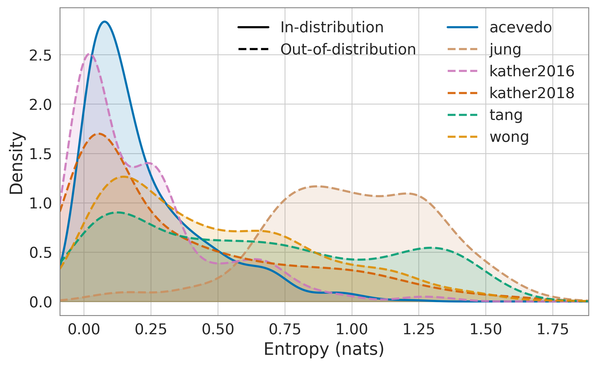
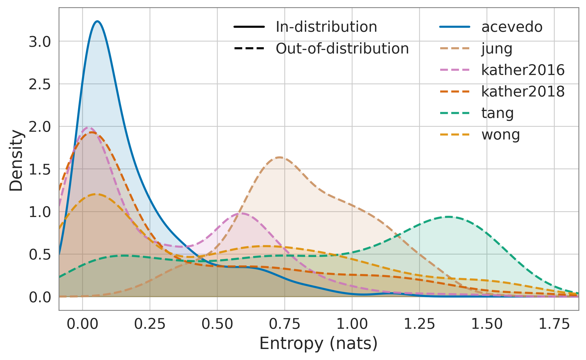
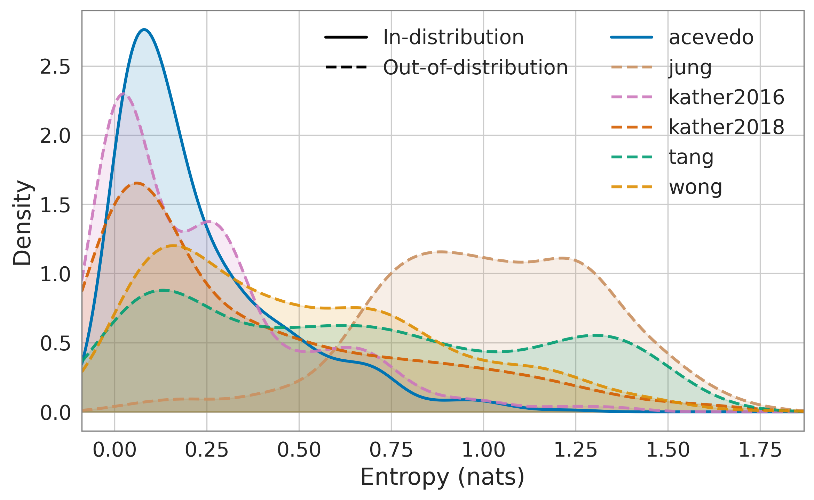
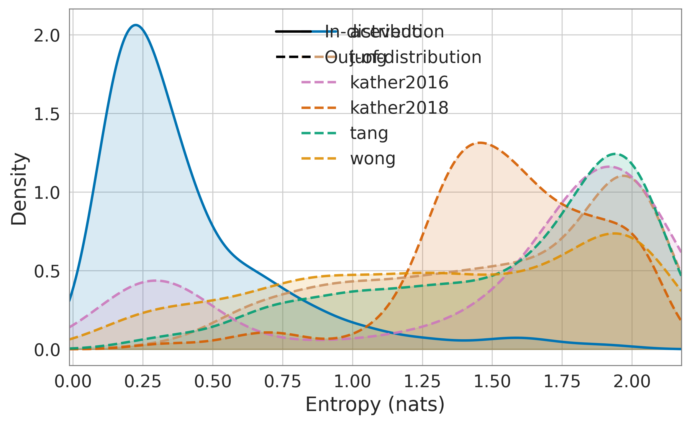
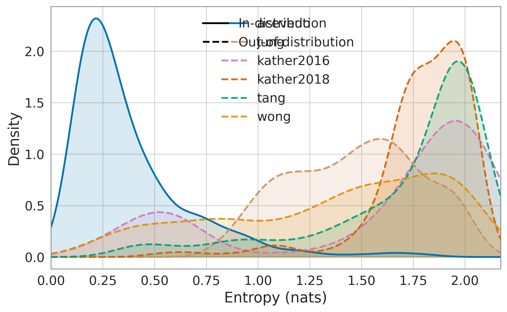
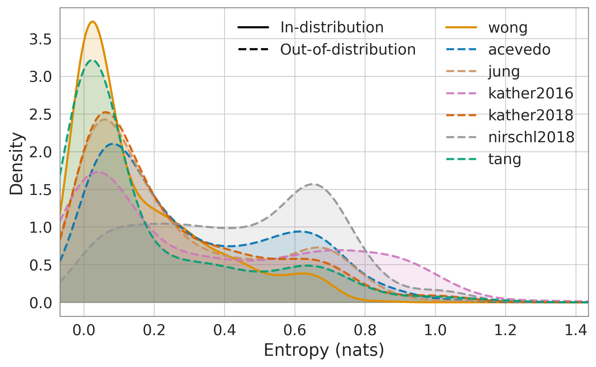
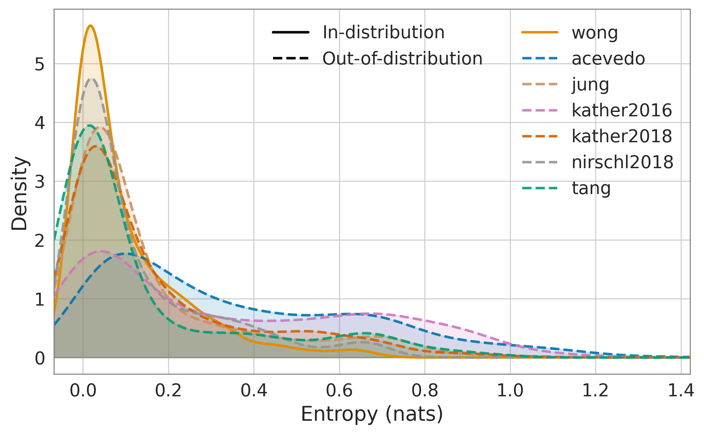
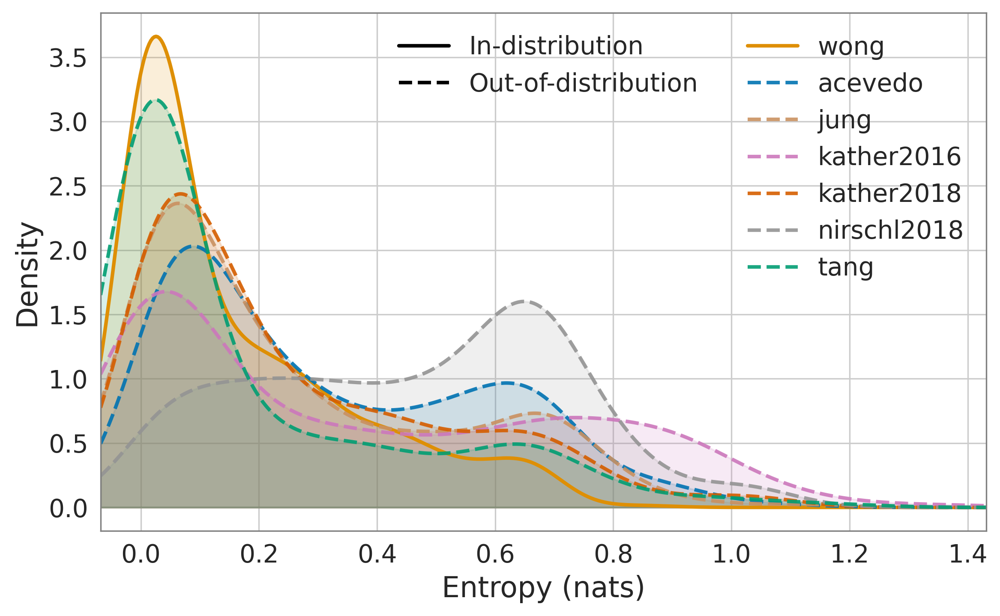
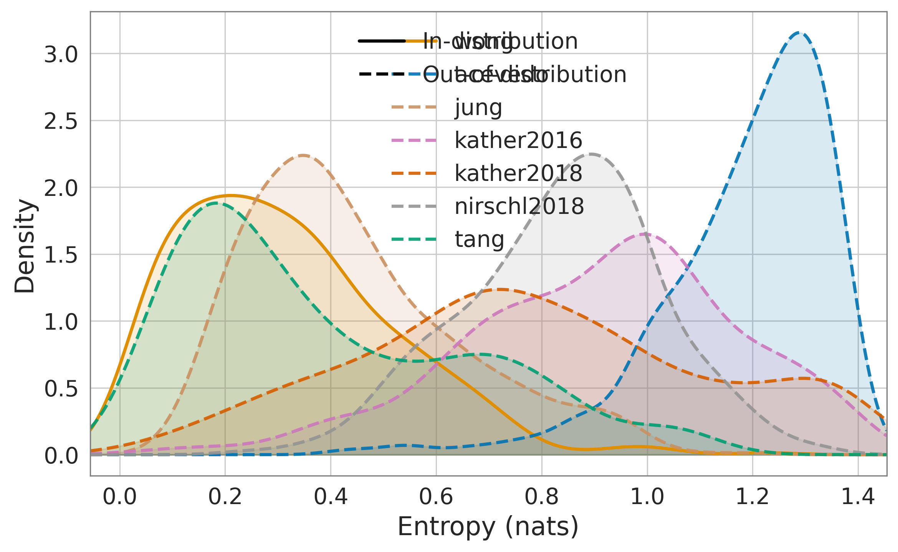
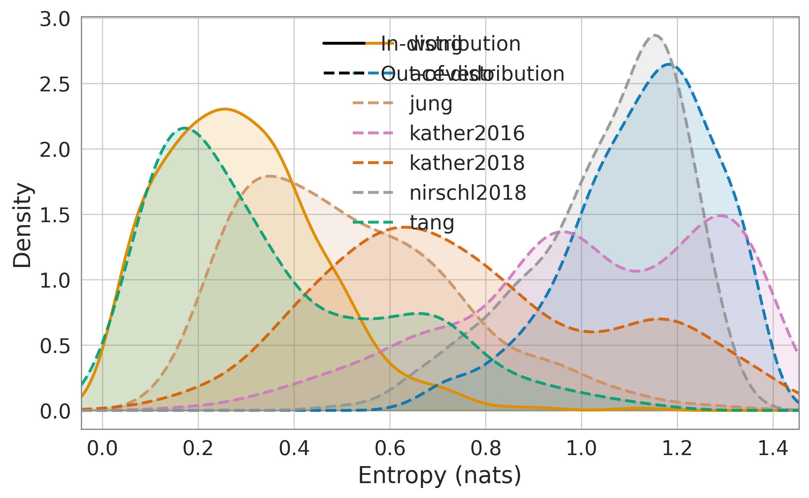

# In-Distribution 

### Acevedo
| Model | Accuracy ↑ | Precision ↑ | Recall ↑ | F1 ↑ | AUROC ↑ | AUPRC ↑ | ECE (×10⁻²) ↓ | NLL (×10⁻²) ↓ | Brier (×10⁻²) ↓ | Precision (Micro) ↑ | Recall (Micro) ↑ | F1 (Micro) ↑ |
|---|---:|---:|---:|---:|---:|---:|---:|---:|---:|---:|---:|---:|
| Baseline Classifier | 0.9813 | 0.9798 | 0.9814 | 0.9804 | 0.9996 | 0.9978 | 4.5967 | 9.4385 | 3.7386 | 0.9813 | 0.9813 | 0.9813 |
| Deep Ensemble | **0.9889** | **0.9880** | **0.9888** | **0.9884** | **0.9999** | **0.9990** | **4.0026** | **6.8317** | **2.5308** | **0.9889** | **0.9889** | **0.9889** |
| Monte Carlo Dropout | 0.9816 | 0.9802 | 0.9819 | 0.9808 | 0.9996 | 0.9978 | 4.7886 | 9.5676 | 3.7790 | 0.9816 | 0.9816 | 0.9816 |
| SNGP | 0.9819 | 0.9819 | 0.9792 | 0.9803 | 0.9994 | 0.9963 | 7.6791 | 12.9793 | 4.1757 | 0.9819 | 0.9819 | 0.9819 |
| SNGP Ensemble | 0.9880 | 0.9870 | 0.9878 | 0.9874 | 0.9997 | 0.9981 | 7.3047 | 10.8912 | 3.2163 | 0.9880 | 0.9880 | 0.9880 |

### Wong (All institutions)
| Model | Accuracy ↑ | Precision ↑ | Recall ↑ | F1 ↑ | AUROC ↑ | AUPRC ↑ | ECE (×10⁻²) ↓ | NLL (×10⁻²) ↓ | Brier (×10⁻²) ↓ | Precision (Micro) ↑ | Recall (Micro) ↑ | F1 (Micro) ↑ |
|---|---:|---:|---:|---:|---:|---:|---:|---:|---:|---:|---:|---:|
| Baseline Classifier | 0.9818 | 0.9820 | 0.9818 | 0.9817 | 0.9981 | 0.9953 | 3.4511 | 8.0095 | 3.6862 | 0.9818 | 0.9818 | 0.9818 |
| Deep Ensemble | **0.9924** | **0.9925** | **0.9924** | **0.9923** | **0.9996** | **0.9989** | **2.3860** | **4.3133** | **1.5861** | **0.9924** | **0.9924** | **0.9924** |
| Monte Carlo Dropout | 0.9818 | 0.9821 | 0.9818 | 0.9817 | 0.9981 | 0.9953 | 3.5365 | 8.0981 | 3.7131 | 0.9818 | 0.9818 | 0.9818 |
| SNGP | 0.9878 | 0.9879 | 0.9878 | 0.9878 | 0.9991 | 0.9977 | 8.8451 | 12.1092 | 4.3607 | 0.9878 | 0.9878 | 0.9878 |
| SNGP Ensemble | 0.9904 | 0.9905 | 0.9904 | 0.9903 | 0.9996 | 0.9989 | 8.0570 | 10.5483 | 3.3336 | 0.9904 | 0.9904 | 0.9904 |

### Wong (UC Davis)
| Model | Accuracy ↑ | Precision ↑ | Recall ↑ | F1 ↑ | AUROC ↑ | AUPRC ↑ | ECE (×10⁻²) ↓ | NLL (×10⁻²) ↓ | Brier (×10⁻²) ↓ | Precision (Micro) ↑ | Recall (Micro) ↑ | F1 (Micro) ↑ |
|---|---:|---:|---:|---:|---:|---:|---:|---:|---:|---:|---:|---:|
| Baseline Classifier | 0.9881 | 0.9888 | 0.9860 | 0.9874 | 0.9988 | 0.9969 | 8.2786 | 11.6170 | 4.8461 | 0.9881 | 0.9881 | 0.9881 |
| Deep Ensemble | 0.9899 | 0.9923 | 0.9874 | 0.9897 | 0.9992 | 0.9982 | 7.1133 | 9.7708 | 3.5234 | 0.9899 | 0.9899 | 0.9899 |
| Monte Carlo Dropout | 0.9871 | 0.9878 | 0.9852 | 0.9864 | 0.9988 | 0.9970 | 8.2584 | 11.6993 | 4.8764 | 0.9871 | 0.9871 | 0.9871 |
| SNGP | 0.9827 | 0.9845 | 0.9800 | 0.9821 | 0.9983 | 0.9957 | 5.6070 | 9.7136 | 3.7980 | 0.9827 | 0.9827 | 0.9827 |
| SNGP Ensemble | **0.9910** | **0.9926** | **0.9889** | **0.9906** | **0.9997** | **0.9991** | **3.5961** | **5.8695** | **1.8979** | **0.9910** | **0.9910** | **0.9910** |

---

# Out-of-Distribution (OOD) settings

Reported OOD-detection numbers use entropy AUROC: the normalized Shannon entropy of
the full predicted class-probability vector, `H(p) / log(K)` for `K` classes, used
directly as the uncertainty score (higher entropy = more OOD-like, no inversion
needed). This differs from max-softmax-probability (MSP), which looks only at the
top predicted class's probability (`1 - max(p)` as the uncertainty score) and
ignores how probability mass is spread over the remaining classes. MSP-based tables
for the same runs are kept in [subdocs/OOD_MSP_AUROC.md](subdocs/OOD_MSP_AUROC.md) for
reference.

### Model Trained on Acevedo and Tested on other datasets

**Entropy AUROC ↑**
| Model | Jung | Kather2016 | Kather2018 | Nirschl2018 | Tang | Wong |
|---|---:|---:|---:|---:|---:|---:|
| Baseline Classifier | 0.9700 ± 0.0018 | 0.4382 ± 0.0053 | 0.5107 ± 0.0111 | 0.0573 ± 0.0018 | 0.6533 ± 0.0111 | 0.7280 ± 0.0079 |
| Deep Ensemble | 0.9633 ± 0.0026 | 0.5321 ± 0.0038 | 0.4255 ± 0.0122 | 0.0494 ± 0.0016 | 0.8487 ± 0.0088 | 0.6285 ± 0.0135 |
| Monte Carlo Dropout | 0.9705 ± 0.0018 | 0.4586 ± 0.0053 | 0.5203 ± 0.0109 | 0.0664 ± 0.0019 | 0.6620 ± 0.0109 | 0.7412 ± 0.0074 |
| SNGP | 0.9649 ± 0.0018 | 0.8894 ± 0.0019 | 0.9801 ± 0.0026 | 0.9973 ± 0.0009 | 0.9709 ± 0.0029 | 0.9230 ± 0.0056 |
| SNGP Ensemble | **0.9865 ± 0.0015** | **0.9494 ± 0.0009** | **0.9952 ± 0.0006** | **0.9999 ± 0.0001** | **0.9904 ± 0.0013** | **0.9486 ± 0.0029** |

### Model Trained on Wong (All institutions) and Tested on other datasets

**Entropy AUROC ↑**
| Model | Acevedo | Jung | Kather2016 | Kather2018 | Nirschl2018 | Tang |
|---|---:|---:|---:|---:|---:|---:|
| Baseline Classifier | 0.7229 ± 0.0104 | 0.6529 ± 0.0069 | 0.6548 ± 0.0045 | 0.6573 ± 0.0154 | 0.8252 ± 0.0054 | 0.3716 ± 0.0052 |
| Deep Ensemble | 0.8087 ± 0.0036 | 0.5983 ± 0.0060 | 0.6833 ± 0.0030 | 0.5875 ± 0.0113 | 0.5140 ± 0.0052 | 0.3152 ± 0.0083 |
| Monte Carlo Dropout | 0.7281 ± 0.0103 | 0.6588 ± 0.0070 | 0.6614 ± 0.0045 | 0.6638 ± 0.0155 | 0.8316 ± 0.0054 | 0.3734 ± 0.0052 |
| SNGP | 0.9974 ± 0.0004 | 0.6851 ± 0.0064 | 0.9587 ± 0.0012 | 0.9000 ± 0.0068 | 0.9648 ± 0.0018 | **0.4606 ± 0.0101** |
| SNGP Ensemble | **0.9989 ± 0.0003** | **0.7938 ± 0.0051** | **0.9808 ± 0.0006** | **0.9360 ± 0.0054** | **0.9974 ± 0.0003** | 0.4095 ± 0.0059 |

**Notes.** For each in-distribution/OOD dataset pair, AUROC is computed by treating
the in-distribution predictions as the negative class and the OOD predictions as
the positive class, using entropy as the decision score. To obtain a mean and
standard deviation rather than a single estimate, this is repeated over 10 fixed
random seeds, each time subsampling up to 1,000 rows without replacement from the
full test-set predictions of each dataset; sampling is independent for every
in-distribution/OOD pair.

---

# Different Scanner: Distribution shift due to different Institution
### Model Trained on Wong (ucdavis) and Tested Wong - upitt, utsouthwestern, Tang-ucdavis

---

# Artifact Simulation: Testing under the influence of artifacts

Simulation has two independent axes — **config** (real artifact cutouts pasted onto the
image) and **procedural** (acquisition degradations: stain shift, blur, noise,
compression, geometry) — see [DATASETS.md](DATASETS.md#artifact-robustness-evaluation).
Each is tested here with the other axis switched off, so a drop can be attributed to one
axis rather than to "simulation" generically. Every table below is computed on the
artifact/corrupted stream alone (Accuracy, Brier, NLL, mean entropy, the ECE-variant
calibration metrics, and the risk-coverage/selective-classification metrics) except OOD
Detection, which is inherently a real-vs-artifact comparison: `AUROC (Entropy)` is how
well the model's own predictive entropy separates real from artifact-affected inputs (0.5
= no better than chance), with AUPR/FPR95 alongside it in the same framing. Real/
in-distribution numbers for these same checkpoints (Accuracy, ECE, Brier, ...) are in the
"In-Distribution" section at the top of this document and are not repeated here. Each axis
renders as a 2x2 grid — Classification (top-left), Calibration (top-right), OOD Detection
(bottom-left), Selective Classification (bottom-right) — computed from each run's
`predictions.csv`/`metrics.json`, paths in
[MASTER_INFER_RESULTS_PATH.md](MASTER_INFER_RESULTS_PATH.md).
Every row but Monte Carlo Dropout is bit-reproducible run to run (the simulator's own seed
is content-derived, see DATASETS.md); MC-Dropout draws a fresh random mask per forward pass
with no pinned seed, so its numbers drift by less than ~0.1pp between identical reruns --
noise, not a finding.

### Model Trained on Acevedo and tested with different artifact secnarios

**Config axis — one pasted artifact overlay (`count=1`, `artifact_balanced`, procedural off)**

<table>
<tr>
<td valign="top">

**Classification (Artifact)**

| Model | Accuracy (Artifact) ↑ | Precision ↑ | Recall ↑ | F1 ↑ | Brier (×10⁻²) ↓ | NLL (×10⁻²) ↓ | Mean Entropy |
|---|---:|---:|---:|---:|---:|---:|---:|
| Baseline Classifier | 0.7672 | 0.7846 | 0.7616 | 0.7604 | 37.00 | 123.54 | 0.1813 |
| Deep Ensemble | 0.7727 | 0.8003 | 0.7609 | 0.7704 | 35.75 | 115.69 | 0.1762 |
| Monte Carlo Dropout | 0.7660 | 0.7836 | 0.7599 | 0.7590 | 36.93 | 122.07 | 0.1854 |
| SNGP | 0.7839 | **0.8175** | 0.7609 | 0.7785 | 32.04 | 77.78 | 0.3223 |
| SNGP Ensemble | **0.7856** | 0.8113 | **0.7686** | **0.7816** | **29.61** | **70.54** | 0.3467 |

</td>
<td valign="top">

**Selective Classification (Artifact)**

| Model | AURC (×10⁻²) ↓ | AUGRC (×10⁻²) ↓ | Cov@5%Risk ↑ | Risk@80%Cov (×10⁻²) ↓ |
|---|---:|---:|---:|---:|
| Baseline Classifier | 16.75 | 7.21 | — | 14.25 |
| Deep Ensemble | 16.71 | 7.16 | — | 13.52 |
| Monte Carlo Dropout | 16.64 | 7.17 | — | 14.22 |
| SNGP | 7.03 | 5.08 | 0.4773 | 12.17 |
| SNGP Ensemble | **5.23** | **4.17** | **0.6692** | **10.23** |

</td>
</tr>
<tr>
<td valign="top">

**OOD Detection — Real vs. Artifact**

| Model | AUROC (Entropy) ↑ | AUPR (Entropy) ↑ | FPR95 (Entropy) ↓ |
|---|---:|---:|---:|
| Baseline Classifier | 0.6124 | 0.6590 | 0.9456 |
| Deep Ensemble | 0.6168 | 0.6737 | 0.9538 |
| Monte Carlo Dropout | 0.6137 | 0.6605 | 0.9476 |
| SNGP | 0.6428 | 0.6796 | 0.9169 |
| SNGP Ensemble | **0.6755** | **0.7259** | **0.9076** |

</td>
<td valign="top">

**Calibration (Artifact)**

| Model | ECE (Artifact) (×10⁻²) ↓ | ECE+ (×10⁻²) ↓ | ECE− (×10⁻²) ↓ | MCE (×10⁻²) ↓ | SmECE (×10⁻²) ↓ | aECE (×10⁻²) ↓ |
|---|---:|---:|---:|---:|---:|---:|
| Baseline Classifier | 10.53 | 10.52 | 0.00 | 100.00 | 8.96 | 10.52 |
| Deep Ensemble | 10.11 | 10.11 | **0.00** | 100.00 | 9.06 | 10.11 |
| Monte Carlo Dropout | 10.38 | 10.38 | 0.00 | 100.00 | 8.87 | 10.38 |
| SNGP | **3.06** | 2.50 | 0.56 | **9.18** | 3.33 | 3.55 |
| SNGP Ensemble | 3.48 | **1.56** | 1.91 | 16.65 | **3.26** | **3.42** |

</td>
</tr>
</table>

**Procedural axis — one graded acquisition degradation (`severity=1`, `procedural_ood`, config off)**

<table>
<tr>
<td valign="top">

**Classification (Artifact)**

| Model | Accuracy (Artifact) ↑ | Precision ↑ | Recall ↑ | F1 ↑ | Brier (×10⁻²) ↓ | NLL (×10⁻²) ↓ | Mean Entropy |
|---|---:|---:|---:|---:|---:|---:|---:|
| Baseline Classifier | 0.9786 | 0.9769 | 0.9790 | 0.9777 | 4.08 | 10.16 | 0.1100 |
| Deep Ensemble | **0.9883** | **0.9872** | **0.9879** | **0.9875** | **2.76** | **7.45** | 0.0919 |
| Monte Carlo Dropout | 0.9786 | 0.9769 | 0.9790 | 0.9777 | 4.12 | 10.34 | 0.1129 |
| SNGP | 0.9801 | 0.9794 | 0.9782 | 0.9786 | 4.60 | 13.86 | 0.1931 |
| SNGP Ensemble | 0.9874 | 0.9868 | 0.9868 | 0.9867 | 3.45 | 11.46 | 0.1765 |

</td>
<td valign="top">

**Selective Classification (Artifact)**

| Model | AURC (×10⁻²) ↓ | AUGRC (×10⁻²) ↓ | Cov@5%Risk ↑ | Risk@80%Cov (×10⁻²) ↓ |
|---|---:|---:|---:|---:|
| Baseline Classifier | 0.14 | 0.11 | **1.0000** | 0.07 |
| Deep Ensemble | **0.07** | **0.05** | 1.0000 | **0.04** |
| Monte Carlo Dropout | 0.15 | 0.12 | 1.0000 | 0.07 |
| SNGP | 0.16 | 0.13 | 1.0000 | 0.22 |
| SNGP Ensemble | 0.09 | 0.07 | 1.0000 | 0.11 |

</td>
</tr>
<tr>
<td valign="top">

**OOD Detection — Real vs. Artifact**

| Model | AUROC (Entropy) ↑ | AUPR (Entropy) ↑ | FPR95 (Entropy) ↓ |
|---|---:|---:|---:|
| Baseline Classifier | 0.5136 | 0.5144 | 0.9512 |
| Deep Ensemble | **0.5205** | **0.5177** | 0.9436 |
| Monte Carlo Dropout | 0.5136 | 0.5146 | 0.9517 |
| SNGP | 0.5125 | 0.5105 | 0.9471 |
| SNGP Ensemble | 0.5147 | 0.5118 | **0.9424** |

</td>
<td valign="top">

**Calibration (Artifact)**

| Model | ECE (Artifact) (×10⁻²) ↓ | ECE+ (×10⁻²) ↓ | ECE− (×10⁻²) ↓ | MCE (×10⁻²) ↓ | SmECE (×10⁻²) ↓ | aECE (×10⁻²) ↓ |
|---|---:|---:|---:|---:|---:|---:|
| Baseline Classifier | 4.75 | 0.01 | 4.74 | **17.53** | 4.60 | 4.74 |
| Deep Ensemble | **4.39** | 0.02 | **4.37** | 37.62 | **4.17** | **4.35** |
| Monte Carlo Dropout | 4.94 | 0.02 | 4.92 | 38.92 | 4.80 | 4.90 |
| SNGP | 7.96 | **0.00** | 7.96 | 80.15 | 7.96 | 7.96 |
| SNGP Ensemble | 7.57 | 0.00 | 7.57 | 63.84 | 7.57 | 7.57 |

</td>
</tr>
</table>

At these settings, a single pasted artifact overlay drops accuracy roughly 80-100x more
than one mild graded acquisition degradation (compare each Classification quadrant's
Accuracy (Artifact) above against the same checkpoint's Accuracy in the In-Distribution
section) — SNGP and its ensemble are the most robust to pasted artifacts and the best at
flagging them via entropy, but that separation mostly disappears on the procedural axis,
where every model stays close to its real-stream accuracy. Calibration tells a different
story from accuracy: on the config axis, SNGP's and SNGP Ensemble's ECE actually *improves*
under artifacts relative to their In-Distribution ECE (7.68→3.06, 7.30→3.48) even as their
accuracy drops ~20pp — they get more uncertain in roughly the right proportion to how much
worse they're doing — while the baseline-family models' ECE more than doubles
(4.0-4.7→10.1-10.5), i.e. they stay overconfident on inputs they're now getting wrong. On
the procedural axis, ECE barely moves for any model, consistent with the accuracy numbers.
See the Classification/Selective-Classification/OOD-Detection/Calibration grid above for
additional diagnostics (Accuracy/Precision/Recall/F1, AURC/AUGRC/Cov@5%Risk/Risk@80%Cov,
AUPR/FPR95, ECE+/ECE−/MCE/SmECE/aECE) computed on the artifact stream alone.

### Model Trained on Wong and tested with different artifact secnarios

---

# Data visualization

### entropy plots

Predictive-entropy KDE per model, trained on Acevedo and evaluated across all
datasets (in-distribution vs. out-of-distribution).

<table>
<tr>
<td align="center" width="20%">
 
Baseline
</td>
<td align="center" width="20%">
 
Deep Ensemble
</td>
<td align="center" width="20%">
 
MC Dropout
</td>
<td align="center" width="20%">
 
SNGP
</td>
<td align="center" width="20%">
 
SNGP Ensemble
</td>
</tr>
</table>

Predictive-entropy KDE per model, trained on Wong (all institutions) and
evaluated across all datasets (in-distribution vs. out-of-distribution).

<table>
<tr>
<td align="center" width="20%">
 
Baseline
</td>
<td align="center" width="20%">
 
Deep Ensemble
</td>
<td align="center" width="20%">
 
MC Dropout
</td>
<td align="center" width="20%">
 
SNGP
</td>
<td align="center" width="20%">
 
SNGP Ensemble
</td>
</tr>
</table>

**Notes.** For each dataset, 500 predictions are sampled class-balanced by label
(seed 42), and per-sample predictive entropy is computed in nats from the
predicted class-probability vector. The resulting per-dataset entropy
distributions are visualized as kernel density estimates (Scott's rule bandwidth)
over a shared x-range, with the in-distribution dataset drawn as a solid line and
OOD datasets as dashed lines.
