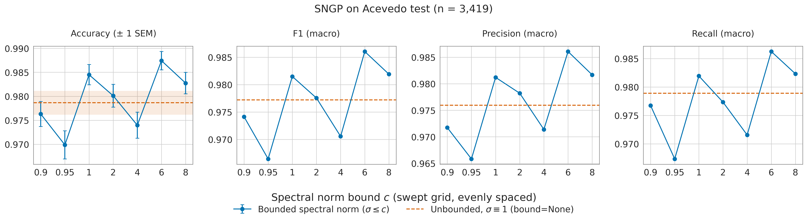

# Acevedo — post-correction results, pre- vs post-calibration

Corrected protocol: canonical SNGP head (Liu et al. 2020), plain cross-entropy,
checkpoint and early-stopping selection on `val/nll_cal`, W&B re-sweep hyperparameters.
Trained 2026-09-17 on branch `sngp-corrections`. SNGP used `spectral_norm_bound: 4.0`.

**Not comparable with [../RESULTS.md](../RESULTS.md)'s Acevedo rows** — those used
class-balanced focal loss, hard spectral normalization and `val/auprc_best` selection.
See [../KNOWN_ISSUES.md](../KNOWN_ISSUES.md).

Deep Ensemble and SNGP Ensemble are absent: no members trained under this protocol yet.
Monte Carlo Dropout is the Baseline checkpoint at `infer.runtime.use_mc_dropout=true`,
10 passes, inheriting the Baseline's temperature.

Checkpoints: [../MASTER_CHECKPONT_PATHS.md](../MASTER_CHECKPONT_PATHS.md). Inference
output directories and reproduce commands:
[../MASTER_INFER_RESULTS_PATH.md](../MASTER_INFER_RESULTS_PATH.md).

---

## Fitted calibration knobs

One post-hoc scalar per family, fit by minimizing validation NLL with
`scripts/checkpoints/calibrate_checkpoint.py` (n = 1,709). Both divide every logit of an
example by one positive scalar, so accuracy and macro-F1 cannot move.

| Family | Knob | Before | Fitted | val NLL | val smECE |
|---|---|---:|---:|---|---|
| Baseline / MC-Dropout | `temperature` | 1.0 | 0.9782 | 0.05099 → 0.05097 | 0.02602 → 0.02447 |
| SNGP | `mean_field_factor` | 1.0 | 0.0 | 0.04898 → 0.04751 | 0.01555 → 0.01748 |

Both fits match the `val/nll_cal` each run's `ModelCheckpoint` recorded during training
(0.05097, 0.04748). SNGP's fitted factor of 0.0 switches the mean-field correction off
entirely; the OOD cost of that is measured below.

---

## In-distribution — Acevedo test split (n = 3,419)

### Pre-calibration (`best.ckpt`)

| Model | Accuracy ↑ | Precision ↑ | Recall ↑ | F1 ↑ | AUROC ↑ | AUPRC ↑ | ECE (×10⁻²) ↓ | NLL (×10⁻²) ↓ | Brier (×10⁻²) ↓ |
|---|---:|---:|---:|---:|---:|---:|---:|---:|---:|
| Baseline Classifier | 0.9784 | 0.9767 | 0.9759 | 0.9762 | **0.9996** | **0.9968** | 0.5318 | 6.2941 | **3.2203** |
| Monte Carlo Dropout | **0.9789** | **0.9779** | **0.9766** | **0.9771** | 0.9996 | 0.9967 | **0.5149** | **6.2836** | 3.2324 |
| SNGP | 0.9763 | 0.9743 | 0.9723 | 0.9730 | 0.9993 | 0.9944 | 0.5811 | 7.5652 | 3.6572 |

### Post-calibration (`best.calibrated.ckpt`)

| Model | Accuracy ↑ | Precision ↑ | Recall ↑ | F1 ↑ | AUROC ↑ | AUPRC ↑ | ECE (×10⁻²) ↓ | NLL (×10⁻²) ↓ | Brier (×10⁻²) ↓ |
|---|---:|---:|---:|---:|---:|---:|---:|---:|---:|
| Baseline Classifier | 0.9784 | 0.9767 | 0.9759 | 0.9762 | **0.9996** | 0.9967 | 0.6427 | 6.3162 | **3.2203** |
| Monte Carlo Dropout | 0.9784 | **0.9772** | **0.9760** | **0.9765** | 0.9996 | 0.9967 | **0.5173** | **6.2932** | 3.2230 |
| SNGP | 0.9763 | 0.9743 | 0.9723 | 0.9730 | 0.9993 | **0.9945** | 0.6715 | 7.6193 | 3.6581 |

Post-hoc calibration slightly degrades test calibration here rather than improving it —
the knob is inert for Acevedo, not helpful. Accuracy/precision/recall/F1 are
bit-identical pre/post except for MC-Dropout, whose 10 random masks resample each run
(0.9789 → 0.9784, 2 images, well under the accuracy SEM of 0.0025).

---

## Out-of-distribution — trained on Acevedo, tested on other datasets

Primary score: **entropy AUROC**, normalized Shannon entropy `H(p)/log(K)` over the full
predicted class-probability vector. In-distribution is the negative class, OOD positive.

### Entropy AUROC ↑ — pre-calibration

| Model | Jung | Kather2016 | Kather2018 | Nirschl2018 | Tang | Wong |
|---|---:|---:|---:|---:|---:|---:|
| Baseline Classifier | 0.9324 ± 0.0029 | 0.4518 ± 0.0056 | 0.4327 ± 0.0124 | 0.3059 ± 0.0048 | 0.7390 ± 0.0109 | 0.6705 ± 0.0119 |
| Monte Carlo Dropout | 0.9363 ± 0.0028 | 0.4805 ± 0.0056 | 0.4442 ± 0.0123 | 0.3465 ± 0.0053 | 0.7490 ± 0.0110 | 0.6848 ± 0.0115 |
| SNGP | **0.9949 ± 0.0009** | **0.9478 ± 0.0026** | **0.9574 ± 0.0027** | **0.9975 ± 0.0009** | **0.9917 ± 0.0013** | **0.9482 ± 0.0036** |

### Entropy AUROC ↑ — post-calibration

| Model | Jung | Kather2016 | Kather2018 | Nirschl2018 | Tang | Wong |
|---|---:|---:|---:|---:|---:|---:|
| Baseline Classifier | 0.9320 ± 0.0029 | 0.4518 ± 0.0056 | 0.4328 ± 0.0124 | 0.3063 ± 0.0048 | 0.7388 ± 0.0109 | 0.6703 ± 0.0119 |
| Monte Carlo Dropout | 0.9364 ± 0.0029 | 0.4835 ± 0.0056 | 0.4448 ± 0.0126 | 0.3467 ± 0.0054 | 0.7489 ± 0.0107 | 0.6842 ± 0.0120 |
| SNGP | **0.9928 ± 0.0010** | **0.9369 ± 0.0028** | **0.9431 ± 0.0033** | **0.9947 ± 0.0016** | **0.9853 ± 0.0017** | **0.9333 ± 0.0039** |

SNGP separates every OOD dataset; Baseline and MC-Dropout separate only Jung and fall
below 0.5 on Kather2016/Kather2018/Nirschl2018 — worse than uninformative. Calibration
costs SNGP about 1 AUROC point and leaves the softmax methods unchanged.

### Max-softmax-probability (MSP) AUROC ↑ — secondary

Uncertainty score `1 - max(p)`; ignores how the remaining mass is spread, so entropy
above is primary. Compare with [../subdocs/OOD_MSP_AUROC.md](../subdocs/OOD_MSP_AUROC.md).

**Pre-calibration**

| Model | Jung | Kather2016 | Kather2018 | Nirschl2018 | Tang | Wong |
|---|---:|---:|---:|---:|---:|---:|
| Baseline Classifier | 0.9266 ± 0.0033 | 0.4575 ± 0.0058 | 0.4401 ± 0.0121 | 0.3192 ± 0.0052 | 0.7381 ± 0.0107 | 0.6701 ± 0.0119 |
| Monte Carlo Dropout | 0.9300 ± 0.0033 | 0.4850 ± 0.0055 | 0.4502 ± 0.0121 | 0.3578 ± 0.0053 | 0.7480 ± 0.0108 | 0.6841 ± 0.0114 |
| SNGP | **0.9892 ± 0.0013** | **0.9340 ± 0.0034** | **0.9452 ± 0.0035** | **0.9801 ± 0.0033** | **0.9827 ± 0.0020** | **0.9377 ± 0.0042** |

**Post-calibration**

| Model | Jung | Kather2016 | Kather2018 | Nirschl2018 | Tang | Wong |
|---|---:|---:|---:|---:|---:|---:|
| Baseline Classifier | 0.9263 ± 0.0033 | 0.4593 ± 0.0057 | 0.4425 ± 0.0125 | 0.3231 ± 0.0056 | 0.7381 ± 0.0108 | 0.6703 ± 0.0119 |
| Monte Carlo Dropout | 0.9305 ± 0.0033 | 0.4891 ± 0.0057 | 0.4523 ± 0.0125 | 0.3599 ± 0.0059 | 0.7480 ± 0.0105 | 0.6837 ± 0.0120 |
| SNGP | **0.9865 ± 0.0016** | **0.9218 ± 0.0040** | **0.9320 ± 0.0041** | **0.9675 ± 0.0040** | **0.9754 ± 0.0025** | **0.9229 ± 0.0046** |

---

## Spectral norm bound ablation — Acevedo test split (n = 3,419)

SNGP only, sweeping `model.net.spectral_norm_bound` (`c`, Liu et al. 2022 eq. 15),
everything else at `experiment=sngp_acevedo`, seed 12345 throughout. Uncalibrated
`best.ckpt` — no post-hoc knob can move these four metrics.

*Acevedo test metrics vs. `c`. Bounds are drawn at even spacing, not to scale. The dashed
line is the unbounded (`σ ≡ 1`) run. Error bars are ±1 SEM and appear on accuracy only:
macro precision/recall/F1 are count-based and have no per-sample dispersion.*

| `spectral_norm_bound` | Accuracy ↑ | F1 ↑ | Precision ↑ | Recall ↑ |
|---|---:|---:|---:|---:|
| 0.9 | 0.9763 ± 0.0026 | 0.9741 | 0.9717 | 0.9767 |
| 0.95 | 0.9699 ± 0.0029 | 0.9664 | 0.9658 | 0.9673 |
| 1.0 | 0.9845 ± 0.0021 | 0.9815 | 0.9812 | 0.9819 |
| 2.0 | 0.9801 ± 0.0024 | 0.9775 | 0.9782 | 0.9773 |
| 4.0 (pinned) | 0.9740 ± 0.0027 | 0.9705 | 0.9714 | 0.9716 |
| **6.0** (family default) | **0.9874 ± 0.0019** | **0.9860** | **0.9861** | **0.9862** |
| 8.0 | 0.9827 ± 0.0022 | 0.9819 | 0.9817 | 0.9823 |
| None (unbounded, σ ≡ 1) | 0.9786 ± 0.0025 | 0.9772 | 0.9760 | 0.9789 |

**`c = 1.0` and `None` impose the same constraint on these checkpoints, so their gap is
the noise floor.** A float `c` rescales a weight only when `σ̂ > c` while `None` always
divides by `σ̂` — a real difference in general, but every wrapped layer here has `σ̂`
between 27 and 414, so the `c = 1.0` clamp binds everywhere and both configurations give
`σ(W_eff) = 1.0000` across all 20 layers. The pair is therefore an accidental duplicate
run, and its 0.0059 accuracy gap is a direct measurement of run-to-run variation:
`deterministic: false`, TF32 matmuls and three concurrent GPU lanes mean a shared seed
does not make two runs of one configuration identical.

That noise floor is ~2.4× the within-checkpoint SEM and covers a third of the sweep's
entire 0.0175 spread. All four metrics zig-zag together across the grid, consistent with
that variation rather than with a response to `c`, and no `c` should be read off this
grid. `c = 4.0`, the value pinned in `configs/experiment/sngp_acevedo.yaml`, is last on
test accuracy and second-worst on the selection metric `val/nll_cal_best` (0.0880 vs
0.0536 at `c = 6.0`). That pin came from the W&B re-sweep, which varied other
hyperparameters jointly, so this is not on its own grounds to re-pin — settling it needs
multiple seeds per bound.

---

## Notes

- **AUROC dispersion** is resampling spread over the 10 fixed seeds in
  `src/metrics/auc.py`, each subsampling up to 1,000 rows from both prediction sets — not
  per-sample spread, which is why the in-distribution tables carry no ± on AUROC.
- **`metrics.json` dispersion**: only `acc`, `nll` and `brier` get `_std`/`_sem`. AUROC,
  AUPRC, ECE and macro-F1 are rank-, bin- or count-based and deliberately get none.
- **OOD datasets have no in-distribution metrics**: a different `num_classes` trips
  `infer.py`'s `_check_metric_compatibility`, which writes an empty `metrics.json`.
  `predictions.csv` is still written, which is all the label-free OOD AUROC needs.
- **Kather2016 needs care**: it has 8 classes, so the check passes and its `metrics.json`
  is populated with meaningless numbers. Only its `predictions.csv` is used here.
- **MC-Dropout's temperature** was fit on the deterministic forward pass, so it is
  approximately, not exactly, NLL-optimal for the mean-of-softmax predictive.
- **Fold policy**: `calculate_ood_metrics.py` ran without `--fold`; every run here is
  `fold=test`. This differs from `AUROC_across_dataset`'s `LEGACY_ISBI_FOLD_POLICY`,
  which filters the in-distribution frame only to keep published ISBI numbers reproducible.
