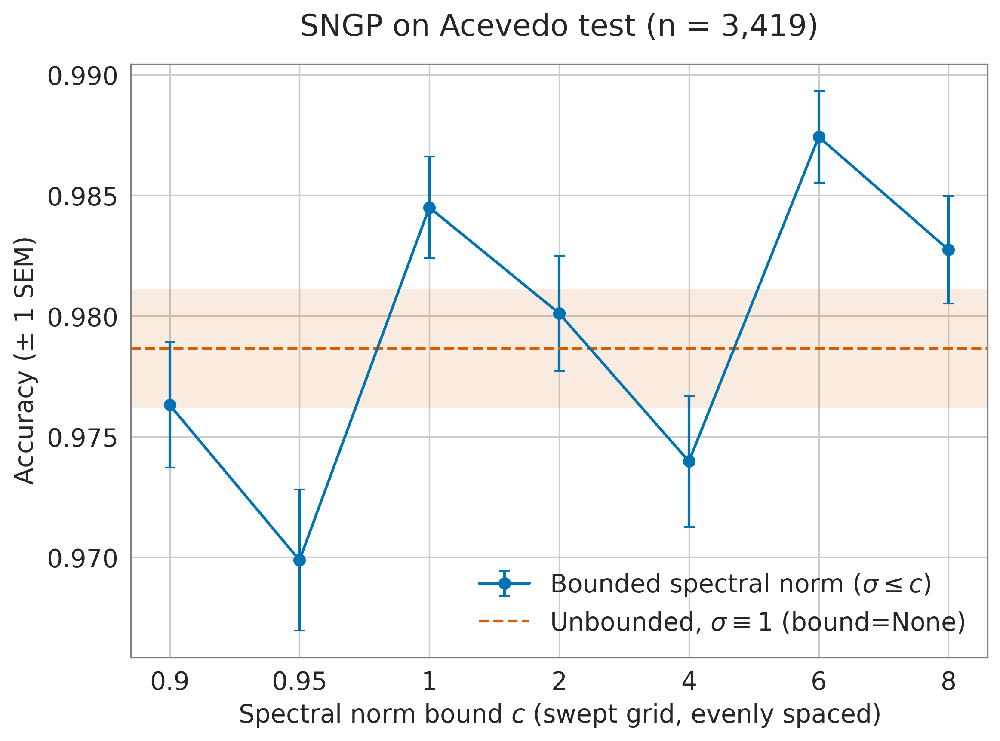

# Acevedo — post-correction results, pre- vs post-calibration

The first Acevedo runs on the corrected protocol: canonical SNGP head (Liu et al. 2020),
plain cross-entropy, checkpoint and early-stopping selection on `val/nll_cal`, and the
W&B re-sweep's hyperparameters. Trained 2026-09-17 on branch `sngp-corrections`.

**These numbers do not belong in the same table as [../RESULTS.md](../RESULTS.md)'s
Acevedo rows.** Those came from checkpoints trained with class-balanced focal loss, hard
spectral normalization and `val/auprc_best` selection — a different protocol, not a
different seed. See [../KNOWN_ISSUES.md](../KNOWN_ISSUES.md).

Three methods are reported. Deep Ensemble and SNGP Ensemble are absent because no
ensemble members have been trained under this protocol yet. Monte Carlo Dropout is not a
separate training run — it is the Baseline checkpoint evaluated with
`infer.runtime.use_mc_dropout=true` at the default 10 passes, so it inherits the
Baseline's fitted temperature.

Checkpoints: [../MASTER_CHECKPONT_PATHS.md](../MASTER_CHECKPONT_PATHS.md).
Inference output directories and reproduce commands:
[../MASTER_INFER_RESULTS_PATH.md](../MASTER_INFER_RESULTS_PATH.md).

The SNGP run was trained with `spectral_norm_bound: 4.0` (its re-sweep winner), now
pinned in `configs/experiment/sngp_acevedo.yaml`; the family default remains 6.0.

---

## Fitted calibration knobs

Each family has exactly one post-hoc scalar, fit by minimizing **validation** NLL with
`scripts/checkpoints/calibrate_checkpoint.py` (n = 1,709). Both knobs divide every logit
of an example by one positive scalar, so the argmax — and hence accuracy and macro-F1 —
cannot move.

| Family | Knob | Before | Fitted | val NLL | val smECE |
|---|---|---:|---:|---|---|
| Baseline / MC-Dropout | `temperature` | 1.0 | 0.9782 | 0.05099 → 0.05097 | 0.02602 → 0.02447 |
| SNGP | `mean_field_factor` | 1.0 | 0.0 | 0.04898 → 0.04751 | 0.01555 → 0.01748 |

Both fits land on the `val/nll_cal` each run's own `ModelCheckpoint` recorded during
training (0.05097 and 0.04748), which is the expected agreement — the offline fit and the
per-epoch selection metric solve the same problem on the same split.

Two things are worth stating plainly. The Baseline's temperature is 0.978, i.e. **within
2% of a no-op**: selecting on calibrated validation NLL already delivers a calibrated
model, leaving the post-hoc knob nothing to do. And SNGP's fitted mean-field factor is
**0.0** — minimizing in-distribution NLL switches the mean-field correction off entirely,
because on a validation set the model already classifies correctly, inflating variance
only costs log-likelihood. The consequences for OOD detection are measured below rather
than assumed.

---

## In-distribution — Acevedo test split (n = 3,419)

### Pre-calibration (`best.ckpt`)

| Model | Accuracy ↑ | Precision ↑ | Recall ↑ | F1 ↑ | AUROC ↑ | AUPRC ↑ | ECE (×10⁻²) ↓ | NLL (×10⁻²) ↓ | Brier (×10⁻²) ↓ |
|---|---:|---:|---:|---:|---:|---:|---:|---:|---:|
| Baseline Classifier | 0.9784 | 0.9767 | 0.9759 | 0.9762 | **0.9996** | **0.9968** | 0.5318 | 6.2941 | **3.2203** |
| Monte Carlo Dropout | **0.9789** | **0.9779** | **0.9766** | **0.9771** | 0.9996 | 0.9967 | **0.5149** | **6.2836** | 3.2324 |
| SNGP | 0.9763 | 0.9743 | 0.9723 | 0.9730 | 0.9993 | 0.9944 | 0.5811 | 7.5652 | 3.6572 |

### Post-calibration (`best.calibrated.ckpt`)

| Model | Accuracy ↑ | Precision ↑ | Recall ↑ | F1 ↑ | AUROC ↑ | AUPRC ↑ | ECE (×10⁻²) ↓ | NLL (×10⁻²) ↓ | Brier (×10⁻²) ↓ |
|---|---:|---:|---:|---:|---:|---:|---:|---:|---:|
| Baseline Classifier | 0.9784 | 0.9767 | 0.9759 | 0.9762 | **0.9996** | 0.9967 | 0.6427 | 6.3162 | **3.2203** |
| Monte Carlo Dropout | 0.9784 | **0.9772** | **0.9760** | **0.9765** | 0.9996 | 0.9967 | **0.5173** | **6.2932** | 3.2230 |
| SNGP | 0.9763 | 0.9743 | 0.9723 | 0.9730 | 0.9993 | **0.9945** | 0.6715 | 7.6193 | 3.6581 |

**Post-hoc calibration does not improve test calibration here; it very slightly degrades
it.** Baseline ECE goes 0.532 → 0.643 (×10⁻²) and NLL 6.294 → 6.316; SNGP 0.581 → 0.672
and 7.565 → 7.619. This is not a bug and not a contradiction of the validation fit: the
knob was chosen to minimize NLL on 1,709 validation images and is applied to 3,419
different test images, and when a model is already calibrated to within half a percent
the fit has no real signal left to capture — only the sampling difference between the two
splits. The honest reading is that under this protocol the post-hoc knob is inert for
Acevedo, not that it helps.

Accuracy, precision, recall and F1 are **bit-identical** pre/post for Baseline and SNGP,
as they must be. Monte Carlo Dropout is the one exception (0.9789 → 0.9784, a difference
of 2 images): its prediction averages 10 random dropout masks, so two runs differ by
sampling noise whatever the temperature. The gap is an order of magnitude below the
metric's own standard error (accuracy SEM ≈ 0.0025).

`metrics.json` additionally carries `_std`/`_sem` for `acc`, `nll` and `brier` — the only
three that are a mean over per-sample values. AUROC/AUPRC/ECE/macro-F1 are rank-, bin- or
count-based, have no per-sample decomposition, and deliberately get no dispersion.

---

## Spectral norm bound ablation — Acevedo test split (n = 3,419)

SNGP only, sweeping `model.net.spectral_norm_bound` (`c`, Liu et al. 2022 eq. 15) over
the 7-value grid plus the unbounded regime, everything else at `experiment=sngp_acevedo`
and seed 12345 throughout. Uncalibrated `best.ckpt`: both post-hoc knobs divide every
logit of an example by one positive scalar, so accuracy cannot move and no calibrated
checkpoints were needed for this figure.

*Acevedo test accuracy vs. `c`, ±1 SEM (binomial standard error over the 3,419 test
images). The dashed line and band are the unbounded run. Bounds are drawn at even
spacing, not to scale.*

| `spectral_norm_bound` | Accuracy ↑ | F1 ↑ | ECE (×10⁻²) ↓ | NLL (×10⁻²) ↓ | `val/nll_cal_best` ↓ |
|---|---:|---:|---:|---:|---:|
| 0.9 | 0.9763 ± 0.0026 | 0.9741 | 0.8028 | 6.9928 | 0.0748 |
| 0.95 | 0.9699 ± 0.0029 | 0.9664 | 0.5977 | 8.6203 | 0.0965 |
| 1.0 | 0.9845 ± 0.0021 | 0.9815 | 0.7211 | 5.2225 | 0.0567 |
| 2.0 | 0.9801 ± 0.0024 | 0.9775 | 0.5535 | 5.2299 | 0.0541 |
| 4.0 (pinned) | 0.9740 ± 0.0027 | 0.9705 | 0.6484 | 8.7620 | 0.0880 |
| **6.0** (family default) | **0.9874 ± 0.0019** | **0.9860** | **0.4485** | **4.5445** | **0.0536** |
| 8.0 | 0.9827 ± 0.0022 | 0.9819 | 0.4939 | 5.7015 | 0.0573 |
| None (unbounded, σ ≡ 1) | 0.9786 ± 0.0025 | 0.9772 | 0.5031 | 7.0290 | 0.0669 |

`None` is **not** the `c → 1` limit and is deliberately off the curve. A float `c`
rescales a weight only when `σ̂ > c` and leaves it untouched otherwise; `None` is stock
`torch.nn.utils.spectral_norm`, which divides every wrapped weight by its estimated
spectral norm, so `σ ≡ 1` exactly and weights are scaled *up* as readily as down (see
`src/models/components/spectral_norm.py`). Different regime, not a smaller bound —
which is also why `c = 1.0` (0.9845) and `None` (0.9786) do not coincide.

**The curve is not monotonic and does not separate cleanly.** Accuracy spans
0.9699–0.9874 across the grid, about 7 SEM wide, so the endpoints differ by more than
single-checkpoint noise — but the ordering zig-zags (0.9 → 0.95 down, → 1.0 up, → 2.0
down, → 4.0 down, → 6.0 up, → 8.0 down), which is the signature of run-to-run variation
rather than a response to `c`. This is a **single-seed** sweep, so it carries no
run-to-run dispersion to test that against; the ± above is within-checkpoint only.
Nothing here supports reading a best `c` off the peak.

**`c = 4.0` is the worst bound in the grid on this seed, and it is the value pinned in
`configs/experiment/sngp_acevedo.yaml`.** It is last on test accuracy (0.9740) and
second-worst on the selection metric `val/nll_cal_best` (0.0880 vs 0.0536 at `c = 6.0`),
so the two splits agree — this is not a test-set-only artifact. The pin came from the
W&B re-sweep, which searched other hyperparameters jointly rather than varying `c` alone,
so the two results are not directly comparable and this is not on its own grounds to
re-pin. It does mean the pinned value is unsupported by the one-factor evidence, and the
family default of 6.0 is the best point in this grid on both metrics. Confirming either
way needs multiple seeds per bound.

---

## Out-of-distribution — trained on Acevedo, tested on other datasets

Primary score: **entropy AUROC**, the normalized Shannon entropy `H(p)/log(K)` of the full
predicted class-probability vector used directly as the uncertainty score. In-distribution
predictions are the negative class, OOD the positive.

### Entropy AUROC ↑ — pre-calibration

| Model | Jung | Kather2016 | Kather2018 | Nirschl2018 | Tang | Wong |
|---|---:|---:|---:|---:|---:|---:|
| Baseline Classifier | 0.9324 ± 0.0029 | 0.4518 ± 0.0056 | 0.4327 ± 0.0124 | 0.3059 ± 0.0048 | 0.7390 ± 0.0109 | 0.6705 ± 0.0119 |
| Monte Carlo Dropout | 0.9363 ± 0.0028 | 0.4805 ± 0.0056 | 0.4442 ± 0.0123 | 0.3465 ± 0.0053 | 0.7490 ± 0.0110 | 0.6848 ± 0.0115 |
| SNGP | **0.9949 ± 0.0009** | **0.9478 ± 0.0026** | **0.9574 ± 0.0027** | **0.9975 ± 0.0009** | **0.9917 ± 0.0013** | **0.9482 ± 0.0036** |

### Entropy AUROC ↑ — post-calibration

| Model | Jung | Kather2016 | Kather2018 | Nirschl2018 | Tang | Wong |
|---|---:|---:|---:|---:|---:|---:|
| Baseline Classifier | 0.9320 ± 0.0029 | 0.4518 ± 0.0056 | 0.4328 ± 0.0124 | 0.3063 ± 0.0048 | 0.7388 ± 0.0109 | 0.6703 ± 0.0119 |
| Monte Carlo Dropout | 0.9364 ± 0.0029 | 0.4835 ± 0.0056 | 0.4448 ± 0.0126 | 0.3467 ± 0.0054 | 0.7489 ± 0.0107 | 0.6842 ± 0.0120 |
| SNGP | **0.9928 ± 0.0010** | **0.9369 ± 0.0028** | **0.9431 ± 0.0033** | **0.9947 ± 0.0016** | **0.9853 ± 0.0017** | **0.9333 ± 0.0039** |

**SNGP separates every OOD dataset; the two softmax methods separate only Jung.**
Baseline and MC-Dropout are strong on Jung (~0.93), mediocre on Tang and Wong (0.67–0.75),
and *below 0.5* on Kather2016, Kather2018 and Nirschl2018 — meaning they are
systematically **more** confident on out-of-distribution tissue than on the
white-blood-cell data they were trained on, which is worse than uninformative as a
detector. SNGP stays above 0.93 on every dataset in both tables.

**Calibration costs SNGP about 1 AUROC point, and nothing else changes.** Setting
`mean_field_factor` to 0 removes the GP variance from the predicted probabilities
entirely, yet entropy AUROC falls only 0.9478 → 0.9369 (Kather2016), 0.9574 → 0.9431
(Kather2018), 0.9482 → 0.9333 (Wong), and less elsewhere. SNGP's OOD advantage therefore
comes mostly from the spectral-normalized backbone and GP head — the representation
itself — rather than from folding the mean-field correction into the probabilities. For
Baseline and MC-Dropout the tables are unchanged to ~0.003, as expected from a
temperature of 0.978.

There is a genuine tension here worth recording: the knob is fit to minimize
in-distribution NLL, and that objective is indifferent to OOD separation. It picked the
value that slightly *degrades* the property SNGP is used for. Anyone reporting OOD
detection off a calibrated SNGP checkpoint should know they are giving up that point.

### Max-softmax-probability (MSP) AUROC ↑ — secondary

MSP looks only at the top class's probability (`1 - max(p)` as the uncertainty score) and
ignores how the remaining mass is spread, so entropy above is the primary metric. Kept
here for comparison with the MSP tables in [../subdocs/OOD_MSP_AUROC.md](../subdocs/OOD_MSP_AUROC.md).

**Pre-calibration**

| Model | Jung | Kather2016 | Kather2018 | Nirschl2018 | Tang | Wong |
|---|---:|---:|---:|---:|---:|---:|
| Baseline Classifier | 0.9266 ± 0.0033 | 0.4575 ± 0.0058 | 0.4401 ± 0.0121 | 0.3192 ± 0.0052 | 0.7381 ± 0.0107 | 0.6701 ± 0.0119 |
| Monte Carlo Dropout | 0.9300 ± 0.0033 | 0.4850 ± 0.0055 | 0.4502 ± 0.0121 | 0.3578 ± 0.0053 | 0.7480 ± 0.0108 | 0.6841 ± 0.0114 |
| SNGP | **0.9892 ± 0.0013** | **0.9340 ± 0.0034** | **0.9452 ± 0.0035** | **0.9801 ± 0.0033** | **0.9827 ± 0.0020** | **0.9377 ± 0.0042** |

**Post-calibration**

| Model | Jung | Kather2016 | Kather2018 | Nirschl2018 | Tang | Wong |
|---|---:|---:|---:|---:|---:|---:|
| Baseline Classifier | 0.9263 ± 0.0033 | 0.4593 ± 0.0057 | 0.4425 ± 0.0125 | 0.3231 ± 0.0056 | 0.7381 ± 0.0108 | 0.6703 ± 0.0119 |
| Monte Carlo Dropout | 0.9305 ± 0.0033 | 0.4891 ± 0.0057 | 0.4523 ± 0.0125 | 0.3599 ± 0.0059 | 0.7480 ± 0.0105 | 0.6837 ± 0.0120 |
| SNGP | **0.9865 ± 0.0016** | **0.9218 ± 0.0040** | **0.9320 ± 0.0041** | **0.9675 ± 0.0040** | **0.9754 ± 0.0025** | **0.9229 ± 0.0046** |

---

## Notes

**AUROC dispersion.** Each `mean ± std` is taken over the 10 fixed seeds in
`src/metrics/auc.py`, each seed subsampling up to 1,000 rows without replacement from
both the in-distribution and the OOD prediction set. Sampling is independent per pair.
This is resampling spread, not a measured per-sample spread — which is why the
in-distribution tables above carry no ± on AUROC.

**Why the OOD datasets have no in-distribution-style metrics.** An 8-class Acevedo model
run on Jung (5 classes), Kather2018 (9), Nirschl2018 (2), Tang (4) or Wong (4) trips
`infer.py`'s `_check_metric_compatibility`, which skips metrics and writes an empty
`metrics.json` rather than scoring against a label space the model never saw.
`predictions.csv` is still written, and OOD AUROC needs nothing else — it is label-free.

**Kather2016 needs care.** It happens to have 8 classes too, so the compatibility check
passes and its `metrics.json` *is* populated — with accuracy and F1 that score colorectal
tissue against white-blood-cell label indices. Those numbers are meaningless and are not
reported here; only its `predictions.csv` is used, for OOD scoring.

**MC-Dropout's temperature.** It reuses the Baseline's fitted value, which was fit on the
*deterministic* forward pass. It is therefore approximately, not exactly, NLL-optimal for
the mean-of-softmax MC predictive.

**Fold policy.** `calculate_ood_metrics.py` was run without `--fold`, so both frames are
unfiltered; every run here is `fold=test`, so each prediction set is already that
dataset's test split. This differs from `AUROC_across_dataset`'s
`LEGACY_ISBI_FOLD_POLICY`, which filters the in-distribution frame only — that asymmetry
exists to keep already-published ISBI numbers reproducible and does not apply here.
