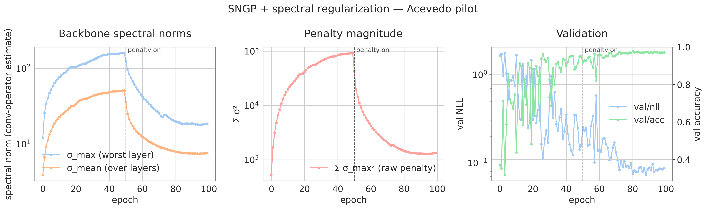
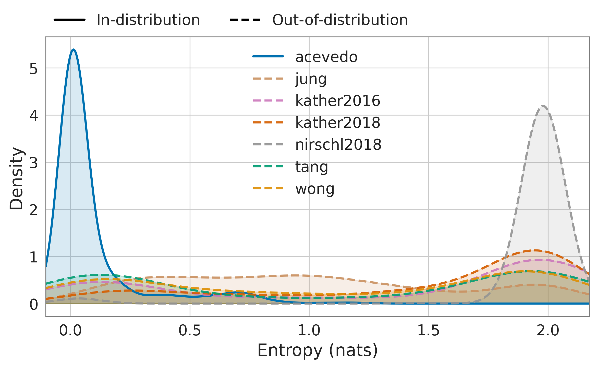
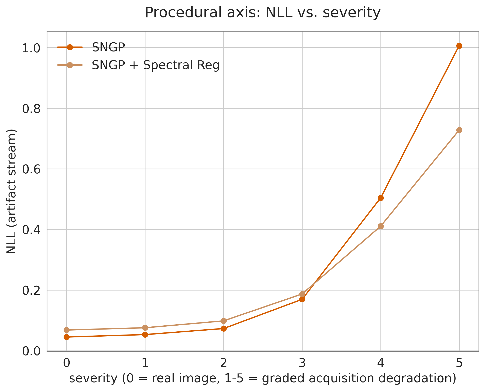
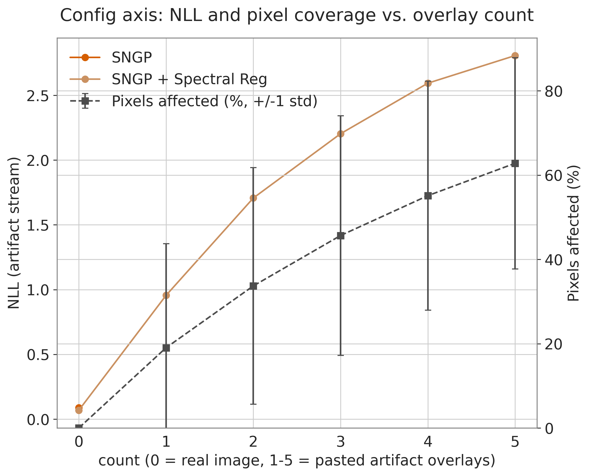
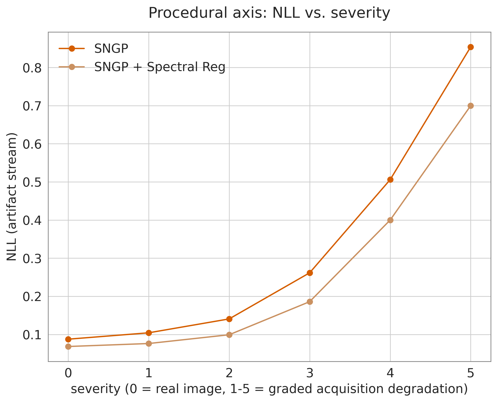
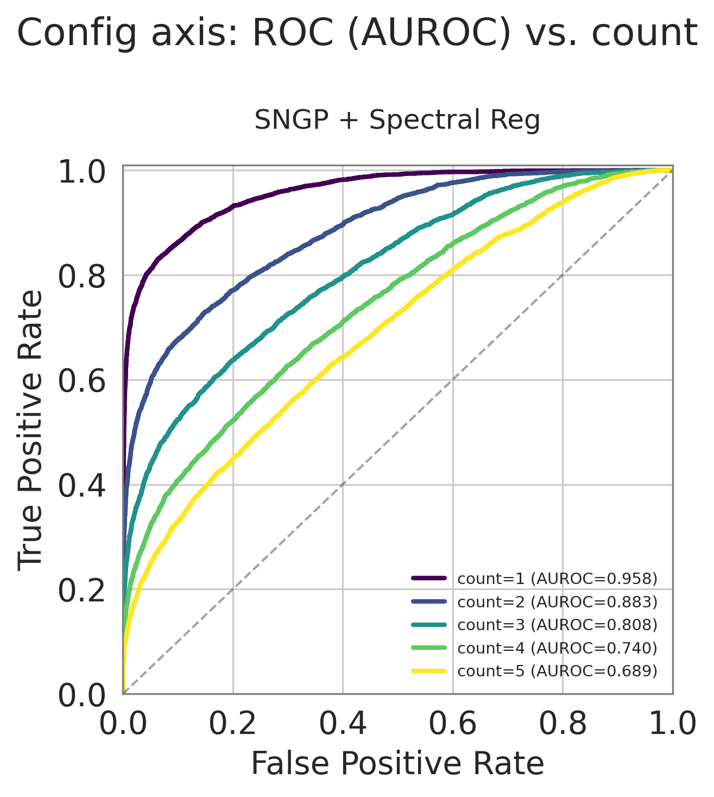
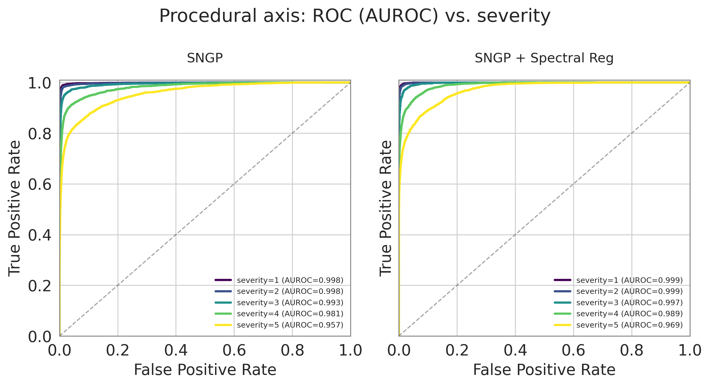

# Acevedo — SNGP + spectral regularization pilot

The rep-spectral variant of SNGP (Yang, Zavatone-Veth & Pehlevan 2024,
[arXiv 2405.17181](https://arxiv.org/abs/2405.17181)): the backbone's top singular values
are bounded by a **loss penalty**, `CE + 0.01 · Σ_l σ_max²(W_l)` over the resnet18
backbone, instead of by spectral normalization; the GP head is untouched and no weight is
ever rescaled. Method and knobs:
[../models/SNGP_SPECREG_GUIDE.md](../models/SNGP_SPECREG_GUIDE.md) and
[../SUPPORTED_MODELS.md](../SUPPORTED_MODELS.md#sngp-with-spectral-regularization-rep-spectral).
Trained 2026-09-18 on branch `sngp-spectral-reg`, `experiment=sngp_specreg_acevedo`,
W&B run `5bnnbxdb` (group `SpectralReg`).

**Off the fair-comparison protocol, deliberately** (each a user decision for this pilot):

- paper-literal schedule — 100 epochs, the first 50 unregularized (burn-in), penalty every
  24 optimizer steps afterwards, **no early stopping**;
- AdamW `lr 1e-3` (family default, not Acevedo's re-swept 0.00916) with **weight decay 0**,
  so the spectral penalty is the only weight regularizer;
- `best.ckpt` = min raw `val/nll` over the regularized epochs only (epoch 88 of 0–99;
  `ModelCheckpointFromEpoch`), not `val/nll_cal`;
- **no post-hoc calibration** outside the calibrated comparison section. Every other
  number is `best.ckpt` as saved (`mean_field_factor 1.0`), so it is comparable only to
  the *pre-calibration* rows of [ACEVEDO_RESULTS.md](ACEVEDO_RESULTS.md). Differences to
  SNGP are confounded by lr / weight decay / selection metric, not attributable to the
  regularizer alone.

The [calibrated comparison](#calibrated-comparison--sngp-c--60-vs-sngp--spectral-reg)
refits `mean_field_factor` on val for this model and for SNGP at its val-selected bound
`c* = 6.0`, then compares the two on test and OOD.

Reference rows in the in-distribution and OOD tables (Baseline Classifier, Monte Carlo
Dropout, SNGP with `spectral_norm_bound 4.0` = `sngp_acevedo_v2`) are copied verbatim from
[ACEVEDO_RESULTS.md](ACEVEDO_RESULTS.md)'s pre-calibration tables. In the artifact section
the **severity** axis is compared against spectral-norm SNGP with `c = 4.0`, read from the
bound ablation's existing `spectral_norm_bound_4.0` arms (uncalibrated, `mean_field_factor
1.0`): the same configuration as `sngp_acevedo_v2` but a *separate training run*, so read
the gap with the run-to-run variation documented in ACEVEDO_RESULTS.md in mind. The
**count** axis holds this model alone.

Checkpoint: [../MASTER_CHECKPONT_PATHS.md](../MASTER_CHECKPONT_PATHS.md)
(`sngp_specreg_acevedo_v1`). Inference directories and every reproduce command:
[../MASTER_INFER_RESULTS_PATH.md](../MASTER_INFER_RESULTS_PATH.md).

---

## Training trajectory

*σ_max / σ_mean over the 20 backbone convs (true conv-operator estimate), the raw penalty
Σσ² and validation NLL / accuracy per epoch; the dashed line is the first regularized epoch.
With no weight decay and BatchNorm after every conv, nothing restrains conv scale during
burn-in, so σ_max grows from 12 to 160 before the penalty pulls it to 18. Tidy CSV:
`figures/acevedo_specreg/spectral_reg_training_curves.csv` (W&B history).*

| Epoch | Phase | σ_max | σ_mean | Σσ² | val/nll | val/acc |
|---|---|---:|---:|---:|---:|---:|
| 0 | burn-in | 12.1 | 3.9 | 528 | 1.649 | 0.372 |
| 49 | last unregularized | 160.3 | 51.3 | 92,490 | 0.158 | 0.949 |
| 50 | penalty on | 126.8 | 35.7 | 43,860 | 0.253 | 0.918 |
| 53 | | 75.5 | 18.9 | 11,192 | 0.157 | 0.941 |
| **88** | **selected (`best.ckpt`)** | 18.4 | 7.5 | 1,295 | **0.073** | **0.974** |
| 99 | last (`last.ckpt`) | 18.6 | 7.6 | 1,333 | 0.087 | 0.971 |

---

## In-distribution — Acevedo test split (n = 3,419), uncalibrated `best.ckpt`

| Model | Accuracy ↑ | Precision ↑ | Recall ↑ | F1 ↑ | AUROC ↑ | AUPRC ↑ | ECE (×10⁻²) ↓ | NLL (×10⁻²) ↓ | Brier (×10⁻²) ↓ |
|---|---:|---:|---:|---:|---:|---:|---:|---:|---:|
| Baseline Classifier | 0.9784 | 0.9767 | 0.9759 | 0.9762 | **0.9996** | **0.9968** | 0.5318 | 6.2941 | **3.2203** |
| Monte Carlo Dropout | **0.9789** | **0.9779** | **0.9766** | **0.9771** | 0.9996 | 0.9967 | 0.5149 | **6.2836** | 3.2324 |
| SNGP (`c = 4.0`) | 0.9763 | 0.9743 | 0.9723 | 0.9730 | 0.9993 | 0.9944 | 0.5811 | 7.5652 | 3.6572 |
| SNGP + Spectral Reg | 0.9751 | 0.9713 | 0.9680 | 0.9691 | 0.9994 | 0.9954 | **0.4555** | 6.8369 | 3.5656 |

*Reference rows from ACEVEDO_RESULTS.md (pre-calibration). SNGP + Spectral Reg dispersion,
exact per-sample SEM from `metrics.json`: accuracy 0.9751 ± 0.0027, NLL 6.84 ± 0.68, Brier
3.57 ± 0.35 (×10⁻²). Its `acevedo/metrics.json` equals the training-time test stage and the
artifact sweep's `real_baseline` to all digits.*

---

## Out-of-distribution — trained on Acevedo, tested on other datasets

Primary score: **entropy AUROC**, normalized Shannon entropy `H(p)/log(K)` over the predicted
class-probability vector; in-distribution negative, OOD positive; mean ± std over the 10
fixed seeds of `src/metrics/auc.py`, ≤ 1,000 rows per seed per side.

### Entropy AUROC ↑ (uncalibrated)

| Model | Jung | Kather2016 | Kather2018 | Nirschl2018 | Tang | Wong |
|---|---:|---:|---:|---:|---:|---:|
| Baseline Classifier | 0.9324 ± 0.0029 | 0.4518 ± 0.0056 | 0.4327 ± 0.0124 | 0.3059 ± 0.0048 | 0.7390 ± 0.0109 | 0.6705 ± 0.0119 |
| Monte Carlo Dropout | 0.9363 ± 0.0028 | 0.4805 ± 0.0056 | 0.4442 ± 0.0123 | 0.3465 ± 0.0053 | 0.7490 ± 0.0110 | 0.6848 ± 0.0115 |
| SNGP (`c = 4.0`) | **0.9949 ± 0.0009** | 0.9478 ± 0.0026 | 0.9574 ± 0.0027 | **0.9975 ± 0.0009** | **0.9917 ± 0.0013** | **0.9482 ± 0.0036** |
| SNGP + Spectral Reg | 0.9732 ± 0.0021 | **0.9544 ± 0.0018** | **0.9792 ± 0.0016** | 0.9925 ± 0.0004 | 0.9160 ± 0.0042 | 0.9407 ± 0.0029 |

### Max-softmax-probability (MSP) AUROC ↑ (uncalibrated) — secondary

| Model | Jung | Kather2016 | Kather2018 | Nirschl2018 | Tang | Wong |
|---|---:|---:|---:|---:|---:|---:|
| Baseline Classifier | 0.9266 ± 0.0033 | 0.4575 ± 0.0058 | 0.4401 ± 0.0121 | 0.3192 ± 0.0052 | 0.7381 ± 0.0107 | 0.6701 ± 0.0119 |
| Monte Carlo Dropout | 0.9300 ± 0.0033 | 0.4850 ± 0.0055 | 0.4502 ± 0.0121 | 0.3578 ± 0.0053 | 0.7480 ± 0.0108 | 0.6841 ± 0.0114 |
| SNGP (`c = 4.0`) | **0.9892 ± 0.0013** | 0.9340 ± 0.0034 | 0.9452 ± 0.0035 | 0.9801 ± 0.0033 | **0.9827 ± 0.0020** | **0.9377 ± 0.0042** |
| SNGP + Spectral Reg | 0.9650 ± 0.0028 | **0.9487 ± 0.0020** | **0.9739 ± 0.0019** | **0.9921 ± 0.0003** | 0.9060 ± 0.0046 | 0.9324 ± 0.0034 |

*SNGP + Spectral Reg: kernel density of predictive entropy (nats) on the Acevedo test split
(solid) and on each OOD test set (dashed), class-balanced 500-row samples per dataset.*

---

## Calibrated comparison — SNGP `c* = 6.0` vs SNGP + Spectral Reg

SNGP here is the spectral-norm-bound ablation's `c = 6.0` arm, the bound selected by min
val NLL ([ACEVEDO_RESULTS.md](ACEVEDO_RESULTS.md#selecting-c-on-validation-n--1709)). It is
not the `c = 4.0` reference row above. Each model gets one post-hoc knob,
`mean_field_factor`, fit by minimizing Acevedo val NLL with
`scripts/checkpoints/calibrate_checkpoint.py` (n = 1,709). The knob cannot move the
argmax, so accuracy, precision, recall and F1 are identical before and after.

### Fitted `mean_field_factor`

| Model | Before | Fitted | val NLL | val smECE |
|---|---:|---:|---|---|
| SNGP `c* = 6.0` | 1.0 | 0.4909 | 0.05372 → 0.05363 | 0.01854 → 0.01864 |
| SNGP + Spectral Reg | 1.0 | 0.2455 | 0.07383 → 0.07375 | 0.02207 → 0.02696 |

### In-distribution — Acevedo test split (n = 3,419)

| Model | Calibration | Accuracy ↑ | Precision ↑ | Recall ↑ | F1 ↑ | AUROC ↑ | AUPRC ↑ | ECE (×10⁻²) ↓ | NLL (×10⁻²) ↓ | Brier (×10⁻²) ↓ |
|---|---|---:|---:|---:|---:|---:|---:|---:|---:|---:|
| SNGP `c* = 6.0` | pre | **0.9874 ± 0.0019** | **0.9861** | **0.9862** | **0.9860** | 0.9997 | 0.9977 | 0.4497 | 4.5363 ± 0.6142 | 2.0209 ± 0.2683 |
| SNGP `c* = 6.0` | post | **0.9874 ± 0.0019** | **0.9861** | **0.9862** | **0.9860** | **0.9997** | **0.9977** | **0.3889** | **4.5019 ± 0.6343** | **2.0091 ± 0.2710** |
| SNGP + Spectral Reg | pre | 0.9751 ± 0.0027 | 0.9713 | 0.9680 | 0.9691 | 0.9994 | 0.9954 | 0.4555 | 6.8369 ± 0.6845 | 3.5656 ± 0.3490 |
| SNGP + Spectral Reg | post | 0.9751 ± 0.0027 | 0.9713 | 0.9680 | 0.9691 | 0.9994 | 0.9955 | 0.6409 | 6.8081 ± 0.7030 | 3.5598 ± 0.3528 |

### Entropy AUROC ↑

| Model | Calibration | Jung | Kather2016 | Kather2018 | Nirschl2018 | Tang | Wong | Mean |
|---|---|---:|---:|---:|---:|---:|---:|---:|
| SNGP `c* = 6.0` | pre | 0.9108 ± 0.0020 | 0.8241 ± 0.0024 | **0.9824 ± 0.0022** | **0.9989 ± 0.0006** | **0.9762 ± 0.0018** | 0.9257 ± 0.0044 | 0.9364 |
| SNGP `c* = 6.0` | post | 0.9050 ± 0.0021 | 0.8234 ± 0.0024 | 0.9805 ± 0.0023 | 0.9977 ± 0.0011 | 0.9723 ± 0.0021 | 0.9208 ± 0.0045 | 0.9333 |
| SNGP + Spectral Reg | pre | **0.9732 ± 0.0021** | **0.9544 ± 0.0018** | 0.9792 ± 0.0016 | 0.9925 ± 0.0004 | 0.9160 ± 0.0042 | **0.9407 ± 0.0029** | **0.9593** |
| SNGP + Spectral Reg | post | 0.9688 ± 0.0023 | 0.9488 ± 0.0019 | 0.9750 ± 0.0018 | 0.9920 ± 0.0004 | 0.9045 ± 0.0045 | 0.9348 ± 0.0031 | 0.9540 |

### MSP AUROC ↑ — secondary

| Model | Calibration | Jung | Kather2016 | Kather2018 | Nirschl2018 | Tang | Wong |
|---|---|---:|---:|---:|---:|---:|---:|
| SNGP `c* = 6.0` | pre | 0.9054 ± 0.0026 | 0.8200 ± 0.0027 | **0.9777 ± 0.0028** | 0.9897 ± 0.0026 | **0.9695 ± 0.0024** | 0.9203 ± 0.0047 |
| SNGP `c* = 6.0` | post | 0.8999 ± 0.0027 | 0.8192 ± 0.0027 | 0.9756 ± 0.0030 | 0.9877 ± 0.0028 | 0.9658 ± 0.0027 | 0.9156 ± 0.0048 |
| SNGP + Spectral Reg | pre | **0.9650 ± 0.0028** | **0.9487 ± 0.0020** | 0.9739 ± 0.0019 | **0.9921 ± 0.0003** | 0.9060 ± 0.0046 | **0.9324 ± 0.0034** |
| SNGP + Spectral Reg | post | 0.9612 ± 0.0030 | 0.9429 ± 0.0022 | 0.9694 ± 0.0021 | 0.9916 ± 0.0004 | 0.8948 ± 0.0048 | 0.9268 ± 0.0037 |

After calibration, neither model wins outright:
- **In-distribution:** SNGP `c* = 6.0` is better on every metric (accuracy +0.0123, NLL −2.3 ×10⁻²).
- **OOD:** SNGP + Spectral Reg separates better on average (mean entropy AUROC 0.954 vs 0.933). It is ahead on Jung, Kather2016 and Wong; SNGP is ahead on Kather2018, Nirschl2018 and Tang.
- **Effect of calibration:** both fitted factors are below 1, which lowers every OOD AUROC slightly, while val NLL gains only about 0.0001.

### Procedural axis — calibrated (artifact stream, n = 3,419)

This is the same graded acquisition degradation as the uncalibrated procedural table
below, run on the two `best.calibrated.ckpt`s. Severity 0 is the clean real stream.

*Artifact-stream NLL vs. severity. "SNGP" is `c* = 6.0` with `mean_field_factor` 0.4909;
"SNGP + Spectral Reg" has 0.2455. Tidy CSV: `figures/acevedo_calibrated_comparison/procedural_axis_nll_vs_severity.csv`.*

| Severity | Model | Accuracy ↑ | F1 ↑ | NLL (×10⁻²) ↓ | Brier (×10⁻²) ↓ | ECE (×10⁻²) ↓ |
|---|---|---:|---:|---:|---:|---:|
| 0 (real) | SNGP `c* = 6.0` | **0.9874 ± 0.0019** | **0.9860** | **4.50 ± 0.63** | **2.01 ± 0.27** | **0.39** |
| 0 (real) | SNGP + Spectral Reg | 0.9751 ± 0.0027 | 0.9691 | 6.81 ± 0.70 | 3.56 ± 0.35 | 0.64 |
| 1 | SNGP `c* = 6.0` | **0.9833 ± 0.0022** | **0.9804** | **5.31 ± 0.67** | **2.54 ± 0.30** | **0.23** |
| 1 | SNGP + Spectral Reg | 0.9757 ± 0.0026 | 0.9699 | 7.56 ± 0.75 | 3.81 ± 0.37 | 0.66 |
| 2 | SNGP `c* = 6.0` | **0.9772 ± 0.0026** | **0.9726** | **7.30 ± 0.78** | **3.56 ± 0.36** | **0.57** |
| 2 | SNGP + Spectral Reg | 0.9678 ± 0.0030 | 0.9614 | 9.83 ± 0.83 | 4.94 ± 0.41 | 0.60 |
| 3 | SNGP `c* = 6.0` | **0.9523 ± 0.0036** | **0.9438** | **16.94 ± 1.41** | **7.31 ± 0.52** | **1.41** |
| 3 | SNGP + Spectral Reg | 0.9377 ± 0.0041 | 0.9285 | 18.70 ± 1.16 | 9.29 ± 0.56 | 1.51 |
| 4 | SNGP `c* = 6.0` | **0.8833 ± 0.0055** | **0.8714** | 50.41 ± 2.77 | **18.44 ± 0.83** | 5.29 |
| 4 | SNGP + Spectral Reg | 0.8690 ± 0.0058 | 0.8598 | **41.06 ± 1.81** | 18.99 ± 0.79 | **4.39** |
| 5 | SNGP `c* = 6.0` | 0.7754 ± 0.0071 | 0.7599 | 100.64 ± 3.90 | 33.97 ± 1.07 | 12.18 |
| 5 | SNGP + Spectral Reg | **0.7833 ± 0.0070** | **0.7694** | **72.79 ± 2.52** | **30.81 ± 0.98** | **9.31** |

The curves cross between severity 3 and 4:
- **Mild shift (severity 0–3):** SNGP `c* = 6.0` is more accurate and has lower NLL at every level.
- **Severity 4:** it is still more accurate, but its NLL is higher by 9.4 ×10⁻².
- **Severity 5:** its NLL is higher by 27.9 ×10⁻², so it is more confident in its mistakes than SNGP + Spectral Reg.

Calibration slightly worsens SpecReg under heavy shift, because its fitted factor is below 1. At severity 5 its NLL rises from 69.98 (uncalibrated, table below) to 72.79.

Caveats: this compares two training recipes (see the off-protocol list at the top), each
from a single seed. `c* = 6.0` was selected on in-distribution val NLL, and its OOD
AUROC on Jung and Kather2016 is well below the `c = 4.0` reference row.

---

## Artifact simulation — Acevedo test split (n = 3,419)

Two independent axes ([../DATASETS.md](../DATASETS.md#artifact-robustness-evaluation)):
the **config** axis pastes `count` real artifact cutouts per image (`artifact_balanced`,
procedural off); the **procedural** axis applies graded acquisition degradations at
`severity` 1–5 (`procedural_ood`, config off). One shared clean arm per checkpoint
(`real_baseline`, identical to that checkpoint's in-distribution run); every other arm
reports the artifact stream. All numbers from each arm's `metrics.json`
(`…/sngp_specreg_classifier_acevedo/2026-09-18_14-11-49/acevedo_artifact/` and, for
SNGP `c = 4.0`, `…/sngp_classifier_acevedo_snb_artifact_ablation/2026-09-17_15-06-32/spectral_norm_bound_4.0/`).

### Config axis — SNGP + Spectral Reg only (artifact stream)

| Arm | Accuracy ↑ | F1 ↑ | NLL (×10⁻²) ↓ | Brier (×10⁻²) ↓ | ECE (×10⁻²) ↓ |
|---|---:|---:|---:|---:|---:|
| real (count 0) | 0.9751 ± 0.0027 | 0.9691 | 6.84 ± 0.68 | 3.57 ± 0.35 | 0.46 |
| count = 1 | 0.7713 ± 0.0072 | 0.7624 | 95.55 ± 3.38 | 34.66 ± 1.08 | 12.33 |
| count = 2 | 0.6049 ± 0.0084 | 0.5904 | 170.71 ± 4.13 | 60.54 ± 1.27 | 22.71 |
| count = 3 | 0.4803 ± 0.0085 | 0.4604 | 220.35 ± 4.25 | 78.40 ± 1.29 | 29.67 |
| count = 4 | 0.3870 ± 0.0083 | 0.3571 | 259.37 ± 4.25 | 92.28 ± 1.26 | 35.54 |
| count = 5 | 0.3238 ± 0.0080 | 0.2861 | 280.68 ± 4.11 | 100.58 ± 1.21 | 38.96 |

### Procedural axis — SNGP + Spectral Reg vs. SNGP `c = 4.0` (artifact stream)

| Severity | Model | Accuracy ↑ | F1 ↑ | NLL (×10⁻²) ↓ | Brier (×10⁻²) ↓ | ECE (×10⁻²) ↓ |
|---|---|---:|---:|---:|---:|---:|
| 0 (real) | SNGP + Spectral Reg | **0.9751 ± 0.0027** | 0.9691 | **6.84 ± 0.68** | **3.57 ± 0.35** | **0.46** |
| 0 (real) | SNGP (`c = 4.0`) | 0.9740 ± 0.0027 | **0.9705** | 8.76 ± 0.86 | 3.88 ± 0.37 | 0.65 |
| 1 | SNGP + Spectral Reg | **0.9757 ± 0.0026** | **0.9699** | **7.62 ± 0.73** | **3.83 ± 0.36** | 0.59 |
| 1 | SNGP (`c = 4.0`) | 0.9687 ± 0.0030 | 0.9641 | 10.43 ± 0.95 | 4.72 ± 0.42 | **0.47** |
| 2 | SNGP + Spectral Reg | **0.9678 ± 0.0030** | **0.9614** | **9.92 ± 0.80** | **4.97 ± 0.40** | 0.59 |
| 2 | SNGP (`c = 4.0`) | 0.9591 ± 0.0034 | 0.9542 | 14.07 ± 1.10 | 6.41 ± 0.49 | **0.51** |
| 3 | SNGP + Spectral Reg | **0.9377 ± 0.0041** | **0.9285** | **18.60 ± 1.11** | **9.25 ± 0.54** | **1.06** |
| 3 | SNGP (`c = 4.0`) | 0.9272 ± 0.0044 | 0.9200 | 26.17 ± 1.58 | 11.28 ± 0.65 | 1.86 |
| 4 | SNGP + Spectral Reg | **0.8690 ± 0.0058** | **0.8598** | **40.00 ± 1.70** | **18.74 ± 0.77** | **3.58** |
| 4 | SNGP (`c = 4.0`) | 0.8678 ± 0.0058 | 0.8591 | 50.59 ± 2.29 | 20.53 ± 0.86 | 4.89 |
| 5 | SNGP + Spectral Reg | 0.7833 ± 0.0070 | 0.7694 | **69.98 ± 2.36** | **30.23 ± 0.95** | **8.22** |
| 5 | SNGP (`c = 4.0`) | **0.7841 ± 0.0070** | **0.7714** | 85.38 ± 3.01 | 32.76 ± 1.04 | 9.86 |

*± is the exact per-sample SEM (`_sem` in `metrics.json`); F1 and ECE carry none. Bold marks
the better of the two models at each severity. Accuracy is within one SEM at every
severity; the separation is in NLL / Brier, i.e. how confidently the wrong answers are
given.*

<table>
<tr>
<td width="50%"> 
Config axis (spectral reg only): artifact-stream NLL vs. overlay count, with the mean ± std fraction of pixels covered (right axis).</td>
<td width="50%"> 
Procedural axis, one line per model: artifact-stream NLL vs. severity. Point 0 on both is the clean real stream.</td>
</tr>
<tr>
<td width="50%"> 
Config axis: ROC per overlay count (darker = more overlays).</td>
<td width="50%"> 
Procedural axis, one panel per model: ROC per severity.</td>
</tr>
</table>

*Precision–recall and risk–coverage counterparts:
`figures/acevedo_specreg/{config,procedural}_axis_{aupr,aurc}_curves.{png,pdf}`.*

### Robustness and detection tables at the first level of each axis

Rendered by `render_artifact_results_tables.py` from the paired real / artifact
predictions (same layout as `docs/RESULTS.md`'s artifact section: Classification,
Selective Classification, OOD Detection with the real stream as in-distribution and the
artifact stream as OOD, Calibration; ×10⁻² where marked). The count = 1 tables hold the
spectral-reg model alone; the severity = 1 tables carry both models, best in bold.

#### Config axis, count = 1 (SNGP + Spectral Reg)

**Config axis — one pasted artifact overlay (count=1, artifact_balanced, procedural off)**

<table>
<tr>
<td valign="top">

**Classification (Artifact)**

| Model | Accuracy (Artifact) ↑ | Precision ↑ | Recall ↑ | F1 ↑ | Brier (×10⁻²) ↓ | NLL (×10⁻²) ↓ | Mean Entropy |
|---|---:|---:|---:|---:|---:|---:|---:|
| SNGP + Spectral Reg | **0.7713** | **0.7949** | **0.7566** | **0.7624** | **34.66** | **95.55** | 0.1477 |

</td>
<td valign="top">

**Selective Classification (Artifact)**

| Model | AURC (×10⁻²) ↓ | AUGRC (×10⁻²) ↓ | Cov@5%Risk ↑ | Risk@80%Cov (×10⁻²) ↓ |
|---|---:|---:|---:|---:|
| SNGP + Spectral Reg | **5.78** | **4.58** | **0.6215** | **11.99** |

</td>
</tr>
<tr>
<td valign="top">

**OOD Detection — Real vs. Artifact**

| Model | AUROC (Entropy) ↑ | AUPR (Entropy) ↑ | FPR95 (Entropy) ↓ |
|---|---:|---:|---:|
| SNGP + Spectral Reg | **0.6571** | **0.7008** | **0.9087** |

</td>
<td valign="top">

**Calibration (Artifact)**

| Model | ECE (Artifact) (×10⁻²) ↓ | ECE+ (×10⁻²) ↓ | ECE− (×10⁻²) ↓ | MCE (×10⁻²) ↓ | SmECE (×10⁻²) ↓ | aECE (×10⁻²) ↓ |
|---|---:|---:|---:|---:|---:|---:|
| SNGP + Spectral Reg | **12.33** | **12.33** | **0.00** | **35.05** | **18.36** | **12.33** |

</td>
</tr>
</table>

#### Procedural axis, severity = 1 (both models)

**Procedural axis — one graded acquisition degradation (severity=1, procedural_ood, config off)**

<table>
<tr>
<td valign="top">

**Classification (Artifact)**

| Model | Accuracy (Artifact) ↑ | Precision ↑ | Recall ↑ | F1 ↑ | Brier (×10⁻²) ↓ | NLL (×10⁻²) ↓ | Mean Entropy |
|---|---:|---:|---:|---:|---:|---:|---:|
| SNGP | 0.9687 | 0.9650 | 0.9659 | 0.9641 | 4.72 | 10.43 | 0.0549 |
| SNGP + Spectral Reg | **0.9757** | **0.9712** | **0.9694** | **0.9699** | **3.83** | **7.62** | 0.0378 |

</td>
<td valign="top">

**Selective Classification (Artifact)**

| Model | AURC (×10⁻²) ↓ | AUGRC (×10⁻²) ↓ | Cov@5%Risk ↑ | Risk@80%Cov (×10⁻²) ↓ |
|---|---:|---:|---:|---:|
| SNGP | 0.38 | 0.30 | **1.0000** | 0.62 |
| SNGP + Spectral Reg | **0.18** | **0.15** | 1.0000 | **0.11** |

</td>
</tr>
<tr>
<td valign="top">

**OOD Detection — Real vs. Artifact**

| Model | AUROC (Entropy) ↑ | AUPR (Entropy) ↑ | FPR95 (Entropy) ↓ |
|---|---:|---:|---:|
| SNGP | 0.5089 | 0.5111 | 0.9535 |
| SNGP + Spectral Reg | **0.5223** | **0.5201** | **0.9412** |

</td>
<td valign="top">

**Calibration (Artifact)**

| Model | ECE (Artifact) (×10⁻²) ↓ | ECE+ (×10⁻²) ↓ | ECE− (×10⁻²) ↓ | MCE (×10⁻²) ↓ | SmECE (×10⁻²) ↓ | aECE (×10⁻²) ↓ |
|---|---:|---:|---:|---:|---:|---:|
| SNGP | **0.47** | 0.30 | **0.17** | 70.34 | 1.60 | **0.31** |
| SNGP + Spectral Reg | 0.59 | **0.25** | 0.33 | **39.60** | **1.41** | 0.36 |

</td>
</tr>
</table>

---

## Notes

- **Calibration.** Outside the calibrated comparison section, `best.ckpt` is used as saved,
  so nothing there should be compared to the post-calibration tables of ACEVEDO_RESULTS.md.
  The calibrated comparison uses `best.calibrated.ckpt` for both models (fit 2026-09-29).
- **Selection metric.** `best.ckpt` minimizes raw `val/nll` over epochs ≥ 50 (0.0732 at
  epoch 88); the protocol metric `val/nll_cal` was still logged (0.0738 at the same epoch).
- **Dispersion.** ± on accuracy / NLL / Brier is the exact per-sample SEM from
  `metrics.json`; ± on OOD AUROC is the spread over the 10 fixed subsampling seeds;
  AUROC / AUPRC in-distribution, ECE and macro precision / recall / F1 carry none by design.
- **OOD `metrics.json` files are empty** for every dataset whose class count differs from
  8; `kather2016` (8 classes) gets populated but meaningless numbers. Only
  `predictions.csv` feeds the AUROC.
- **Artifact CSVs are split** — `real_baseline/` holds the real stream once, every other
  arm holds its artifact stream only (`infer.save.streams`), which is what the sidecar
  `configs/paper_helpers/acevedo_specreg_artifact_axis_paths.yaml` describes.
- **Run mechanics.** The 18 inference jobs ran as 4 GPU lanes
  (`scripts/inference/run_eval_suite_parallel.sh`); the `count_5` arm was re-run after a
  transient `/tmp`-full failure on the shared node.
