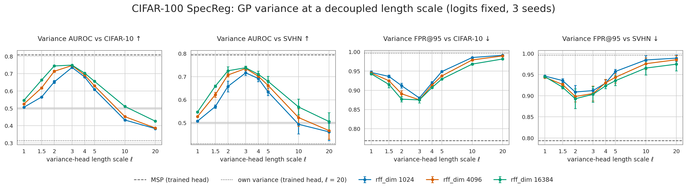

# CIFAR-100 / WideResNet-28-10: GP variance at a decoupled length scale

Can the length scale that sets the GP variance be chosen after training, independently of the
one the logits were trained with? Under the Gaussian likelihood, the variance
`φ(x)ᵀ(ridge·I + Σᵢ φᵢφᵢᵀ)⁻¹φ(x)` needs only the training *features*. It needs no labels
and no classifier weights. So a second random-feature map at a small ℓ can supply the
variance, while the trained ℓ = 20 head keeps supplying the logits. Accuracy is then
unchanged by construction.

Follows up [CIFAR100_RF_E2E_RESULTS.md](CIFAR100_RF_E2E_RESULTS.md), where one end-to-end run
at ℓ = 2 made the variance an SVHN detector.

| | |
|---|---|
| Backbones | SpecReg (matched), seeds 12345 / 1 / 2, `last.ckpt` (epoch 249), frozen. Features from the head-swap cache ([CIFAR100_RF_HEAD_SWAP_RESULTS.md](CIFAR100_RF_HEAD_SWAP_RESULTS.md)) |
| Logits | the trained end-to-end GP head (ℓ = 20), unchanged |
| Variance head | cos / orf, unscaled, ridge 1.0, no input norm. Precision from one augmented train pass. ℓ ∈ {1, 1.5, 2, 3, 4, 5, 10, 20} × rff_dim ∈ {1024, 4096, 16384} |
| Scores | variance alone (AUROC, FPR@95%TPR); rank average of the variance with the trained head's MSP; mean-field predictive with the new variance, λ fitted on val |
| OOD sets | CIFAR-10 (10,000), SVHN (26,032), all on test. ± is the std across the 3 backbone seeds |
| Code, commands | `scripts/metrics/cifar100_decoupled_variance.py`, `src/visualization/cifar100_decoupled_variance.py`; [../MASTER_INFER_RESULTS_PATH.md](../MASTER_INFER_RESULTS_PATH.md), section "Decoupled GP variance" |

**Gate:** the trained head scored with its own variance reproduces the head-swap page
exactly: λ\* 35.31, NLL 0.7472, variance AUROC on SVHN 0.410.

## Variance alone, rff_dim 16384

| Score | ℓ | ρ = ‖x‖/ℓ | AUROC C-10 ↑ | AUROC SVHN ↑ | FPR95 C-10 ↓ | FPR95 SVHN ↓ |
|---|---:|---:|---:|---:|---:|---:|
| *MSP, trained head* | *20* | *0.58* | ***0.809 ± 0.002*** | ***0.795 ± 0.006*** | ***0.769 ± 0.003*** | ***0.794 ± 0.023*** |
| *own variance, trained head* | *20* | *0.58* | *0.314 ± 0.001* | *0.410 ± 0.046* | *0.997* | *0.996* |
| decoupled variance | 1 | 11.5 | 0.546 ± 0.004 | 0.547 ± 0.004 | 0.943 | 0.945 |
| | 1.5 | 7.7 | 0.664 ± 0.004 | 0.659 ± 0.005 | 0.915 | 0.920 |
| | 2 | 5.8 | 0.745 ± 0.003 | 0.726 ± 0.018 | 0.877 | **0.893** |
| | **3** | **3.8** | **0.750 ± 0.002** | **0.739 ± 0.007** | **0.875** | 0.903 |
| | 4 | 2.9 | 0.703 ± 0.002 | 0.710 ± 0.015 | 0.907 | 0.924 |
| | 5 | 2.3 | 0.656 ± 0.002 | 0.680 ± 0.022 | 0.929 | 0.936 |
| | 10 | 1.2 | 0.511 ± 0.003 | 0.569 ± 0.034 | 0.968 | 0.966 |
| | 20 | 0.58 | 0.426 ± 0.003 | 0.506 ± 0.039 | 0.982 | 0.975 |

Effect of rff_dim on SVHN AUROC:

| rff_dim | ℓ = 1.5 | ℓ = 2 | ℓ = 3 |
|---|---:|---:|---:|
| 1024 | 0.571 | 0.658 | 0.717 |
| 4096 | 0.622 | 0.708 | 0.736 |
| 16384 | 0.659 | 0.726 | 0.739 |

## Using it alongside the trained head, ℓ = 3, rff_dim 16384

| Score | AUROC C-10 | AUROC SVHN | FPR95 SVHN | NLL | smECE |
|---|---:|---:|---:|---:|---:|
| MSP, trained head, own variance (λ\* 35.3) | **0.809** | **0.795** | **0.794** | **0.747** | **0.030** |
| rank average: MSP + decoupled variance | 0.789 ± 0.001 | 0.774 ± 0.004 | 0.833 | — | — |
| mean-field with decoupled variance (λ\* on val) | 0.815 (MSP) | 0.792 (MSP) / 0.822 (DS) | — | 0.763 | 0.037 |

The rank average is below MSP on every seed and both OOD sets, at every ℓ and rff_dim.

*Mean ± 1 std over 3 backbone seeds. Dashed: the trained head's MSP. Dotted: its own
ℓ = 20 variance. Grey band: chance.*

## Analysis

1. **Distance-awareness comes back without retraining.** The variance AUROC rises from
   0.31 / 0.41 (inverted: OOD gets *lower* variance) to 0.75 / 0.74. It peaks in the interior
   at ℓ ≈ 3, i.e. ρ ≈ 3.8, on both OOD sets and all three seeds.
   - Too small an ℓ makes the kernel a spike: every point, ID or not, is "far" from the
     training set, and the AUROC falls to chance.
   - Too large an ℓ makes the kernel flat, and the variance stops tracking distance.
   - The optimum is broad (ℓ 2–4, ρ ≈ 3–6), so the choice is not fragile.
2. **A sharp kernel needs many random features.** At ℓ = 1.5–2, going from 1024 to 16384
   features adds 0.07–0.10 AUROC. By ℓ = 3 the curve has converged at 4096. At the
   recipe's 1024 features, the small-ℓ variance is limited by random-feature noise, not by
   the backbone.
3. **It does not beat MSP, and it doesn't add to it.**
   - It is 0.06 AUROC below MSP.
   - It is far worse in the high-TPR regime (FPR95 0.88–0.90 vs 0.77–0.79): it orders the
     bulk sensibly but not the tails.
   - Combining the two by rank average lands between them, so the variance carries a weaker
     copy of MSP's information rather than new information.
   - Fed into the mean-field correction, it costs 0.016 NLL, moves MSP by under 0.01, and
     lowers DS on SVHN by 0.011. For calibration, keep the trained head's own variance.
4. **The backbone is the bottleneck, not the choice of ℓ.** The single end-to-end ℓ = 2 run
   reached 0.80 on SVHN but only 0.65 on CIFAR-10, against 0.73 / 0.745 here. Training the
   backbone at a small ℓ shapes it for far-OOD. Tuning ℓ afterwards on an ℓ = 20 backbone
   recovers near-OOD better but tops out below MSP.
5. **For the sweet-spot question:** decoupling removes the conflict between in-distribution
   performance and OOD detection, and makes searching over ℓ free. The payoff is capped by
   the features.

## Caveats

- ℓ = 3 is read off the test OOD sets, so it is optimistic. A deployable choice needs an
  in-distribution-only rule or a proxy OOD set. The broad optimum limits how much this
  matters.
- The backbones co-trained with an ℓ = 20 head. This measures a post-hoc variance on those
  features, not what the backbone would learn at a small ℓ.
- Gaussian likelihood only. A logistic Laplace weight depends on the classifier, so the
  variance would no longer be independent of the logits' head.
