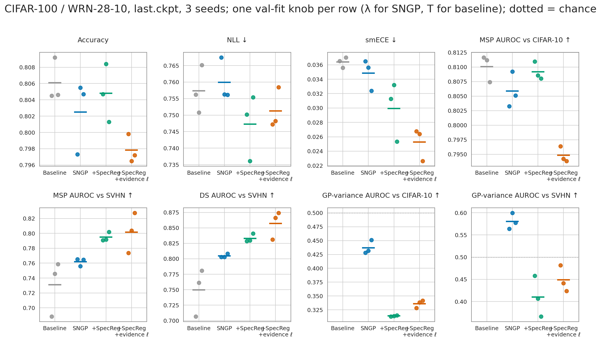

# CIFAR-100 / WideResNet-28-10: SNGP vs SNGP+SpecReg vs SNGP+SpecReg at the evidence-picked ℓ

Does training end-to-end at the length scale chosen by type-II GP evidence help SpecReg? On the
frozen ℓ = 20 SpecReg backbones the evidence picks **ℓ = 7** at the recipe's rff_dim 1024
([CIFAR100_LENGTH_SCALE_EVIDENCE_RESULTS.md](CIFAR100_LENGTH_SCALE_EVIDENCE_RESULTS.md)), using
in-distribution data only. Used post hoc, a length scale in that range made the GP variance a
weak OOD signal. At rff_dim 1024 its SVHN AUROC is 0.63 at ℓ = 5 and 0.49 at ℓ = 10 (ℓ = 7 was
not in that grid), against 0.41 for the trained ℓ = 20 head. This page retrains at ℓ = 7.

| | |
|---|---|
| Arms | Baseline; SNGP (`c = 6.0`); SNGP + SpecReg (matched); **SNGP + SpecReg + evidence ℓ = 7**, which is the SpecReg recipe with `model.net.length_scale=7.0` and nothing else changed |
| Runs | seeds 12345 / 1 / 2, 250 epochs, `last.ckpt` (epoch 249). The first three arms reuse the existing runs; checkpoints are in [../checkpoints/CIFAR_CHECKPOINTS.md](../checkpoints/CIFAR_CHECKPOINTS.md) |
| Protocol | **One post-hoc knob per row**, fit on **val** NLL by `calibrate_checkpoint.py`: λ (mean-field factor) for the SNGP arms, T for the baseline. σ² = 1, ridge 1.0 and the `gaussian` likelihood are fixed. Every number is on **test** |
| OOD | the full CIFAR-10 (10,000) and SVHN (26,032) test sets. `±` is the std across the 3 training seeds |
| Data, commands | [../MASTER_INFER_RESULTS_PATH.md](../MASTER_INFER_RESULTS_PATH.md), section "evidence_ls" |

- The first three rows differ from the headline of [CIFAR100_RESULTS.md](CIFAR100_RESULTS.md),
  which pins λ at 7.5 and gives the baseline no knob. Here every row is at its own fitted
  knob. The SNGP / SpecReg rows reproduce that page's val-fit table exactly (NLL 0.7600 /
  0.7472).
- The baseline's validation-fitted temperature is T = 1.31 on every seed. At that T its NLL
  (0.7574) is below SNGP's.

## Results

| Arm | Acc | NLL | smECE | knob\* (val) |
|---|---:|---:|---:|---:|
| Baseline | **0.8061 ± 0.0027** | 0.7574 ± 0.0072 | 0.0364 ± 0.0007 | T 1.31 |
| SNGP (`c = 6.0`) | 0.8025 ± 0.0045 | 0.7600 ± 0.0065 | 0.0348 ± 0.0022 | λ 32.5 |
| SNGP + SpecReg | 0.8048 ± 0.0036 | **0.7472 ± 0.0100** | 0.0299 ± 0.0041 | λ 35.3 |
| SNGP + SpecReg + evidence ℓ = 7 | 0.7978 ± 0.0017 | 0.7513 ± 0.0062 | **0.0253 ± 0.0023** | λ 43.1 |

| Arm | MSP C-10 | MSP SVHN | DS C-10 | DS SVHN | Var C-10 | Var SVHN | FPR95 MSP SVHN ↓ |
|---|---:|---:|---:|---:|---:|---:|---:|
| Baseline | **0.8101 ± 0.0023** | 0.7309 ± 0.0373 | **0.8121 ± 0.0020** | 0.7496 ± 0.0383 | — | — | 0.855 ± 0.025 |
| SNGP (`c = 6.0`) | 0.8059 ± 0.0031 | 0.7620 ± 0.0053 | 0.8082 ± 0.0029 | 0.8047 ± 0.0032 | **0.437 ± 0.012** | **0.580 ± 0.018** | 0.828 ± 0.011 |
| SNGP + SpecReg | 0.8092 ± 0.0016 | 0.7948 ± 0.0060 | 0.8110 ± 0.0020 | 0.8330 ± 0.0068 | 0.314 ± 0.001 | 0.410 ± 0.046 | 0.794 ± 0.023 |
| SNGP + SpecReg + evidence ℓ = 7 | 0.7948 ± 0.0014 | **0.8016 ± 0.0269** | 0.7846 ± 0.0036 | **0.8571 ± 0.0230** | 0.336 ± 0.007 | 0.449 ± 0.030 | **0.778 ± 0.036** |

Paired per seed, evidence ℓ = 7 − SpecReg (both at their own λ\*):

| | Acc | NLL | smECE | MSP C-10 | MSP SVHN | DS SVHN | Var C-10 | Var SVHN |
|---|---:|---:|---:|---:|---:|---:|---:|---:|
| mean | −0.0070 | +0.0041 | −0.0047 | −0.0144 | +0.0068 | +0.0241 | +0.0220 | +0.0388 |
| sign-consistent | **3/3** | 2/3 | **3/3** | **3/3** | 2/3 | **3/3** | **3/3** | **3/3** |

For reference, SpecReg − SNGP on the same seeds: NLL −0.013 (3/3), smECE −0.005 (3/3), MSP SVHN
+0.033 (3/3), DS SVHN +0.028 (3/3), Var SVHN −0.170 (3/3).

- **Mixed result for ℓ = 7.**
  - It gains on far-OOD DS (+0.024, 3/3) and on smECE (−0.005, 3/3).
  - It costs 0.7 pt of accuracy (3/3) and 0.014 of near-OOD MSP AUROC (3/3).
  - NLL and MSP SVHN change within noise. MSP SVHN's seed spread quadruples (±0.027 vs ±0.006).
- **The GP variance is still inverted.** Variance AUROC rises only slightly (C-10 0.34, SVHN 0.45)
  and stays below chance. Post hoc on the ℓ = 20 backbones, the neighbouring length scales gave
  C-10 0.43–0.61 and SVHN 0.49–0.63 at rff_dim 1024 (ℓ = 10 / ℓ = 5,
  [CIFAR100_LENGTH_SCALE_EVIDENCE_RESULTS.md](CIFAR100_LENGTH_SCALE_EVIDENCE_RESULTS.md)). So
  end-to-end training at ℓ = 7 lands below even the ℓ = 10 post-hoc value: co-training the
  backbone gives the gain back.
- **SNGP's spectral normalization, not the length scale, is what keeps the variance
  meaningful.** SNGP is the only arm whose SVHN variance AUROC is above chance (0.58). The far-OOD
  gains of both SpecReg arms come from the logits (MSP / DS), not from distance-awareness.

## Evidence re-check on the ℓ = 7 backbones

The same type-II evidence, re-run on the new backbones' features (rff_dim 1024, 3 seeds):

| | ℓ = 20 SpecReg backbones | ℓ = 7 backbones |
|---|---:|---:|
| type-II argmax, train / val | 7 / 7 | **7 / 7** (all 3 seeds) |
| median ‖x‖, train features | 11.9 | 9.1 |
| ρ = ‖x‖/ℓ at ℓ = 7, train | 1.70 | 1.30 |
| type-II log-evidence/N, ℓ = 7 minus ℓ = 20 (train) | +15.8 | +3.2 |
| type-II log-evidence/N, ℓ = 7 minus ℓ = 10 (train) | +5.7 | +1.0 |

- **ℓ = 7 is a fixed point.** A backbone trained at ℓ = 7 is still scored best at ℓ = 7, so
  evidence selection is self-consistent here. It does not keep drifting toward smaller ℓ. The
  preference is much weaker, though: the curve is nearly flat from ℓ = 7 to 30.
- **The backbone adapts its feature norm to the head.** Under the same ℓ, ‖x‖ shrank by ~23%, so
  the effective ρ sits well below where the evidence was measured. This matches the learnable-ℓ
  runs, where the backbone rescaled ‖x‖ to hold ρ fixed. SVHN features again sit at a *smaller*
  norm than CIFAR-100's: median ρ 1.13–1.21 against 1.32 on test. That gives them *lower* GP
  variance, which is the mechanism behind the inverted variance AUROC.

Reproduce: `figures/cifar100_evidence_ls/cifar100_evidence_ls_recheck_{per_seed,summary}.csv`,
commands in [../MASTER_INFER_RESULTS_PATH.md](../MASTER_INFER_RESULTS_PATH.md).

## Caveats

- Three seeds. The accuracy, smECE, near-OOD and DS SVHN deltas are sign-consistent. MSP SVHN
  and NLL are not.
- ℓ = 7 came from backbones trained with an ℓ = 20 head. The fixed-point check says the choice
  survives retraining, but it does not say that ℓ = 7 is the best end-to-end ℓ.
- The evidence is a Gaussian-likelihood surrogate on one-hot targets. It defines the SNGP
  variance, but it is not the CE model the network trains.
- One ℓ was tested. Whether a smaller end-to-end ℓ can make the variance distance-aware with
  SpecReg is still open. The backbone's norm adaptation suggests it would compensate there too.
