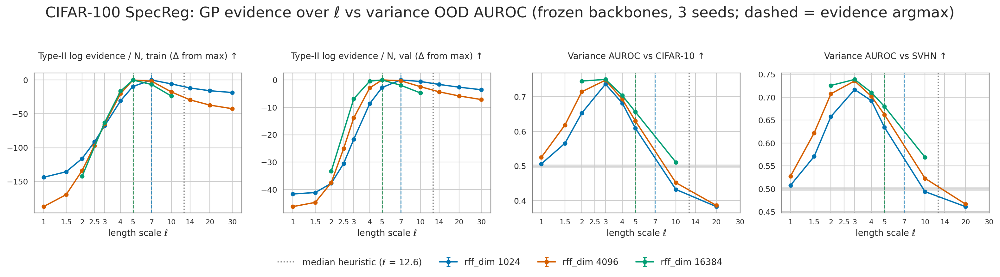

# CIFAR-100 / WideResNet-28-10: choosing ℓ by GP evidence

Can the GP's own model-selection criterion pick a distance-aware length scale without OOD data?
[CIFAR100_DECOUPLED_VARIANCE_RESULTS.md](CIFAR100_DECOUPLED_VARIANCE_RESULTS.md) found the
variance AUROC peaks at ℓ ≈ 3, but it read that ℓ off the test OOD sets. Here the log marginal
likelihood of the random-feature Bayesian linear model is used instead. It is computed under
the Gaussian likelihood, the same model whose posterior gives the SNGP variance, and it uses
in-distribution data only.

| | |
|---|---|
| Backbones | SpecReg (matched), seeds 12345 / 1 / 2, `last.ckpt`, frozen; features from the head-swap cache ([CIFAR100_RF_HEAD_SWAP_RESULTS.md](CIFAR100_RF_HEAD_SWAP_RESULTS.md)) |
| Features | The decoupled study's variance head: cos / orf, unscaled, no input norm, same random draw. ℓ ∈ {1 … 30} × rff_dim ∈ {1024, 4096}; 16384 at ℓ ∈ {2 … 10} |
| Evidence | Y one-hot, prior precision α, noise s. Two settings: the recipe's (α, s) = (1, 1), i.e. the head's ridge 1 and unit weight, and **type-II** (α, s) by MacKay's fixed point. Computed on the augmented train pass (N = 45,000) and on held-out val (N = 5,000). `src/metrics/gp_evidence.py` |
| Median heuristic | Median pairwise distance of the train features |
| AUROC column | Variance-only AUROC from the decoupled study at the same (ℓ, rff_dim) |
| Code, commands | `scripts/metrics/cifar100_length_scale_evidence.py`, `src/visualization/cifar100_length_scale_evidence.py`; [../MASTER_INFER_RESULTS_PATH.md](../MASTER_INFER_RESULTS_PATH.md), section "Length-scale evidence" |

**Gate:** the joined AUROC reproduces the decoupled page, e.g. rff_dim 1024, ℓ = 3: SVHN 0.717.

## Selected ℓ

The argmax is identical on all 3 seeds in every row.

| Rule | rff_dim 1024 | rff_dim 4096 | rff_dim 16384 |
|---|---:|---:|---:|
| evidence, recipe (α, s) = (1, 1) | 30 (largest in grid) | 30 (largest in grid) | 10 (largest in grid) |
| **evidence, type-II, train** | **7** | **5** | **5** |
| **evidence, type-II, val** | **7** | **5** | **5** (ℓ = 4 within 0.4 / N) |
| median heuristic | 12.6 | 12.6 | 12.6 |
| *variance-AUROC optimum (OOD-tuned)* | *3* | *3* | *3* |

Variance AUROC (C-10 / SVHN) at the ℓ each rule picks:

| rff_dim | type-II evidence ℓ | AUROC at that ℓ | AUROC at ℓ = 3 | AUROC at ℓ = 20 (recipe) |
|---|---:|---:|---:|---:|
| 1024 | 7 | between ℓ = 5 (0.609 / 0.634) and ℓ = 10 (0.433 / 0.494) | 0.736 / 0.717 | 0.383 / 0.461 |
| 4096 | 5 | 0.630 / 0.662 | 0.748 / 0.736 | 0.386 / 0.467 |
| 16384 | 5 | 0.656 / 0.680 (ℓ = 4: 0.703 / 0.710) | 0.750 / 0.739 | — |

*Mean ± 1 std over 3 backbone seeds. Evidence is shown relative to its maximum per rff_dim.
Dashed: type-II argmax per rff_dim. Dotted: median heuristic. Grey band: chance.*

## Analysis

1. **Type-II evidence moves ℓ most of the way.** It has a sharp interior maximum at ℓ = 5–7
   (ρ = ‖x‖/ℓ ≈ 1.7–2.4), stable across seeds.
   - It lands in the distance-aware regime: variance AUROC 0.63–0.68 against 0.39–0.47 at the
     recipe's ℓ = 20.
   - It stops short of the OOD-tuned ℓ ≈ 3 (0.74–0.75), which costs about 0.06–0.11 AUROC.
2. **The recipe's fixed (α, s) is useless as a selector.** Evidence rises monotonically with ℓ.
   With α and s pinned, a smoother kernel always looks better. The type-II fit needs α ~ 10⁵–10⁷
   and s ~ 10⁻⁴–10⁻², far from (1, 1).
3. **Train and held-out val agree.** The backbone all but interpolates its training images
   (type-II s ~ 10⁻⁴). Even so, evidence on val features, which never shaped the backbone, picks
   the same ℓ. The train-set fit is therefore not what sets the choice.
4. **More features pull the argmax down** (7 → 5 → 5, with ℓ = 4 tied on val at 16384). This
   mirrors the decoupled finding that a sharp kernel is limited by random-feature noise at
   small rff_dim.
5. **The median heuristic (ℓ ≈ 12.6, ρ ≈ 0.95) is too smooth.** It sits on the flat,
   non-distance-aware side of the curve.

## Caveats

- Gaussian likelihood on one-hot targets: a regression surrogate for the classifier. It is the
  model that defines the SNGP variance, but not the model trained by CE.
- Backbones are frozen and were co-trained with an ℓ = 20 head. The evidence ranks kernels on
  those features; it does not say what a backbone trained at ℓ = 5 would learn.
- The rff_dim 16384 grid stops at ℓ = 10, so its recipe-(1, 1) argmax is a grid edge.
