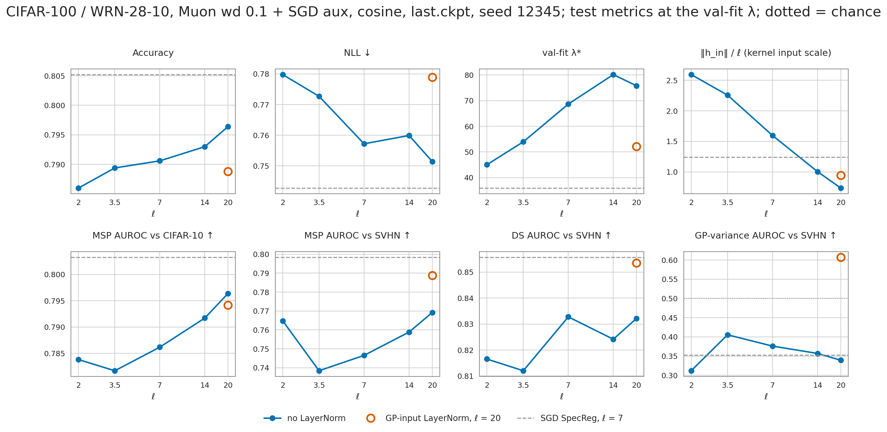

# CIFAR-100 / WideResNet-28-10: GP head on an unconstrained backbone, trained with Muon

The CIFAR-100 follow-up of [ACEVEDO_MUON_RESULTS.md](ACEVEDO_MUON_RESULTS.md). The SNGP GP head
sits on a WRN-28-10 with **no spectral normalization and no spectral penalty on the convs**. It is trained
with Muon on the 27 hidden convs (`src/models/components/optimizers.py`), at the evidence-picked ℓ = 7.
The rows below vary four things:
- the LR schedule;
- the optimizer on the remaining parameters (the stem, BatchNorm and GP output layer);
- a cap on BatchNorm's gain;
- a LayerNorm on the GP input;
- the GP length scale ℓ, without the LayerNorm ([section below](#length-scale-sweep-no-layernorm)).

All are set against the SGD-trained SNGP / SpecReg references.

| | |
|---|---|
| Optimizer | `[SGD]`: SGD-Nesterov (0.04, L2 6e-4) on every weight. `[Muon + AdamW]` / `[Muon + SGD]`: Muon (lr 0.02, momentum 0.95, decoupled wd 0 or 0.1) on the hidden convs, with AdamW (lr 1e-3, wd 0.01) or the `[SGD]` recipe on the stem / BN / GP head (`MuonWithAuxAdamW` / `MuonWithAuxSGD`) |
| Schedule | piecewise (the benchmark's ×0.2 at epochs 75 / 150 / 200, 1 warmup epoch); WSD (1 warmup epoch, flat to 175, linear to 1/75 at 249); cosine (`CosineAnnealingLR` to 0, no warmup — the Acevedo schedule) |
| BN spectral norm | `SpectralBatchNorm2d` (DUE, van Amersfoort et al. 2021): every BN's gain max_i \|γ_i\|/√(running_var_i+ε) capped at 3. A BN spectral-*regularization* run (loss + 0.01·Σ_l gain²) trained unstably and is not evaluated |
| Head | σ² 1, ridge 1.0, unscaled features, `gaussian`; ℓ as in the ℓ column (20 is the benchmark recipe; "online" is the [online ℓ page](CIFAR100_ONLINE_LS_RESULTS.md)'s in-training evidence ℓ). GP input not normalized (the reference's `gp_input_normalization=False`), except the GP-input LayerNorm row (`normalize_input: true`, ℓ = 20 so that ‖h‖/ℓ ≈ √640/20 ≈ 1.26 at init) |
| Runs | 250 epochs, `last.ckpt`. The five piecewise `[SGD]` rows are 3 seeds (12345 / 1 / 2); every other row is seed 12345 only. [../checkpoints/CIFAR_CHECKPOINTS.md](../checkpoints/CIFAR_CHECKPOINTS.md), sections "muon" and "cosine" |
| Protocol | One post-hoc knob per row, fit on **val** NLL (λ for SNGP arms, T for the baseline); metrics on **test**. `±` is the std across 3 seeds. Bold is the best value per column across all rows |
| Data, commands | [../MASTER_INFER_RESULTS_PATH.md](../MASTER_INFER_RESULTS_PATH.md), sections "muon" and "cosine" |

## Results

| Arm | Optimizer | Schedule | ℓ | Seeds | Acc | NLL | smECE | knob\* (val) |
|---|---|---|---|---|---:|---:|---:|---:|
| Baseline | [SGD] | piecewise | — | 3 | **0.8061 ± 0.0027** | 0.7574 ± 0.0072 | 0.0364 ± 0.0007 | T 1.31 |
| SNGP (`c = 6.0`) | [SGD] | piecewise | 20 | 3 | 0.8025 ± 0.0045 | 0.7600 ± 0.0065 | 0.0348 ± 0.0022 | λ 32.5 |
| SNGP + SpecReg | [SGD] | piecewise | 20 | 3 | 0.8048 ± 0.0036 | 0.7472 ± 0.0100 | 0.0299 ± 0.0041 | λ 35.3 |
| SNGP + SpecReg + evidence ℓ | [SGD] | piecewise | 7 | 3 | 0.7978 ± 0.0017 | 0.7513 ± 0.0062 | 0.0253 ± 0.0023 | λ 43.1 |
| SNGP + SpecReg + online evidence ℓ | [SGD] | piecewise | online | 3 | 0.7999 ± 0.0003 | 0.7566 ± 0.0039 | 0.0274 ± 0.0011 | λ 49.1 |
| SNGP (`c = 6.0`) | [SGD] | cosine | 7 | 1 | 0.7993 | 0.7697 | 0.0343 | λ 34.3 |
| SNGP + SpecReg | [SGD] | cosine | 7 | 1 | 0.8052 | **0.7427** | 0.0276 | λ 35.9 |
| GP head, no SN, wd 0 | [Muon + AdamW] | piecewise | 7 | 1 | 0.7626 | 0.8855 | 0.0173 | λ 191.1 |
| GP head, no SN, wd 0.1 | [Muon + AdamW] | piecewise | 7 | 1 | 0.7729 | 0.8282 | 0.0157 | λ 113.5 |
| GP head, no SN, wd 0 | [Muon + AdamW] | WSD | 7 | 1 | 0.7537 | 0.9129 | 0.0168 | λ 240.4 |
| GP head, no SN, wd 0.1 | [Muon + AdamW] | WSD | 7 | 1 | 0.7462 | 0.9003 | **0.0127** | λ 63.5 |
| GP head, no SN, wd 0.1 | [Muon + AdamW] | cosine | 7 | 1 | 0.7635 | 0.8501 | 0.0144 | λ 95.0 |
| GP head, no SN, wd 0.1 | [Muon + SGD] | cosine | 7 | 1 | 0.7906 | 0.7572 | 0.0242 | λ 68.7 |
| GP head, no SN, wd 0 | [Muon + SGD] | cosine | 7 | 1 | 0.7903 | 0.8355 | 0.0354 | λ 29.7 |
| GP head, no SN, wd 0.1, BN spectral norm `c = 3` | [Muon + SGD] | cosine | 7 | 1 | 0.7793 | 0.9184 | 0.1220 | λ 0.0 |
| GP head, no SN, wd 0.1, GP-input LayerNorm | [Muon + SGD] | cosine | 20 | 1 | 0.7888 | 0.7789 | 0.0276 | λ 52.2 |

| Arm | Optimizer | Schedule | MSP C-10 | MSP SVHN | DS C-10 | DS SVHN | Var C-10 | Var SVHN | FPR95 MSP SVHN ↓ |
|---|---|---|---:|---:|---:|---:|---:|---:|---:|
| Baseline | [SGD] | piecewise | **0.8101 ± 0.0023** | 0.7309 ± 0.0373 | 0.8121 ± 0.0020 | 0.7496 ± 0.0383 | — | — | 0.855 ± 0.025 |
| SNGP (`c = 6.0`) | [SGD] | piecewise | 0.8059 ± 0.0031 | 0.7620 ± 0.0053 | 0.8082 ± 0.0029 | 0.8047 ± 0.0032 | 0.437 ± 0.012 | 0.580 ± 0.018 | 0.828 ± 0.011 |
| SNGP + SpecReg | [SGD] | piecewise | 0.8092 ± 0.0016 | 0.7948 ± 0.0060 | 0.8110 ± 0.0020 | 0.8330 ± 0.0068 | 0.314 ± 0.001 | 0.410 ± 0.046 | 0.794 ± 0.023 |
| SNGP + SpecReg + evidence ℓ | [SGD] | piecewise | 0.7948 ± 0.0014 | 0.8016 ± 0.0269 | 0.7846 ± 0.0036 | 0.8571 ± 0.0230 | 0.336 ± 0.007 | 0.449 ± 0.030 | 0.778 ± 0.036 |
| SNGP + SpecReg + online evidence ℓ | [SGD] | piecewise | 0.7866 ± 0.0066 | 0.7667 ± 0.0113 | 0.7618 ± 0.0127 | 0.8012 ± 0.0143 | 0.294 ± 0.010 | 0.297 ± 0.044 | 0.824 ± 0.017 |
| SNGP (`c = 6.0`) | [SGD] | cosine | 0.7987 | 0.7578 | 0.7995 | 0.8198 | 0.393 | 0.595 | 0.841 |
| SNGP + SpecReg | [SGD] | cosine | 0.8032 | 0.7984 | 0.7967 | 0.8557 | 0.315 | 0.353 | 0.800 |
| GP head, no SN, wd 0 | [Muon + AdamW] | piecewise | 0.7615 | 0.8120 | 0.7135 | 0.8777 | 0.370 | 0.427 | 0.757 |
| GP head, no SN, wd 0.1 | [Muon + AdamW] | piecewise | 0.7685 | 0.7507 | 0.7321 | 0.8441 | 0.410 | 0.416 | 0.796 |
| GP head, no SN, wd 0 | [Muon + AdamW] | WSD | 0.7624 | 0.8249 | 0.7229 | 0.8853 | 0.388 | 0.567 | 0.729 |
| GP head, no SN, wd 0.1 | [Muon + AdamW] | WSD | 0.7601 | **0.8301** | 0.7205 | **0.8919** | 0.431 | 0.470 | **0.699** |
| GP head, no SN, wd 0.1 | [Muon + AdamW] | cosine | 0.7724 | 0.7793 | 0.7353 | 0.8674 | 0.416 | 0.450 | 0.750 |
| GP head, no SN, wd 0.1 | [Muon + SGD] | cosine | 0.7862 | 0.7465 | 0.7556 | 0.8328 | 0.351 | 0.376 | 0.808 |
| GP head, no SN, wd 0 | [Muon + SGD] | cosine | 0.8044 | 0.8281 | 0.8114 | 0.8523 | 0.297 | 0.430 | 0.736 |
| GP head, no SN, wd 0.1, BN spectral norm `c = 3` | [Muon + SGD] | cosine | 0.8075 | 0.8257 | **0.8139** | 0.8591 | 0.212 | 0.498 | 0.792 |
| GP head, no SN, wd 0.1, GP-input LayerNorm | [Muon + SGD] | cosine | 0.7942 | 0.7887 | 0.7758 | 0.8535 | **0.661** | **0.607** | 0.745 |

Paired at seed 12345 (row − row), each row at its own λ\*:

| | Acc | NLL | smECE | MSP C-10 | MSP SVHN | DS SVHN | Var C-10 | Var SVHN |
|---|---:|---:|---:|---:|---:|---:|---:|---:|
| *Muon vs SGD at ℓ = 7* | | | | | | | | |
| [Muon + AdamW] wd 0, piecewise − [SGD] SpecReg + evidence ℓ | −0.0372 | +0.1383 | −0.0095 | −0.0349 | +0.0382 | +0.0467 | +0.0420 | −0.0546 |
| [Muon + AdamW] wd 0.1, piecewise − [SGD] SpecReg + evidence ℓ | −0.0269 | +0.0811 | −0.0110 | −0.0279 | −0.0231 | +0.0131 | +0.0819 | −0.0658 |
| [Muon + AdamW] wd 0, WSD − [SGD] SpecReg + evidence ℓ | −0.0461 | +0.1657 | −0.0099 | −0.0340 | +0.0512 | +0.0544 | +0.0595 | +0.0852 |
| [Muon + AdamW] wd 0.1, WSD − [SGD] SpecReg + evidence ℓ | −0.0536 | +0.1531 | −0.0141 | −0.0363 | +0.0563 | +0.0610 | +0.1027 | −0.0115 |
| [Muon + AdamW] wd 0.1, cosine − [SGD] SpecReg, cosine | −0.0417 | +0.1074 | −0.0133 | −0.0308 | −0.0191 | +0.0117 | +0.1009 | +0.0971 |
| [Muon + SGD] wd 0.1, cosine − [SGD] SpecReg, cosine | −0.0146 | +0.0145 | −0.0035 | −0.0171 | −0.0518 | −0.0229 | +0.0361 | +0.0232 |
| [Muon + SGD] wd 0, cosine − [SGD] SpecReg, cosine | −0.0149 | +0.0928 | +0.0077 | +0.0012 | +0.0298 | −0.0034 | −0.0185 | +0.0774 |
| [Muon + SGD] wd 0.1 + BN SN, cosine − [SGD] SpecReg, cosine | −0.0259 | +0.1757 | +0.0943 | +0.0042 | +0.0273 | +0.0034 | −0.1033 | +0.1453 |
| [Muon + SGD] wd 0.1 + GP-input LN, cosine − [SGD] SpecReg, cosine | −0.0164 | +0.0362 | −0.0001 | −0.0091 | −0.0096 | −0.0022 | +0.3460 | +0.2543 |
| *Schedule* | | | | | | | | |
| [Muon + AdamW] wd 0: WSD − piecewise | −0.0089 | +0.0274 | −0.0004 | +0.0009 | +0.0130 | +0.0076 | +0.0175 | +0.1398 |
| [Muon + AdamW] wd 0.1: WSD − piecewise | −0.0267 | +0.0721 | −0.0030 | −0.0084 | +0.0793 | +0.0479 | +0.0208 | +0.0543 |
| [Muon + AdamW] wd 0.1: cosine − piecewise | −0.0094 | +0.0219 | −0.0013 | +0.0040 | +0.0286 | +0.0233 | +0.0056 | +0.0338 |
| [SGD] SpecReg ℓ = 7: cosine − piecewise | +0.0054 | −0.0045 | +0.0009 | +0.0068 | +0.0246 | +0.0247 | −0.0133 | −0.1291 |
| *Aux optimizer (stem / BN / GP head)* | | | | | | | | |
| Muon wd 0.1, cosine: [Muon + SGD] − [Muon + AdamW] | +0.0271 | −0.0929 | +0.0098 | +0.0137 | −0.0328 | −0.0346 | −0.0648 | −0.0739 |
| *BN spectral norm* | | | | | | | | |
| [Muon + SGD] wd 0.1, cosine: with − without | −0.0113 | +0.1612 | +0.0978 | +0.0213 | +0.0791 | +0.0263 | −0.1394 | +0.1222 |
| *GP-input LayerNorm (ℓ 7 → 20)* | | | | | | | | |
| [Muon + SGD] wd 0.1, cosine: with − without | −0.0018 | +0.0217 | +0.0034 | +0.0080 | +0.0422 | +0.0207 | +0.3099 | +0.2311 |

- **Muon + AdamW: worse in-distribution than every SGD row.** Accuracy is down 2.7–5.4 points and NLL
  up 0.08–0.17 against evidence ℓ = 7. The val-fitted λ\* is 63–240, against 33–49 for the SGD rows, so
  the trained logits are far more overconfident. smECE is the lowest of any row only after that large
  correction. Near-OOD (CIFAR-10) is worse on every row. On far-OOD (SVHN), three of the four
  piecewise/WSD rows beat every SGD row, with DS SVHN 0.878–0.892 and the best FPR95 0.70. The GP
  variance is not the source.
- **Schedule: not the lever.** WSD lowered accuracy and raised NLL against piecewise at both weight
  decays. Cosine moved accuracy by +0.5 points (SpecReg) and −0.9 points (Muon), within the SGD rows'
  seed spread.
- **Aux optimizer: the lever for Muon's in-distribution gap.** At Muon wd 0.1, SGD instead of AdamW on
  the stem / BN / GP head gives +2.7 points of accuracy and −0.093 NLL. The final BN |γ| fell from 1.34
  to 0.59, and the GP output layer ‖β‖_F from 44 to 19. The AdamW rows' far-OOD SVHN gain went with
  it. That gain came from a narrowed kernel: ‖h‖/ℓ was 2.0 against 1.23 for SGD.
- **Muon + SGD wd 0** has the best far-OOD of the cosine rows (MSP SVHN 0.828, FPR95 0.736) and the
  SGD rows' BN scale (final BN |γ| 0.31, ‖β‖_F 9.7), but its NLL is 0.836.
- **BN spectral norm: best near-OOD of the single-seed rows, worst calibration.** DS CIFAR-10 (0.814) is
  the highest in the table. MSP CIFAR-10 (0.808) trails only the 3-seed Baseline (0.810) and SpecReg
  (0.809). MSP SVHN is up 0.08 on the same recipe without the cap. But the
  model is underconfident. The val fit hits λ = 0, the bottom of the range (λ only damps logits), and
  smECE is 0.122.
  - **Mechanism:** the cap binds on 13 of 25 BN layers and shrinks the final BN's gain about 16× (raw
    47 → 3). It divides γ but not β, so the backbone features collapse toward a constant.
  - **Effect:** distances between val features are 0.06–0.11 ℓ, the kernel is about 0.99 between any
    two images, and the logits stay small.
  - **Why ℓ matters:** DUE learns ℓ, which would absorb this; the fixed ℓ = 7 does not.
- **GP-input LayerNorm (ℓ = 20): the only row whose GP variance ranks OOD above ID on both sets.**
  Var AUROC is 0.661 on CIFAR-10 and 0.607 on SVHN, against 0.351 / 0.376 on the same recipe without
  it. Every other row is below 0.44 on CIFAR-10. MSP SVHN is up 0.042 and FPR95 drops from 0.808 to
  0.745. In-distribution it is slightly worse: −0.2 points of accuracy, +0.022 NLL.
  - **It did not stop the λ drift it was run to test.** The val-fit λ still climbs from epoch 150
    (7.7 → 52.2 at epoch 249, against 7.3 → 68.7 without it). ‖β‖_F is 19.9 against 18.8 without it
    and 12.1 for SpecReg, so the drift tracks the GP output layer, not the feature scale.
  - **Feature scale at `last.ckpt`** (2000 val images): L2 shrinks the LayerNorm gain to 0.50, so
    ‖h‖/ℓ is 0.95, not the 1.26 at init. Pairwise distances stay at the no-LayerNorm level: same-class
    d/ℓ 1.00 against 1.07, and 0.75 for SpecReg.

Caveats:
- **Seeds:** every non-piecewise-SGD row is one seed. The SGD rows' seed spread is about ±0.004 for
  accuracy, ±0.01 for NLL and ±0.02–0.04 for DS SVHN.
- **Muon recipe:** Muon's lr and momentum are the reference defaults, untuned on this backbone.

## Length-scale sweep (no LayerNorm)

`[Muon + SGD]` wd 0.1, cosine, GP input **not** normalized, seed 12345. Only `model.net.length_scale`
changes; ℓ = 7 is the "GP head, no SN, wd 0.1 [Muon + SGD] cosine" row above. The hollow marker is
the GP-input LayerNorm row (ℓ = 20), the dashed line `[SGD]` SpecReg at ℓ = 7 (cosine).

In-distribution, and the feature scale the kernel sees (2000 val images, `last.ckpt`,
`scripts/metrics/cifar100_gp_head_diag.py`; k is the exact RBF kernel averaged over same- / different-class pairs):

| ℓ | Acc | NLL | smECE | λ\* | ‖h‖ | ‖h‖/ℓ | k same | k diff | ‖β‖_F |
|---|---:|---:|---:|---:|---:|---:|---:|---:|---:|
| 2 | 0.7860 | 0.7798 | 0.0214 | 45.0 | 5.2 | 2.59 | 0.30 | 0.15 | 19.8 |
| 3.5 | 0.7894 | 0.7727 | **0.0194** | 53.9 | 7.9 | 2.26 | 0.36 | 0.19 | 19.4 |
| 7 | 0.7906 | 0.7572 | 0.0242 | 68.7 | 11.2 | 1.60 | 0.57 | 0.39 | 18.8 |
| 14 | 0.7930 | 0.7599 | 0.0262 | 80.1 | 14.1 | 1.01 | 0.82 | 0.68 | 18.3 |
| 20 | **0.7964** | **0.7514** | 0.0267 | 75.8 | 14.7 | 0.74 | 0.90 | 0.80 | 18.5 |
| 20, GP-input LayerNorm | 0.7888 | 0.7789 | 0.0276 | 52.2 | 0.64 (post-LN 19.0) | 0.95 | 0.60 | 0.44 | 19.9 |

OOD AUROC:

| ℓ | MSP C-10 | MSP SVHN | DS C-10 | DS SVHN | Var C-10 | Var SVHN | FPR95 MSP SVHN ↓ |
|---|---:|---:|---:|---:|---:|---:|---:|
| 2 | 0.7838 | 0.7648 | 0.7518 | 0.8165 | 0.350 | 0.312 | 0.818 |
| 3.5 | 0.7817 | 0.7384 | 0.7474 | 0.8120 | 0.354 | 0.405 | 0.795 |
| 7 | 0.7862 | 0.7465 | 0.7556 | 0.8328 | 0.351 | 0.376 | 0.808 |
| 14 | 0.7917 | 0.7589 | 0.7672 | 0.8242 | 0.327 | 0.357 | 0.797 |
| 20 | **0.7964** | 0.7692 | **0.7854** | 0.8322 | 0.313 | 0.339 | 0.803 |
| 20, GP-input LayerNorm | 0.7942 | **0.7887** | 0.7758 | **0.8535** | **0.661** | **0.607** | **0.745** |

- **ℓ is a real knob here, only partly absorbed.** Over ℓ 2 → 20 (×10) the backbone grows ‖h‖ ×2.8,
  so ‖h‖/ℓ still falls 2.59 → 0.74 and the same-class kernel widens 0.30 → 0.90. (In the
  [learnable-ℓ study](CIFAR100_LEARNABLE_LS_RESULTS.md) ‖h‖/ℓ locked at ~2.2 instead.)
- **In-distribution and near-OOD: larger ℓ is better.** ℓ 2 → 20: accuracy +1.0 point (monotone over
  all five ℓ), NLL −0.028, MSP C-10 +0.013, DS C-10 +0.034 (each with one out-of-order step). The ℓ = 20 row is the best `[Muon + SGD]` wd 0.1 row,
  still −0.9 points of accuracy and +0.009 NLL behind `[SGD]` SpecReg.
- **Far-OOD (SVHN): no trend.** MSP 0.738–0.769, DS 0.812–0.833 and FPR95 0.79–0.82 move without
  order, within the ±0.02–0.04 seed spread. A small ℓ does not buy far-OOD.
- **GP variance: inverted at every ℓ** (AUROC 0.31–0.41). Changing ℓ does not un-invert it; the
  LayerNorm does. Ad hoc check (2000 test images per set against 4000 CIFAR-100 val features): without the
  LayerNorm, CIFAR-10 / SVHN features are 3–13 % shorter than CIFAR-100 test features and sit closer to the
  centre of the CIFAR-100 cloud. Their nearest-neighbour distance is only +5 % / +1 % above ID at ℓ = 7,
  and ℓ rescales every distance alike. With the LayerNorm, SVHN's raw ‖h‖ is half of ID's, but the LayerNorm
  normalizes it away, and the nearest-neighbour gap becomes +17 % / +11 %.
- **LayerNorm at matched ℓ = 20:** −0.8 points of accuracy, +0.028 NLL, MSP C-10 −0.002; MSP SVHN +0.020,
  DS SVHN +0.021, FPR95 −0.058, Var AUROC +0.35 / +0.27. So its in-distribution cost is larger than
  the −0.2 points measured against ℓ = 7.
- **λ\* rises with ℓ** (45 → 80) while ‖β‖_F stays at 18–20. So the post-hoc λ is not set by ‖β‖
  alone; it also grows as the kernel widens.

Caveat: one seed per ℓ.
