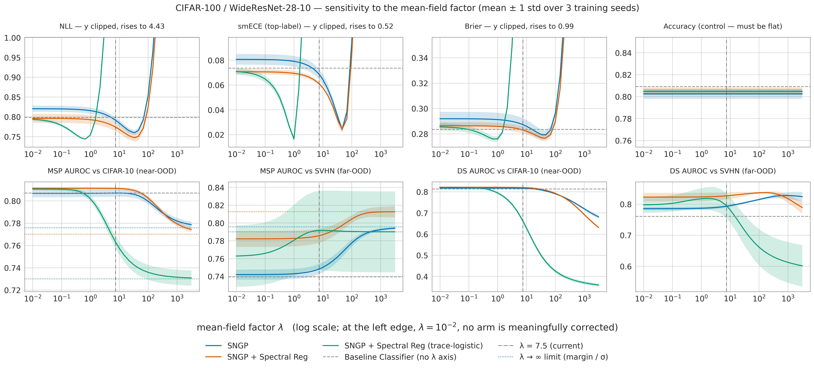

# CIFAR-100 / WideResNet-28-10 — SNGP vs. spectral regularization (uncalibrated)

Reproduction of the benchmark SNGP was published on (Liu et al. 2022,
[arXiv 2205.00403](https://arxiv.org/abs/2205.00403)), run so that the rep-spectral
variant can be judged against a *reproduced* SNGP number rather than only against the
Acevedo pilot ([ACEVEDO_SPECREG_RESULTS.md](ACEVEDO_SPECREG_RESULTS.md)).

| | |
|---|---|
| Runs | 250 epochs, one L40S per arm, 2026-09-20/21, branch `sngp-spectral-reg` |
| Seeds | 12345 / 1 / 2 — baseline, SNGP `c = 6.0`, SpecReg (matched) 12345 only — SNGP `c = 4.1`, rep-spectral literal |
| W&B | groups `CIFAR100` and `CIFAR100_overnight_2026-09-20_21-38-42` |
| Recipe, deviations, GP-head bugs | [../models/CIFAR100_BENCHMARK.md](../models/CIFAR100_BENCHMARK.md) |
| Checkpoints | [../checkpoints/CIFAR_CHECKPOINTS.md](../checkpoints/CIFAR_CHECKPOINTS.md) |
| Inference dirs, reproduce commands | [../MASTER_INFER_RESULTS_PATH.md](../MASTER_INFER_RESULTS_PATH.md) |
| Random-feature head swap (positive / hyperbolic × ORF / SimRF, SpecReg backbones) | [CIFAR100_RF_HEAD_SWAP_RESULTS.md](CIFAR100_RF_HEAD_SWAP_RESULTS.md) |
| Random-feature heads trained end-to-end (`rf_e2e`, one seed) | [CIFAR100_RF_E2E_RESULTS.md](CIFAR100_RF_E2E_RESULTS.md) |
| GP variance at a decoupled length scale (post hoc, frozen SpecReg backbones) | [CIFAR100_DECOUPLED_VARIANCE_RESULTS.md](CIFAR100_DECOUPLED_VARIANCE_RESULTS.md) |
| Choosing ℓ by type-II GP evidence (in-distribution only, frozen SpecReg backbones) | [CIFAR100_LENGTH_SCALE_EVIDENCE_RESULTS.md](CIFAR100_LENGTH_SCALE_EVIDENCE_RESULTS.md) |

## Read this first

1. **Off the fair-comparison protocol, deliberately** — SGD+Nesterov with a
   warmup/piecewise schedule instead of AdamW+cosine; a fixed 250-epoch budget, no early
   stopping; `val/loss` selection instead of `val/nll_cal`; the reference's CIFAR GP
   constants; **no post-hoc calibration** (`mean_field_factor` pinned at the reference's
   7.5, never fitted). Do not read these numbers next to the biomedical protocol runs.
2. **Compare the arms at epoch 249 (`last.ckpt`), never at `best.ckpt`.** `val/loss`
   selects epoch 75 / 76 / 246 for baseline / SNGP / SpecReg: CE validation loss degrades
   after the first LR drop while accuracy keeps climbing, and the spectral penalty
   suppresses exactly that degradation. Epoch 249 is also the reference's own reporting
   point. The `best.ckpt` table below is kept for reference only.
3. **`±` is across training seeds, always.** Nothing here is resampled. Single-seed
   arms get a bare number.
4. **Metrics.** smECE is top-label (confidence vs. correct); the macro one-vs-rest
   average reads ~0.003 for every arm at 100 classes and says nothing.
5. **OOD AUROC follows the paper's protocol** (arXiv 2205.00403 §6.2.1, appendix C.1):
   the **full** CIFAR-100 test set (10,000 rows) against the **full** OOD test set
   (CIFAR-10 10,000, SVHN 26,032), no subsampling, one deterministic number per run.
   Unequal group sizes are fine — AUROC is a rank statistic estimating
   `P(score_OOD > score_ID)`. Two scores are reported:
   - **MSP**, `max_k softmax(g_k(x))` — what the paper's own tables use, so these are
     the rows to read against its published numbers. For SNGP arms this is MSP of the
     mean-field-adjusted posterior, which is what the paper reports, but
     `mean_field_factor` is pinned at 7.5 and never fitted (see caveat 1).
   - **Dempster-Shafer**, `K / (K + Σ exp(logit))` — what the reference
     *implementation* uses (`dempster_shafer_ood` in `baselines/cifar/sngp.py`). Kept
     because softmax is shift-invariant, so MSP is blind to exactly the logit magnitude
     an SNGP head is trained to modulate.

   Earlier versions of this page reported DS over 10 fixed-seed subsamples of 1000
   rows per frame. Those numbers are within ~0.003 of the full-population ones, so
   nothing here rests on the change — but they are not the paper's protocol, and the
   `±` they carried described resampling noise rather than run-to-run variation.

---

## Headline — three seeds, epoch 249 (`last.ckpt`)

MSP, the paper's own score:

| Arm | seeds | Accuracy | NLL | smECE | MSP AUROC vs CIFAR-10 | MSP AUROC vs SVHN |
|---|---:|---:|---:|---:|---:|---:|
| Baseline (deterministic) | 3 | **0.8061 ± 0.0027** | 0.8074 ± 0.0096 | 0.0779 ± 0.0038 | 0.8056 ± 0.0024 | 0.7235 ± 0.0378 |
| SNGP (`c = 6.0`) | 3 | 0.8025 ± 0.0045 | 0.7912 ± 0.0073 | 0.0685 ± 0.0042 | 0.8070 ± 0.0033 | 0.7483 ± 0.0057 |
| **SpecReg (matched)** | 3 | 0.8048 ± 0.0036 | **0.7739 ± 0.0107** | **0.0609 ± 0.0013** | **0.8111 ± 0.0014** | **0.7857 ± 0.0080** |
| SNGP (`c = 4.1`) | 1 | 0.8019 | 0.7965 | 0.0677 | 0.8026 | 0.7374 |
| SpecReg (rep-spectral literal) | 1 | 0.7372 | 1.2651 | 0.1363 | 0.7332 | 0.7490 |

Dempster-Shafer companion:

| Arm | seeds | DS AUROC vs CIFAR-10 | DS AUROC vs SVHN |
|---|---:|---:|---:|
| Baseline (deterministic) | 3 | 0.8129 ± 0.0020 | 0.7487 ± 0.0382 |
| SNGP (`c = 6.0`) | 3 | 0.8162 ± 0.0037 | 0.7932 ± 0.0045 |
| **SpecReg (matched)** | 3 | **0.8198 ± 0.0019** | **0.8267 ± 0.0114** |
| SNGP (`c = 4.1`) | 1 | 0.8097 | 0.7891 |
| SpecReg (rep-spectral literal) | 1 | 0.7282 | 0.8549 |

*Mean ± std across the three training seeds (12345 / 1 / 2). The literal arm's row comes
from its clean re-run, not from the seed-12345 run detailed below. Regenerate both with
`scripts/metrics/cifar100_overnight_report.py --include-seed-12345`.*

### Paired SpecReg (matched) − SNGP (`c = 6.0`), per seed

Paired rather than differencing the marginal means: the seeds are shared, so a per-seed
difference removes the run-to-run variation that dominates the `±` columns above.

| seed | Accuracy | NLL | smECE | MSP C-10 | MSP SVHN | DS C-10 | DS SVHN |
|---|---:|---:|---:|---:|---:|---:|---:|
| 12345 | +0.0074 | −0.0224 | −0.0121 | +0.0082 | +0.0263 | +0.0086 | +0.0249 |
| 1 | +0.0029 | −0.0264 | −0.0070 | −0.0001 | +0.0427 | −0.0020 | +0.0346 |
| 2 | −0.0034 | −0.0029 | −0.0038 | +0.0043 | +0.0432 | +0.0040 | +0.0410 |
| **mean** | +0.0023 | **−0.0173** | **−0.0076** | +0.0041 | **+0.0374** | +0.0035 | **+0.0335** |
| sign-consistent | mixed | **3/3** | **3/3** | mixed | **3/3** | mixed | **3/3** |

### What three seeds support

- **Survives, and is larger under the paper's own score.** SpecReg beats SNGP on
  **far-OOD (SVHN)** by **+0.037 under MSP** and +0.033 under DS, sign-consistent 3/3
  under both, alongside **NLL (−0.017)** and **calibration (smECE −0.008)**. The
  per-seed MSP SVHN gaps (+0.026, +0.043, +0.043) each exceed SNGP's own across-seed
  std of 0.006. This is the one claim the score choice cannot be accused of carrying.
- **Does not survive.** Accuracy and near-OOD (CIFAR-10) are mixed in sign and within
  noise under both scores — the three arms are indistinguishable on both. Under MSP the
  seed-1 near-OOD delta is −0.0001, i.e. exactly nothing.
- **Near-OOD reproduces; far-OOD does not.** Under MSP our near-OOD numbers (baseline
  0.806, SNGP 0.807) sit ~1 pt above the published 0.795 / 0.798 — a good reproduction.
  Far-OOD is 7–10 pt *below* published (ours 0.724 / 0.748 vs 0.799 / 0.846). Accuracy
  reproduces (0.806 / 0.803 vs ~0.798 / ~0.791) on 45k training images instead of 50k,
  so this is not a broken model; SVHN AUROC is simply the high-variance axis here, and
  the published figure averages 10 seeds against our 3. It is **not** the OOD sample
  count — that is ruled out below. **Treat the absolute far-OOD level as unreproduced
  and read only the between-arm gaps.**
- **SNGP's own claim reproduces on stability, weakly on level.** Its SVHN margin over
  the baseline is **+0.025 under MSP** but +0.044 under DS — so the headline benefit is
  partly a property of the score, not only of the method. What holds under both is the
  *spread*: the baseline's across-seed std on SVHN is ~0.038 against SNGP's ~0.005, so
  the deterministic model swings across seeds where SNGP does not.
- **`c = 4.1` does not help** (MSP SVHN 0.7374, CIFAR-10 0.8026 — both *below*
  `c = 6.0`), so the 1.46× reshaped-vs-operator estimator mismatch was **not** leaving
  the SNGP arm under-constrained. That caveat from the first run is closed. One seed — a
  check, not a tuning result.
- **The literal arm's DS SVHN 0.8549 is an artifact of the score, and MSP shows it.**
  Under DS it posts the best far-OOD number in the table; under MSP it drops to 0.7490,
  mid-pack. The model behind it is the worst one here (0.737 accuracy, 1.265 NLL, 0.136
  smECE): a badly-fit network with uniformly small logits separates ID from OOD on
  *total evidence* while being useless for anything else, and DS reads total evidence
  where MSP does not. The clearest case on this page for reporting both scores.

### Does the SVHN sample count explain the gap to published? No.

SVHN's test split is 26,032 rows against the 10,000 of the CIFAR splits the paper's other
columns use, which is the obvious suspect for the far-OOD shortfall above. Capping SVHN at
10,000 rules it out — across all three arms, three seeds and both scores, ten independent
draws each:

| Arm | Score | SVHN full (26,032) | 10K draws (mean) | Δ |
|---|---|---:|---:|---:|
| Baseline | MSP | 0.7235 ± 0.0378 | 0.7234 ± 0.0379 | −0.0001 |
| SNGP (`c = 6.0`) | MSP | 0.7483 ± 0.0057 | 0.7480 ± 0.0056 | −0.0003 |
| SpecReg (matched) | MSP | 0.7857 ± 0.0080 | 0.7855 ± 0.0080 | −0.0002 |
| Baseline | DS | 0.7487 ± 0.0382 | 0.7484 ± 0.0383 | −0.0002 |
| SNGP (`c = 6.0`) | DS | 0.7932 ± 0.0045 | 0.7929 ± 0.0044 | −0.0003 |
| SpecReg (matched) | DS | 0.8267 ± 0.0114 | 0.8264 ± 0.0116 | −0.0002 |

Every arm moves by ≤ 0.0003; per-run spread across the ten draws is 0.0026–0.0066, so even
a single unlucky draw lands within ~0.004 of the full-population value. This is what the
estimator predicts rather than a surprise: AUROC is a rank statistic estimating
`P(score_OOD > score_ID)`, so discarding 60% of the OOD rows at random costs precision,
not position — the same reason unequal group sizes are fine in the first place.

The full split stays the reported number: same answer, lower variance, no seed.
Reproduce with `scripts/metrics/cifar100_svhn_subsample_check.py`.

---

## `best.ckpt` — reference only, not a like-for-like comparison

Seed 12345 only, so no `±`.

| Arm | Epoch | Accuracy | NLL | smECE | MSP C-10 | MSP SVHN | DS C-10 | DS SVHN |
|---|---:|---:|---:|---:|---:|---:|---:|---:|
| Baseline | 75 | 0.7800 | 0.7974 | 0.0625 | 0.7789 | 0.7780 | 0.7963 | 0.8638 |
| SNGP | 76 | 0.7777 | 0.7927 | 0.0604 | 0.7663 | 0.7160 | 0.7656 | 0.8476 |
| SpecReg (matched) | 246 | 0.8034 | 0.7753 | 0.0612 | 0.8106 | 0.7861 | 0.8212 | 0.8292 |
| SpecReg (literal) | 200 | 0.7404 | 1.2395 | 0.1370 | 0.7380 | 0.7425 | 0.7319 | 0.8573 |

*SpecReg's apparent +2.6 pt accuracy lead here is mostly the 246-vs-75 epoch gap, not the
regularizer — it vanishes at equal epoch. SNGP looks worse than the baseline on OOD only
because epoch 76 precedes the distance-aware behaviour the method depends on. That the
penalty let the matched arm keep improving to epoch 246 is a real property, but it is a
different claim from "better at equal budget", and this table supports neither on its
own.*

## The rep-spectral-literal arm

**The published rep-spectral recipe does not transfer to CIFAR-100 as written.**
`sngp_specreg_cifar100_literal` keeps that recipe — 200 of 250 epochs unregularized,
weight decay 0 so the penalty is the only weight regularizer — and loses badly: 0.7404
accuracy, 1.2395 NLL, 0.1370 smECE at its selected epoch 200. Both causes were predicted
in the config header: 200 epochs with no weight decay overfits a 36M-parameter WRN, and
by epoch 200 the LR has decayed to `0.04 × 0.2³`, leaving the penalty almost no learning
rate to act through. The matched arm — same penalty, active from epoch 1, weight decay
kept at the SNGP arm's 6e-4 — is where the method's benefit shows up.

---

## Seed 12345 in detail — superseded by the three-seed tables, kept for provenance

In-distribution, epoch 249:

| Arm | Accuracy | NLL | smECE | mean DS |
|---|---:|---:|---:|---:|
| Baseline (deterministic) | 0.8045 | 0.8067 | 0.0800 | 0.018 |
| SNGP (`c = 6.0`) | 0.7973 | 0.7995 | 0.0734 | 0.021 |
| **SpecReg (matched)** | **0.8047** | **0.7771** | **0.0613** | 0.023 |
| SpecReg (rep-spectral literal) | — | — | — | — |

*Published reference points: deterministic ~0.798 accuracy / 0.875 NLL, SNGP ~0.791. This
seed reproduces both within ~0.7 pt on accuracy and beats the published NLL, on 45k
training images instead of 50k.*

OOD detection, epoch 249:

| Arm | MSP C-10 (near) | MSP SVHN (far) | DS C-10 | DS SVHN |
|---|---:|---:|---:|---:|
| Baseline (deterministic) | 0.8071 | 0.6804 | 0.8150 | 0.7059 |
| SNGP (`c = 6.0`) | 0.8045 | 0.7521 | 0.8134 | 0.7919 |
| **SpecReg (matched)** | **0.8127** | **0.7784** | **0.8220** | **0.8167** |
| SpecReg (rep-spectral literal) | — | — | — | — |

*One run, so no `±`.*

- **At equal epoch the three arms are within 0.7 pt on accuracy.** SpecReg separates on
  NLL (−0.030 vs SNGP) and calibration (smECE −0.012 vs SNGP, −0.019 vs baseline), not on
  accuracy.
- **This seed flatters SNGP on OOD.** Its baseline SVHN AUROC is the worst of the three
  seeds under either score (MSP 0.680, DS 0.706), so the SNGP margin read here (+7.2 pt
  MSP, +8.6 pt DS) overstates the three-seed +2.5 / +4.4. The CIFAR-10 lead for SpecReg
  does not survive more seeds at all.
- **`—` is "no epoch-249 checkpoint", not "not measured".** This run's literal arm lost
  its `last.ckpt` to a run-directory collision
  ([../checkpoints/CIFAR_CHECKPOINTS.md](../checkpoints/CIFAR_CHECKPOINTS.md)); its
  `best.ckpt` (epoch 200) is in the table above, and the headline's epoch-249 row for
  this arm comes from the clean re-run.

---

## `mean_field_factor` sweep

λ is pinned at 7.5 for every arm and was never fitted (caveat 1). Swept offline from the
persisted `raw_logits` + GP variance over `{0} ∪ logspace(-2, 3.5, 34)` plus 7.5 and each
arm's validation-fitted λ — 39 points, 3 seeds, no re-inference. Reproduce:
[../MASTER_INFER_RESULTS_PATH.md](../MASTER_INFER_RESULTS_PATH.md).

A third arm appears here and nowhere else on this page: **SpecReg (trace-logistic)**, the
matched SpecReg recipe with the GP head's Laplace weight changed from the reference's unit
weight to `1 − ‖p‖²`. It is not in the headline tables, because `likelihood` is an
inference-only knob and at the pinned λ = 7.5 its numbers are an artifact of that pinning
rather than a property of the model — see [What the Laplace weight changes](#what-the-laplace-weight-changes).

Reading notes: the left edge, λ = 0.01, is effectively no correction for every arm, so that is
the uncorrected model. **The arms are not at comparable λ.** The trace-logistic arm's GP
variance is ~65× larger than the gaussian arms', and λ enters only through the product
`λ·var`, so its whole curve is shifted ~50× to the left — the pinned 7.5 is a 1.09× shrink on
the gaussian arms and a 3.5× shrink on it. Accuracy is a control: the correction divides every
logit of an example by one positive scalar, so argmax is invariant and that panel must be flat
(measured range across all λ: exactly 0 for all three arms). The dotted lines are the λ→∞
limit, where the MSP ranking becomes logit-margin / σ. The calibration panels are y-clipped;
all three rise steeply past their own optimum.

### Where each metric optimises

| Arm | metric | at λ = 7.5 | best | at λ | Δ |
|---|---|---:|---:|---:|---:|
| SNGP | NLL | 0.7912 | 0.7600 | 31.6 | **−0.0312** |
| SNGP | smECE | 0.0685 | 0.0242 | 46.4 | **−0.0444** |
| SNGP | MSP AUROC vs CIFAR-10 | 0.8070 | 0.8070 | 10 | +0.0000 |
| SNGP | MSP AUROC vs SVHN | 0.7483 | 0.7942 | 3162 | **+0.0459** |
| SNGP | DS AUROC vs SVHN | 0.7932 | 0.8278 | 1000 | +0.0346 |
| SpecReg | NLL | 0.7739 | 0.7474 | 31.6 | **−0.0265** |
| SpecReg | smECE | 0.0609 | 0.0245 | 46.4 | **−0.0365** |
| SpecReg | MSP AUROC vs CIFAR-10 | 0.8111 | 0.8113 | 0.1 | +0.0002 |
| SpecReg | MSP AUROC vs SVHN | 0.7857 | 0.8126 | 3162 | **+0.0268** |
| SpecReg | DS AUROC vs SVHN | 0.8267 | 0.8370 | 147 | +0.0104 |
| SpecReg (trace) | NLL | 1.6755 | 0.7440 | 0.68 | **−0.9315** |
| SpecReg (trace) | smECE | 0.4122 | 0.0165 | 1.0 | **−0.3957** |
| SpecReg (trace) | MSP AUROC vs CIFAR-10 | 0.7630 | 0.8106 | 0 | **+0.0476** |
| SpecReg (trace) | MSP AUROC vs SVHN | 0.7917 | 0.7917 | 10 | +0.0001 |
| SpecReg (trace) | DS AUROC vs SVHN | 0.7945 | 0.8182 | 1.5 | +0.0237 |

The trace arm's Δ column is large only because 7.5 is a badly wrong λ *for it*; read its
"best" column against the other arms', not its Δ. Its optima sit at λ ≈ 0.7–1.5, ~50× below
the gaussian arms' — the `λ·var` shift, not a different shape.

Sweep range, as a measure of how much λ is worth: smECE 0.49, far-OOD MSP AUROC 0.052 (SNGP)
/ 0.030 (SpecReg), near-OOD MSP AUROC 0.028 / 0.037 / 0.081 (trace). Accuracy 0.000.

**Calibration and far-OOD want different λ.** Calibration bottoms out at λ ≈ 30–50; far-OOD
AUROC is monotone to the end of the sweep and near-OOD is flat then falls. λ ≈ 50 is the
compromise both arms support — three seeds, sign-consistent:

| Arm | λ | NLL | smECE | MSP C-10 | MSP SVHN | DS SVHN |
|---|---:|---:|---:|---:|---:|---:|
| SNGP | 7.5 *(current)* | 0.7912 ± 0.0073 | 0.0685 ± 0.0042 | 0.8070 ± 0.0033 | 0.7483 ± 0.0057 | 0.7932 ± 0.0045 |
| SNGP | 46.4 | 0.7657 ± 0.0063 | **0.0242 ± 0.0017** | 0.8046 ± 0.0030 | 0.7668 ± 0.0049 | 0.8078 ± 0.0029 |
| SpecReg | 7.5 *(current)* | 0.7739 ± 0.0107 | 0.0609 ± 0.0013 | 0.8111 ± 0.0014 | 0.7857 ± 0.0080 | 0.8267 ± 0.0116 |
| SpecReg | 46.4 | 0.7507 ± 0.0100 | **0.0245 ± 0.0029** | 0.8081 ± 0.0015 | 0.7973 ± 0.0054 | 0.8341 ± 0.0057 |

### Control: how much of this is the GP variance?

Each λ was also compared against a *global* temperature of the same average strength
(`softmax(raw / s̄(λ))`, `s̄` = that arm's mean shrink), best-vs-best:

| Arm | metric | best over λ | best global T |
|---|---|---:|---:|
| SNGP | NLL | **0.7600** | 0.7637 |
| SNGP | smECE | **0.0242** | 0.0257 |
| SNGP | MSP AUROC vs SVHN | **0.7942** | 0.7799 |
| SNGP | MSP AUROC vs CIFAR-10 | 0.8070 | **0.8177** |
| SpecReg | NLL | **0.7474** | 0.7554 |
| SpecReg | smECE | **0.0245** | 0.0305 |
| SpecReg | MSP AUROC vs SVHN | 0.8126 | **0.8175** |
| SpecReg | MSP AUROC vs CIFAR-10 | 0.8113 | **0.8219** |
| SpecReg (trace) | NLL | **0.7440** | 0.7539 |
| SpecReg (trace) | smECE | **0.0165** | 0.0297 |
| SpecReg (trace) | MSP AUROC vs SVHN | 0.7917 | **0.7941** |
| SpecReg (trace) | MSP AUROC vs CIFAR-10 | 0.8106 | **0.8211** |

The per-example variance earns its place on calibration only, and by a small margin. On OOD
a plain temperature is better in three of the four arm × dataset cells — including *both*
near-OOD cells, by ~0.011. On this benchmark the mean-field correction is doing much less
epistemic work than its form suggests. The trace arm is the one exception worth noting: its
margin over a global temperature is roughly twice the gaussian arms' on both calibration
metrics (smECE 0.0165 vs 0.0297, a gap of 0.013 against their 0.006), so under that weight the
per-example variance does carry more information than a single scalar. It still loses on all
four OOD cells.

### What the Laplace weight changes

`likelihood` selects how the multinomial Hessian `diag(p) − p pᵀ` is reduced to the single
scalar `w` in `P = ridge·I + Σ wᵢ φᵢ φᵢᵀ`
([SNGP_GUIDE.md](../models/SNGP_GUIDE.md#the-laplace-weight-likelihood)). The `trace-logistic`
arm uses `w = 1 − ‖p‖²` instead of the reference's `w = 1`. It is **inference-only**: the
weight feeds the precision accumulator and never the loss, so this arm and the matched gaussian
one train the same model. Accuracy confirms it — 0.8047 vs 0.8048, and NLL on raw logits
(λ = 0) 0.7958 vs 0.7962.

What it does change:

| | gaussian | trace-logistic |
|---|---:|---:|
| mean Laplace weight over the last epoch | 1.0 | ~0.015 |
| precision-matrix trace | 2.02e7 | 2.99e5 |
| mean GP variance (test) | 0.0228 | 1.489 |
| shrink `√(1 + 7.5·var)` at the pinned λ | 1.08× | 3.50× |

`w = 1 − ‖p‖²` collapses as the classifier saturates (train accuracy 0.9995), so the
accumulator shrinks ~67× and the variance grows ~65×. That is the whole of the λ = 7.5 gap:
λ and the variance enter only as the product `λ·var`, and the validation-fitted λ moves by the
same factor (35.3 → 0.655, a ratio of 54).

**Not a pure rescale, though.** Re-accumulating both weights from the *same* checkpoint over
the same features — so training nondeterminism is excluded — gives a Spearman correlation of
**0.675** between the two variances. The weight genuinely reorders which examples look
uncertain. Whether that reordering is worth anything is what the next table answers.

#### λ fitted on validation, metrics reported on test

The sweep above is a test-split sensitivity analysis, so reading each arm's best λ off it is
test-optimistic — and doubly so here, where the arms' optima differ ~50×. λ is therefore
fitted on the **validation** split
(`scripts/checkpoints/calibrate_checkpoint.py --split val`, per seed, then averaged) and every
metric below is on **test**:

| Arm | λ\* (val) | NLL | smECE | Brier | MSP C-10 | MSP SVHN | DS SVHN |
|---|---:|---:|---:|---:|---:|---:|---:|
| SNGP (`c = 6.0`) | 32.50 | 0.7600 ± 0.0065 | 0.0348 ± 0.0021 | 0.2795 ± 0.0039 | 0.8059 ± 0.0030 | 0.7620 ± 0.0052 | 0.8047 ± 0.0032 |
| SpecReg (matched) | 35.32 | 0.7472 ± 0.0100 | 0.0299 ± 0.0039 | 0.2768 ± 0.0023 | **0.8092 ± 0.0015** | **0.7948 ± 0.0059** | **0.8330 ± 0.0068** |
| SpecReg (trace-logistic) | 0.655 | **0.7439 ± 0.0013** | **0.0281 ± 0.0021** | **0.2761 ± 0.0023** | 0.8059 ± 0.0023 | 0.7769 ± 0.0383 | 0.8154 ± 0.0320 |

λ\* is stable within an arm across seeds (SNGP 32.44/32.48/32.57, SpecReg 35.40/34.74/35.81,
trace 0.670/0.656/0.638), so one value per arm is a fair summary rather than a per-seed fit.
Accuracy at λ\* is 0.8025 / 0.8048 / 0.8047 — unchanged, as it must be.

**Verdict: the trace weight is not worth adopting on this benchmark.**

- **Calibration**: better, but not distinguishably. NLL −0.0033 and smECE −0.0018 against the
  matched gaussian arm, both well inside its seed spread (±0.0100, ±0.0039). Note the smECE
  0.0165 in the table above was a *test-selected* λ; fitting λ honestly on validation gives
  0.0281, which is most of that apparent win gone.
- **OOD**: worse on all three columns — far-OOD MSP −0.018, DS −0.018, near-OOD −0.003.
- **Stability**: far-OOD AUROC has **6× the seed spread** (±0.038 vs ±0.006 MSP, ±0.032 vs
  ±0.007 DS). Calibration is *more* stable under the trace weight (NLL ±0.0013 vs ±0.0100) and
  OOD much less so — the reordering is real but not consistent across seeds, which is what a
  reordering that is not tracking a stable signal looks like.

Three seeds is too few to call the OOD gap decisively, but nothing here argues for changing
`likelihood` off `gaussian`, and the configs stay pinned there.

---

## Predictive link — normalized sigmoid / normCDF vs. mean-field softmax

[arXiv:2502.03366](https://arxiv.org/abs/2502.03366) (Mucsányi et al., NeurIPS 2025)
replaces softmax with an element-wise normCDF or sigmoid that is then normalized. It
consumes only `(mean, variance)`, both of which the SNGP CSVs persist, so it was evaluated
offline from the existing predictions — no re-run, no GPU. Reproduce:
[../MASTER_INFER_RESULTS_PATH.md](../MASTER_INFER_RESULTS_PATH.md).

Read with three caveats:

1. **The paper trains its activations in** (`NormedSigmoidNLLLoss` / `NormedNdtrNLLLoss`);
   it never swaps them onto a softmax-trained model. Softmax is shift-invariant, so CE
   never constrained the absolute logit level; these links are not, so the swap exposes a
   free parameter — quantified in the shift table below.
2. **Accuracy is invariant** under softmax and the sigmoid link (shared per-example
   variance ⇒ identical argmax). It is *not* under normCDF: Φ is within 1e-9 of its ceiling
   by logit 6, and 23–34% of rows have ≥2 classes above that, so those ties are broken
   arbitrarily.
3. **λ and the link are varied independently**, or a win in one would be read as the other.

λ is swept properly in [the section above](#mean_field_factor-sweep) — 30 points rather than
the six used here — so this section varies only the link, at the pinned λ = 7.5 and at each
link's own best λ.

### Naive link swap at λ = 7.5 — not usable

| Arm | predictive | acc | NLL | smECE | MSP C-10 | MSP SVHN |
|---|---|---:|---:|---:|---:|---:|
| SNGP (`c = 6.0`) | softmax | 0.8025 ± 0.0045 | 0.7912 ± 0.0073 | 0.0685 ± 0.0042 | 0.8070 ± 0.0033 | 0.7483 ± 0.0057 |
| SNGP (`c = 6.0`) | normed sigmoid | 0.8025 ± 0.0045 | 3.8673 ± 0.0012 | 0.5189 ± 0.0018 | 0.5818 ± 0.0091 | 0.7644 ± 0.0674 |
| SNGP (`c = 6.0`) | normed normCDF | 0.7971 ± 0.0036 | 3.8276 ± 0.0019 | 0.5167 ± 0.0016 | 0.4761 ± 0.0102 | 0.6879 ± 0.0764 |

### Shift sensitivity, λ = 7.5 — the free parameter, measured

NLL under a global logit offset that cross-entropy never constrained:

| predictive | −8 | −6 | −4 | −2 | 0 | +2 | +4 |
|---|---:|---:|---:|---:|---:|---:|---:|
| softmax | 0.7912 | 0.7912 | 0.7912 | 0.7912 | 0.7912 | 0.7912 | 0.7912 |
| normed sigmoid | 0.8061 | 1.1838 | 2.0092 | 3.0204 | 3.8673 | 4.3619 | 4.5491 |
| normed normCDF | 1.3085 | 1.0145 | 1.4558 | 2.6729 | 3.8276 | 4.4354 | 4.5907 |

SNGP (`c = 6.0`), 3 seeds; std omitted for width, all ≤ 0.021. Softmax is exactly flat by
construction. The links swing by ~3.7 nats along an axis that is not a property of the model.

### Best achievable — `(λ, T, offset)` fit on half the test rows, reported on the other half

| Arm | predictive | λ\* | T\* | offset\* | NLL | smECE | MSP C-10 | MSP SVHN |
|---|---|---:|---:|---:|---:|---:|---:|---:|
| SNGP (`c = 6.0`) | softmax | 30 ± 17 | 1.04 | 0 | 0.7483 ± 0.0118 | 0.0357 ± 0.0031 | **0.8092 ± 0.0047** | **0.7643 ± 0.0056** |
| SNGP (`c = 6.0`) | normed sigmoid | 0 | 1.20 | −8 | 0.7412 ± 0.0116 | 0.0421 ± 0.0028 | 0.7936 ± 0.0033 | 0.6944 ± 0.0144 |
| SNGP (`c = 6.0`) | normed normCDF | 0.13 ± 0.23 | 3.41 | −4 | **0.7067 ± 0.0108** | **0.0230 ± 0.0054** | 0.8040 ± 0.0033 | 0.7199 ± 0.0096 |
| SpecReg (matched) | softmax | 50 ± 0 | 0.92 | 0 | 0.7285 ± 0.0099 | 0.0316 ± 0.0034 | **0.8096 ± 0.0024** | **0.7972 ± 0.0046** |
| SpecReg (matched) | normed sigmoid | 0 | 1.21 | −8 | 0.7359 ± 0.0094 | 0.0583 ± 0.0022 | 0.7953 ± 0.0019 | 0.7428 ± 0.0041 |
| SpecReg (matched) | normed normCDF | 0 | 3.35 | −4 | **0.6893 ± 0.0105** | **0.0196 ± 0.0014** | 0.8059 ± 0.0018 | 0.7605 ± 0.0038 |

Accuracy is identical within each arm (0.8063 ± 0.0066 / 0.8107 ± 0.0044). λ\* ≈ 0 for both
links: their fitted form **discards the GP predictive variance**, and what remains is a
two-parameter affine reshaping of the logits.

### Verdict

Fully retuned, the normCDF link buys in-distribution calibration (NLL −0.04, smECE −0.013)
and pays for it in far-OOD AUROC (SVHN −0.044 SNGP, −0.037 SpecReg) while setting λ\* ≈ 0 —
i.e. it improves the score this project does not lead on by discarding the quantity SNGP
exists to produce. Not adopted. The transferable result is the λ sweep above: the knob
already in the codebase, currently pinned at a value that is not its optimum.

---

## What these numbers do not establish

- **Three seeds, not more.** The surviving claims (SVHN OOD, NLL, smECE) are
  sign-consistent across all three, but three runs is a weak basis for a std. Accuracy
  and CIFAR-10 OOD are *not* established in either direction.
- **The absolute far-OOD level is not reproduced.** MSP SVHN comes out 7–10 pt below the
  published numbers for both the baseline and SNGP, on 45k training images against 50k
  and 3 seeds against 10. The OOD sample count is *not* the cause — capping SVHN at
  10,000 moves every arm by ≤ 0.0003 (see above) — so the remaining candidates are the
  training-set size, the seed count, or a real difference in the arm. Between-arm gaps on
  this axis are consistent and survive both scores; the level does not, so do not quote
  it as a reproduction of the paper.
- **`c = 4.1` and the literal arm are single-seed.** Both are checks, not measurements.
- **The `c = 6.0` estimator mismatch is checked, not eliminated.** `c = 4.1` (the
  operator-norm equivalent of 6.0, given the measured 1.46× ratio) came out slightly
  *worse*, so the bound was not the limiting factor — but that is one run, and no
  intermediate value was tried.
- **No post-hoc calibration.** `mean_field_factor` is pinned at 7.5, not fitted, so the
  calibration columns are uncalibrated for every arm. The sweep above shows 7.5 is *not* the
  optimum for anything: smECE alone improves by ~0.04 on both arms at λ ≈ 46, so the headline
  calibration columns understate every SNGP arm, and the baseline — which has no such knob —
  is being compared against arms held at an arbitrary setting. Note the sweep is evaluated on
  **test**; it is a sensitivity analysis, not a fitting protocol, and a λ chosen from it would
  have to be fitted on validation before any number is re-quoted. That validation fit now
  exists, but only for the three-arm comparison in
  [λ fitted on validation](#λ-fitted-on-validation-metrics-reported-on-test) — re-running the
  headline tables calibrated is still outstanding work, not a finished result.
- **λ has no single optimum.** Calibration wants λ ≈ 30–50, far-OOD AUROC is still improving
  at λ = 3162, and near-OOD degrades past ≈ 50. Any single pinned value is a choice between
  them, so the arms' relative ranking on OOD is partly a function of that choice.
- **The trace-logistic arm is a single likelihood variant at three seeds.** It shows the
  Laplace weight reorders the GP variance (Spearman 0.675) without helping at a fitted λ, but
  the other two reductions (`binary_logistic`, `per_class_logistic`) were not run, and its
  far-OOD seed spread is large enough that the OOD gap is suggestive rather than settled.
- **Figures are partial** — the mean-field sweep panel above exists; reliability curves, DS
  histograms and the OOD-AUROC comparison plot still need generating via
  `src/visualization/`.
