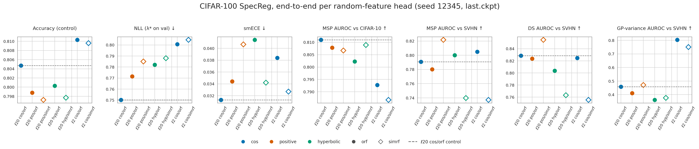

# CIFAR-100 / WideResNet-28-10: SpecReg trained end-to-end per random-feature head (`rf_e2e`)

End-to-end follow-up to the frozen-backbone
[CIFAR100_RF_HEAD_SWAP_RESULTS.md](CIFAR100_RF_HEAD_SWAP_RESULTS.md).

| | |
|---|---|
| Runs | SpecReg (matched), seed 12345, 250 epochs, `last.ckpt` (epoch 249), [../checkpoints/CIFAR_CHECKPOINTS.md](../checkpoints/CIFAR_CHECKPOINTS.md) |
| ℓ20 recipe head | `sngp_specreg_cifar100`: ℓ = 20, unscaled features, σ² = 1; {positive, hyperbolic} × {orf, simrf} |
| ℓ2 paper head | `sngp_specreg_cifar100_rf`: ℓ = 2, σ² = 7.5 in the feature map (Liu et al. eq. 10), scaled base; cos × {orf, simrf} |
| Control | ℓ20 cos/orf, the existing SpecReg seed-12345 run |
| λ | mean-field factor fitted on **val** per run, every number on **test**; OOD vs CIFAR-10 (10,000) and SVHN (26,032) |
| Data, commands | [../MASTER_INFER_RESULTS_PATH.md](../MASTER_INFER_RESULTS_PATH.md), section "rf_e2e" |

- One seed, so there are no error bars. For scale, the SpecReg arm's across-seed std is 0.0036 for
  accuracy and 0.006 for MSP SVHN ([CIFAR100_RESULTS.md](CIFAR100_RESULTS.md)).
- The ℓ2 rows change ℓ, σ², the feature scaling and λ together, so they are a head comparison,
  not a feature-map one. Positive and hyperbolic features did not train at ℓ = 2 (chance
  accuracy in a 3-epoch smoke).

## Results, λ\* fitted on val

| Run | Head | Acc | NLL | smECE | λ\* | MSP C-10 | MSP SVHN | DS SVHN | Var SVHN |
|---|---|---:|---:|---:|---:|---:|---:|---:|---:|
| *cos / orf (control)* | *ℓ20* | *0.8047* | ***0.7502*** | ***0.0313*** | *34.7* | ***0.8110*** | *0.7909* | *0.8285* | *0.4579* |
| positive / orf | ℓ20 | 0.7988 | 0.7716 | 0.0344 | 151 | 0.8078 | 0.7801 | 0.8237 | 0.4115 |
| positive / simrf | ℓ20 | 0.7972 | 0.7851 | 0.0407 | 156 | 0.8067 | **0.8217** | **0.8547** | 0.4712 |
| hyperbolic / orf | ℓ20 | 0.8003 | 0.7820 | 0.0414 | 162 | 0.8022 | 0.8000 | 0.8037 | 0.3609 |
| hyperbolic / simrf | ℓ20 | 0.7977 | 0.7880 | 0.0342 | 173 | 0.8089 | 0.7398 | 0.7630 | 0.3768 |
| cos / orf | ℓ2 | **0.8103** | 0.8007 | 0.0384 | 0 | 0.7927 | 0.8050 | 0.8246 | **0.8033** |
| cos / simrf | ℓ2 | 0.8096 | 0.8046 | 0.0327 | 0 | 0.7867 | 0.7370 | 0.7552 | 0.7504 |

- **ℓ20 positive/hyperbolic vs control:** lower accuracy, worse NLL, and no consistent OOD gain.
- **ℓ2 paper head:** higher accuracy, and the GP variance becomes an SVHN detector (0.80 vs
  0.46). NLL and near-OOD are worse. λ\* = 0: validation prefers no mean-field correction.
- **orf vs simrf:** gaps of up to 0.08 on SVHN change sign between heads, which is consistent
  with single-seed noise.

*Colour = feature map, filled = orf, open = simrf. Dotted vertical line = ℓ20 | ℓ2 head;
dashed horizontal line = ℓ20 cos/orf control.*
