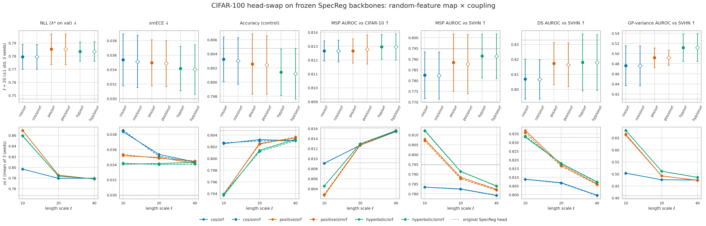

# CIFAR-100 / WideResNet-28-10 — random-feature head swap on frozen SpecReg backbones

Does a better random-feature approximation of the GP kernel buy calibration or OOD detection?
The offline kernel study found that **SimRF** (simplex random features, Reid et al. 2023,
[arXiv 2301.13856](https://arxiv.org/abs/2301.13856)) cuts kernel-approximation MSE to
**~0.1× ORF** with *positive* random features at ρ = ‖x‖/ℓ ≈ 0.5, while only tying ORF for the
cos features SNGP uses today. The CIFAR-100 GP head sits at ρ ≈ 0.58, the favourable regime. This page
retrains only the GP head for every feature map × coupling × length scale and scores the results.

| | |
|---|---|
| Backbones | SpecReg (matched), seeds 12345 / 1 / 2, `last.ckpt` (epoch 249), frozen — [../checkpoints/CIFAR_CHECKPOINTS.md](../checkpoints/CIFAR_CHECKPOINTS.md) |
| Grid | feature map {cos, positive, hyperbolic} × coupling {orf, simrf} × ℓ {10, 20, 40} × 3 seeds = 54 heads, plus the original head |
| Head | the CIFAR recipe's: 640 → 1024 random features, ridge 1.0, unscaled, no input norm; only the three knobs vary |
| Code | `scripts/metrics/cifar100_rf_head_swap.py` (extract + sweep), `src/visualization/cifar100_rf_head_swap.py`; feature maps added to `RandomFeatureGaussianProcess` as `feature_map` |
| Kernel study | `scripts/metrics/random_feature_kernel_mse.py`, [../../figures/random_feature_kernel_mse/](../../figures/random_feature_kernel_mse/) |
| Data, commands | [../MASTER_INFER_RESULTS_PATH.md](../MASTER_INFER_RESULTS_PATH.md), section "Random-feature head swap" |

## Read this first

1. **Head-only, and nothing else.** The backbones co-trained with a cos head for 250 epochs and are
   frozen here. Only the GP head's output layer is retrained, on cached features with 4 augmented train views.
   This measures what the feature map contributes *on a cos-shaped representation*, not what end-to-end
   training with each map would reach. No end-to-end runs were made.
2. **The reference is the retrained cos/orf/ℓ=20 control, never the original head.** Every arm
   shares one optimizer recipe (SGD + Nesterov, cosine LR, 30 epochs). LR and weight decay were picked once,
   on the control only, by validation NLL (→ LR 0.04, weight decay 0), then frozen for every arm and seed. At a
   given seed, all arms draw their random features from the same RNG state.
3. **Calibrated and decoupled.** λ\* (mean-field factor) is fitted on **validation** per head, and every
   number is on **test**. Three OOD scores: MSP and Dempster-Shafer at λ\*, and the raw GP variance. AUROC and
   FPR@95%TPR use the full CIFAR-10 (10,000) and SVHN (26,032) test sets.
4. **± is across the three backbone seeds.** "3/3" means the paired per-seed delta has the same sign
   on all three.

## Gate — how much head-only training costs

The original (end-to-end) SpecReg head scored through the same pipeline reproduces the committed
numbers: λ\* 35.31 (vs. 35.32 on the main results page), NLL 0.7472, MSP SVHN 0.7948. The retrained
cos/orf control matches its **accuracy** (−0.0016). It pays on everything that depends on logit scale,
with the same sign on all three seeds: NLL +0.032, smECE +0.005, MSP SVHN −0.012, DS SVHN −0.026.

The recipe's own weight decay (6e-4) was in the selection grid and lost. On a frozen backbone it caps the
logit scale and leaves the head **under**-confident (confidence − accuracy −0.034, λ\* = 0), so it was not used.
**Read every number below against the control row, not against the main results page.**

## Headline — ℓ = 20 (the recipe; ρ ≈ 0.58)

| Head | Acc | NLL | smECE | λ\* | MSP C-10 | MSP SVHN | DS SVHN | Var SVHN | FPR95 MSP SVHN ↓ |
|---|---:|---:|---:|---:|---:|---:|---:|---:|---:|
| *original (end-to-end)* | *0.8048 ± 0.0036* | *0.7472 ± 0.0100* | *0.0299 ± 0.0041* | *35.3* | *0.8092 ± 0.0016* | *0.7948 ± 0.0060* | *0.8330 ± 0.0068* | *0.410 ± 0.046* | *0.794 ± 0.023* |
| **cos / orf (control)** | 0.8032 ± 0.0032 | **0.7795 ± 0.0094** | 0.0354 ± 0.0036 | 10.6 | 0.8127 ± 0.0007 | 0.7825 ± 0.0109 | 0.8069 ± 0.0133 | 0.476 ± 0.039 | 0.818 ± 0.028 |
| cos / simrf | 0.8030 ± 0.0033 | 0.7794 ± 0.0095 | 0.0351 ± 0.0036 | 10.6 | 0.8127 ± 0.0008 | 0.7824 ± 0.0109 | 0.8067 ± 0.0131 | 0.476 ± 0.039 | 0.819 ± 0.028 |
| positive / orf | 0.8026 ± 0.0043 | 0.7853 ± 0.0117 | 0.0349 ± 0.0032 | 11.6 | 0.8127 ± 0.0009 | 0.7884 ± 0.0134 | 0.8172 ± 0.0140 | 0.492 ± 0.019 | 0.808 ± 0.036 |
| positive / simrf | 0.8024 ± 0.0041 | 0.7852 ± 0.0117 | 0.0348 ± 0.0032 | 11.8 | 0.8128 ± 0.0011 | 0.7877 ± 0.0137 | 0.8164 ± 0.0146 | 0.492 ± 0.015 | 0.808 ± 0.036 |
| hyperbolic / orf | 0.8014 ± 0.0033 | 0.7835 ± 0.0073 | **0.0341 ± 0.0031** | 11.6 | **0.8130 ± 0.0009** | **0.7914 ± 0.0102** | **0.8180 ± 0.0190** | **0.511 ± 0.027** | 0.808 ± 0.033 |
| hyperbolic / simrf | 0.8012 ± 0.0036 | 0.7836 ± 0.0074 | 0.0340 ± 0.0034 | 11.6 | 0.8129 ± 0.0009 | 0.7914 ± 0.0104 | 0.8179 ± 0.0185 | 0.511 ± 0.027 | 0.809 ± 0.033 |

## SimRF vs ORF — no measurable effect

Paired per seed, SimRF − ORF with the same feature map and ℓ, over all 9 (map, ℓ) cells and 8 metrics:
the largest mean |Δ| is **0.004**, and the largest single-seed |Δ| is 0.014 (GP-variance AUROC, positive,
ℓ = 10; that metric's across-seed std is 0.04–0.05). Signs are mixed. Accuracy, NLL and smECE differences
are all ≤ 0.001. At ℓ = 20 on the metrics that matter: positive MSP SVHN −0.0007, DS SVHN −0.0008;
hyperbolic −0.0001 / −0.0001.

**The 10× kernel-MSE gain from the kernel study does not reach any downstream metric.** At m = 1024
random features, the kernel error is already a small fraction of what drives these heads. The learned
output layer and the λ fit absorb it.

## Feature map vs cos — a small, consistent far-OOD gain at ℓ = 20

Paired against the control (orf arms; the simrf arms are indistinguishable):

| vs cos/orf, ℓ = 20 | Acc | NLL | smECE | MSP C-10 | MSP SVHN | DS SVHN | Var SVHN | FPR95 MSP SVHN |
|---|---:|---:|---:|---:|---:|---:|---:|---:|
| positive | −0.0007 | +0.0059 (2/3) | −0.0004 | −0.0000 | **+0.0059 (3/3)** | **+0.0104 (3/3)** | +0.016 (2/3) | −0.011 (2/3) |
| hyperbolic | −0.0018 (3/3) | +0.0041 (3/3) | −0.0012 (3/3) | +0.0003 | **+0.0089 (3/3)** | **+0.0112 (3/3)** | **+0.035 (3/3)** | −0.010 |

- **Survives:** far-OOD. MSP SVHN +0.006 to +0.009 and DS SVHN +0.010 to +0.011, 3/3 for both maps. These gains
  are comparable to the SVHN seed std (±0.010–0.019), so they are consistent but small. Against the
  head-only gap to the original head, they recover about half of the MSP gap (0.006–0.009 of 0.012) and
  about 40% of the DS gap (0.010–0.011 of 0.026).
- **Costs:** NLL +0.004 to +0.006 (3/3 for hyperbolic), and hyperbolic loses 0.0018 accuracy (3/3). Near-OOD
  (CIFAR-10) does not move.
- **Hyperbolic ≥ positive** on every AUROC column (FPR95 is a tie, 0.808 vs 0.808). It is the variant to
  carry forward if any is.

## Length scale — ℓ = 10 trades accuracy for far-OOD

| vs cos/orf ℓ=20 | Acc | NLL | MSP C-10 | MSP SVHN | DS SVHN | Var SVHN | FPR95 MSP SVHN |
|---|---:|---:|---:|---:|---:|---:|---:|
| cos, ℓ = 10 | −0.0007 | +0.017 (3/3) | −0.004 (3/3) | +0.001 | +0.002 (3/3) | +0.027 (3/3) | −0.009 (3/3) |
| positive, ℓ = 10 | **−0.0094 (3/3)** | **+0.090 (3/3)** | −0.010 (3/3) | +0.025 (3/3) | +0.030 (3/3) | **+0.186 (3/3)** | −0.064 (3/3) |
| hyperbolic, ℓ = 10 | **−0.0096 (3/3)** | **+0.079 (3/3)** | −0.008 (3/3) | +0.030 (3/3) | +0.026 (2/3) | **+0.205 (3/3)** | −0.051 |

At ℓ = 10 (ρ ≈ 1.15) the positive maps' **GP variance becomes an OOD signal**: SVHN AUROC 0.66–0.68,
against 0.48–0.50 for cos at any ℓ. Far-OOD MSP/DS improve by 0.025–0.030. But accuracy falls by about a
point and NLL by 0.08–0.09, and the seed spread widens (DS SVHN ±0.03–0.05). At ℓ = 40 the variance carries
no information at all (λ\* = 0 for every head), and the maps converge.

Mechanism, not established: the exact RBF kernel is shift-invariant, so the extra variance signal at
ℓ = 10 is a property of the finite positive feature map, not of the kernel. Positive features weight inputs
by exp(−‖x‖²/ℓ²), and the positive-map estimator's variance itself grows with ρ. SVHN's features have
smaller norms than CIFAR-100's (ρ 0.51 vs 0.58), so a norm-sensitive map can separate them. That is a
plausible reading, not a tested one.

## A side finding: the GP variance is not what detects SVHN here

For the cos head, **variance AUROC vs SVHN is below 0.5**: 0.41 for the original head and 0.48 for the
control. The GP is *less* uncertain on SVHN than on CIFAR-100. SVHN's features do sit at a smaller norm
(ρ 0.51 vs 0.58), which is a plausible cause but not a tested one. Either way, the far-OOD separation this
arm reports on the main page (DS 0.833) comes from the logits' total evidence, not from distance awareness
in the GP head.

## What these numbers do and do not establish

- **Established (head-only, 3 backbones):** SimRF does not change any calibration or OOD metric relative to
  ORF, for any feature map or length scale tested. Hyperbolic/positive features give a small (+0.006 to
  +0.011) far-OOD gain over cos at ℓ = 20, sign-consistent 3/3, for a small NLL cost.
- **Not established:** anything about end-to-end training. The backbone never adapted to a non-cos head,
  and head-only training costs 0.03 NLL and 0.01–0.03 far-OOD AUROC against the original head. A feature
  map that co-trains with the backbone could do better or worse than this.
- **Not established:** that ℓ = 10 is worth its accuracy cost, or why its variance separates SVHN.
- **Three seeds, one near-OOD and one far-OOD set.** The far-OOD gains are the size of the seed std.

**Recommendation.** Drop SimRF for this head: its only demonstrated benefit is kernel MSE, which doesn't
show up in any metric. If one end-to-end run is spent here, it should be **hyperbolic / orf at ℓ = 20**
(3 seeds, SpecReg recipe, `model.net.feature_map=hyperbolic`). It is the only arm with a sign-consistent
OOD gain and no accuracy loss worth mentioning. ℓ = 10 is worth one end-to-end seed only if far-OOD is the
priority over accuracy.
